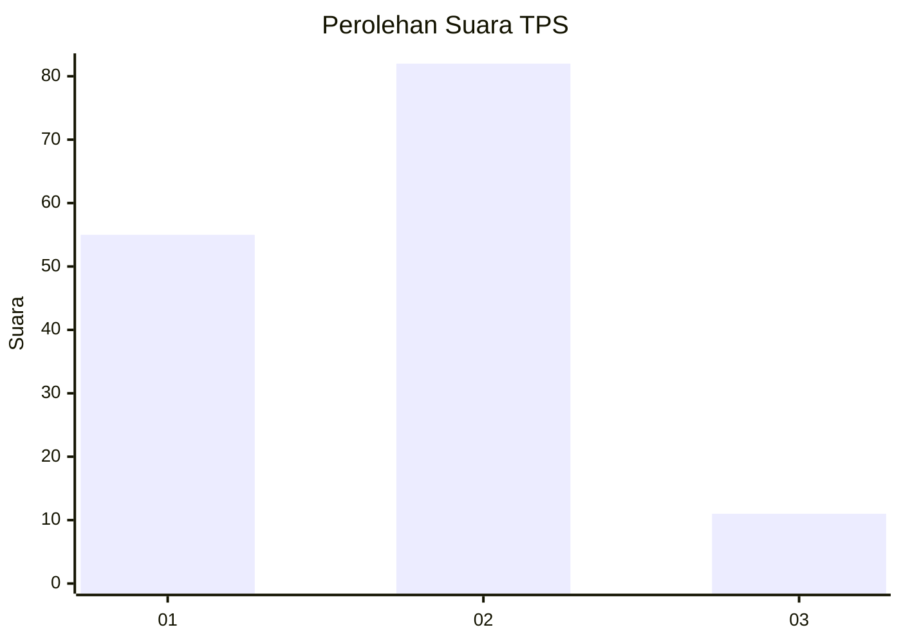
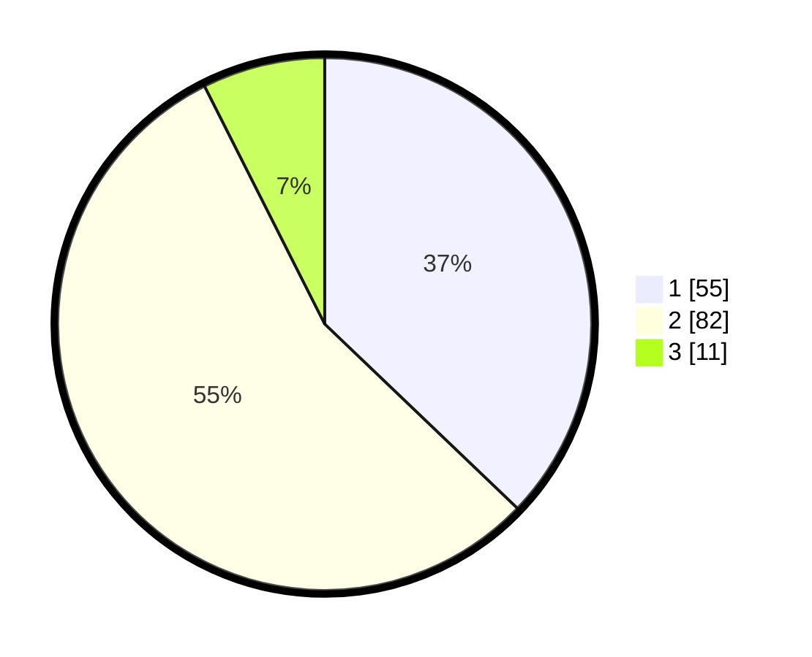

# Hasil

## Grafik

## Tabel

| No. | Nama Paslon    | Suara | Suara (raw) | Persentase |
|:--- |:-------------- | -----:| -----------:| ----------:|
| 1   | ANIES MUHAIMIN | 55    | [55][p-1]   | 37,16      |
| 2   | PRABOWO GIBRAN | 82    | [82][p-2]   | 55,41      |
| 3   | GANJAR MAHFUD  | 11    | [11][p-3]   | 7,43       |

[p-1]: https://github.com/gigit-pemilu/pemilu-2024/blob/main/pilpres/hitung-suara/sub/33-jawa-tengah/sub/28-tegal/sub/07-jatinegara/sub/2001-kedungwungu/sub/008-tps/sub/paslon-1.txt
[p-2]: https://github.com/gigit-pemilu/pemilu-2024/blob/main/pilpres/hitung-suara/sub/33-jawa-tengah/sub/28-tegal/sub/07-jatinegara/sub/2001-kedungwungu/sub/008-tps/sub/paslon-2.txt
[p-3]: https://github.com/gigit-pemilu/pemilu-2024/blob/main/pilpres/hitung-suara/sub/33-jawa-tengah/sub/28-tegal/sub/07-jatinegara/sub/2001-kedungwungu/sub/008-tps/sub/paslon-3.txt

## Foto C Plano

https://sirekap-obj-formc.kpu.go.id/5c23/pemilu/ppwp/33/28/07/20/01/3328072001008-20240223-182235--567617fc-263f-45a7-83d5-bc17db92c51e.jpg

https://sirekap-obj-formc.kpu.go.id/5c23/pemilu/ppwp/33/28/07/20/01/3328072001008-20240223-181817--b9e62ba0-df3c-4be8-924e-33e6310d0d52.jpg

https://sirekap-obj-formc.kpu.go.id/5c23/pemilu/ppwp/33/28/07/20/01/3328072001008-20240223-181726--eff0ec1a-f46f-43d7-84fb-7d15d36be0e3.jpg

## Metadata

| Key        | Value               |
| ---------- | ------------------- |
| Time Stamp | 2024-02-25 13:00:00 |

