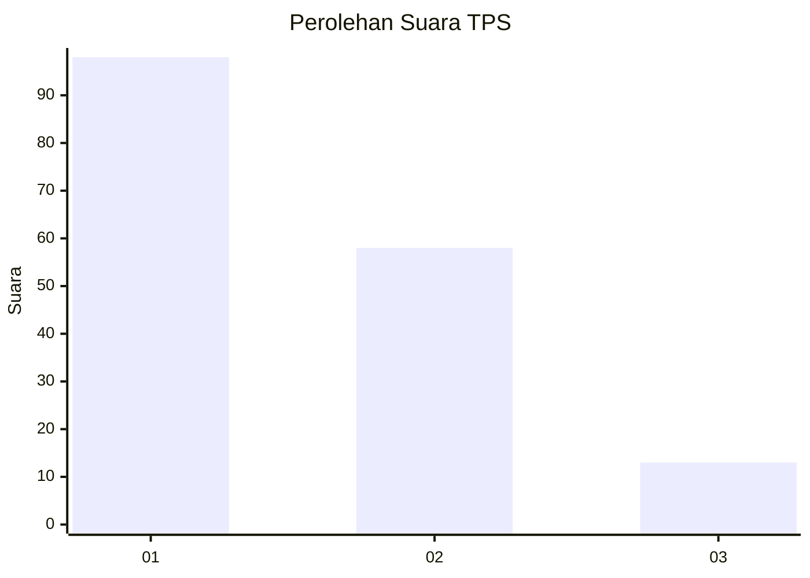
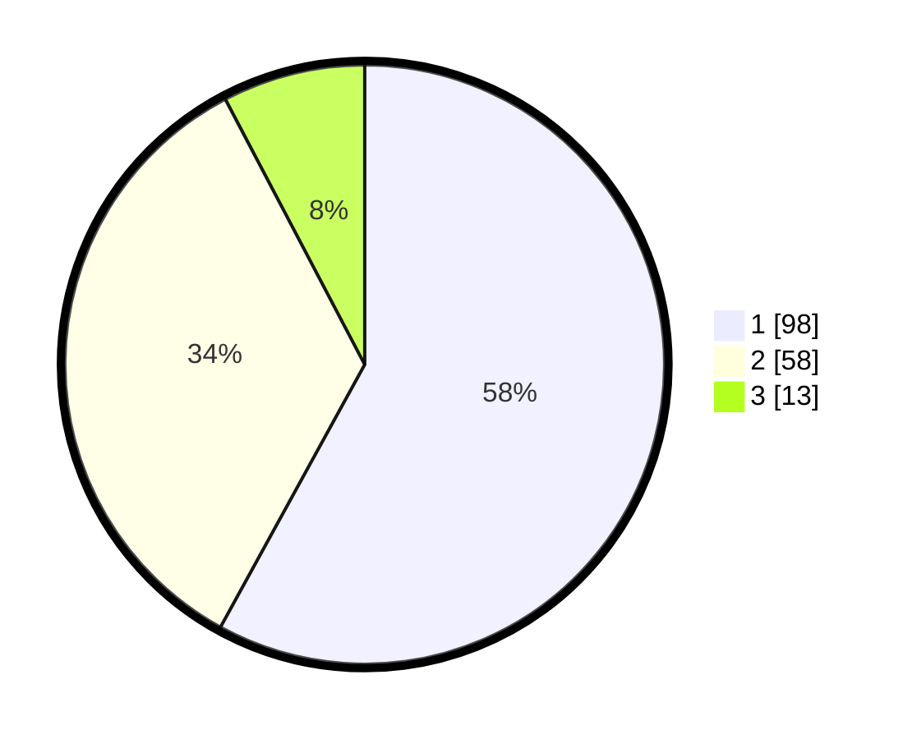

# Hasil

## Grafik

## Tabel

| No. | Nama Paslon    | Suara | Suara (raw) | Persentase |
|:--- |:-------------- | -----:| -----------:| ----------:|
| 1   | ANIES MUHAIMIN | 98    | [98][p-1]   | 57,99      |
| 2   | PRABOWO GIBRAN | 58    | [58][p-2]   | 34,32      |
| 3   | GANJAR MAHFUD  | 13    | [13][p-3]   | 7,69       |

[p-1]: https://github.com/gigit-pemilu/pemilu-2024-33-jawa-tengah/blob/main/pilpres/hitung-suara/sub/33-jawa-tengah/sub/28-tegal/sub/07-jatinegara/sub/2007-gantungan/sub/010-tps/sub/paslon-1.txt
[p-2]: https://github.com/gigit-pemilu/pemilu-2024-33-jawa-tengah/blob/main/pilpres/hitung-suara/sub/33-jawa-tengah/sub/28-tegal/sub/07-jatinegara/sub/2007-gantungan/sub/010-tps/sub/paslon-2.txt
[p-3]: https://github.com/gigit-pemilu/pemilu-2024-33-jawa-tengah/blob/main/pilpres/hitung-suara/sub/33-jawa-tengah/sub/28-tegal/sub/07-jatinegara/sub/2007-gantungan/sub/010-tps/sub/paslon-3.txt

## Foto C Plano

https://sirekap-obj-formc.kpu.go.id/eb7a/pemilu/ppwp/33/28/07/20/07/3328072007010-20240214-233618--d8d727f9-4a1f-4472-9634-f983846c9670.jpg

https://sirekap-obj-formc.kpu.go.id/eb7a/pemilu/ppwp/33/28/07/20/07/3328072007010-20240214-233724--b463a54f-fd40-4d43-8d10-4fcc6bc3730e.jpg

https://sirekap-obj-formc.kpu.go.id/eb7a/pemilu/ppwp/33/28/07/20/07/3328072007010-20240214-233910--d1bb30f6-cd64-463f-bde9-ff0b03e02a77.jpg

## Metadata

| Key        | Value               |
| ---------- | ------------------- |
| Time Stamp | 2024-02-17 12:00:00 |

