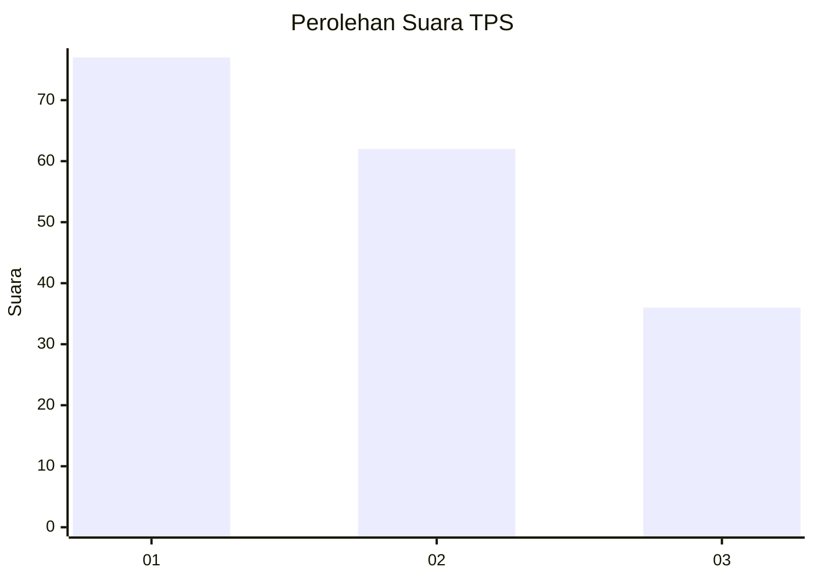
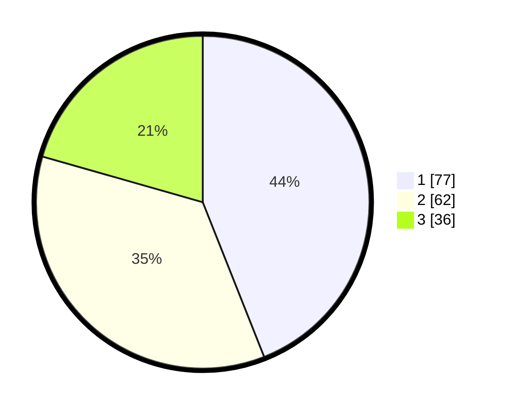

# Hasil

## Grafik

## Tabel

| No. | Nama Paslon    | Suara | Suara (raw) | Persentase |
|:--- |:-------------- | -----:| -----------:| ----------:|
| 1   | ANIES MUHAIMIN | 77    | [77][p-1]   | 44,00      |
| 2   | PRABOWO GIBRAN | 62    | [62][p-2]   | 35,43      |
| 3   | GANJAR MAHFUD  | 36    | [36][p-3]   | 20,57      |

[p-1]: https://github.com/gigit-pemilu/pemilu-2024/blob/main/pilpres/hitung-suara/sub/33-jawa-tengah/sub/28-tegal/sub/07-jatinegara/sub/2013-jatinegara/sub/005-tps/sub/paslon-1.txt
[p-2]: https://github.com/gigit-pemilu/pemilu-2024/blob/main/pilpres/hitung-suara/sub/33-jawa-tengah/sub/28-tegal/sub/07-jatinegara/sub/2013-jatinegara/sub/005-tps/sub/paslon-2.txt
[p-3]: https://github.com/gigit-pemilu/pemilu-2024/blob/main/pilpres/hitung-suara/sub/33-jawa-tengah/sub/28-tegal/sub/07-jatinegara/sub/2013-jatinegara/sub/005-tps/sub/paslon-3.txt

## Foto C Plano

https://sirekap-obj-formc.kpu.go.id/f9ba/pemilu/ppwp/33/28/07/20/13/3328072013005-20240221-180626--fb44af59-08a2-40e8-8cb5-973f86500054.jpg

https://sirekap-obj-formc.kpu.go.id/f9ba/pemilu/ppwp/33/28/07/20/13/3328072013005-20240221-165057--b9a33a32-9af9-4fac-935f-c48e62dec115.jpg

https://sirekap-obj-formc.kpu.go.id/f9ba/pemilu/ppwp/33/28/07/20/13/3328072013005-20240221-165240--b9574222-6c70-45a3-bcbc-bb09396b7c20.jpg

## Metadata

| Key        | Value               |
| ---------- | ------------------- |
| Time Stamp | 2024-02-21 19:00:00 |

