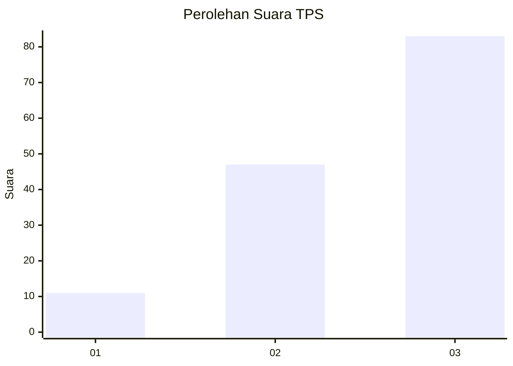
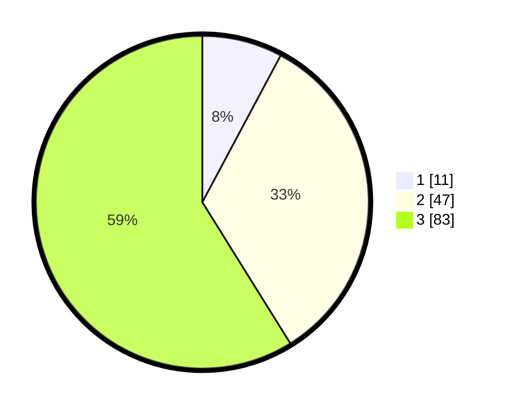

# Hasil

## Grafik

## Tabel

| No. | Nama Paslon    | Suara | Suara (raw) | Persentase |
|:--- |:-------------- | -----:| -----------:| ----------:|
| 1   | ANIES MUHAIMIN | 11    | [11][p-1]   | 7,80       |
| 2   | PRABOWO GIBRAN | 47    | [47][p-2]   | 33,33      |
| 3   | GANJAR MAHFUD  | 83    | [83][p-3]   | 58,87      |

[p-1]: https://github.com/gigit-pemilu/pemilu-2024-33-jawa-tengah/blob/main/pilpres/hitung-suara/sub/33-jawa-tengah/sub/28-tegal/sub/07-jatinegara/sub/2014-luwijawa/sub/009-tps/sub/paslon-1.txt
[p-2]: https://github.com/gigit-pemilu/pemilu-2024-33-jawa-tengah/blob/main/pilpres/hitung-suara/sub/33-jawa-tengah/sub/28-tegal/sub/07-jatinegara/sub/2014-luwijawa/sub/009-tps/sub/paslon-2.txt
[p-3]: https://github.com/gigit-pemilu/pemilu-2024-33-jawa-tengah/blob/main/pilpres/hitung-suara/sub/33-jawa-tengah/sub/28-tegal/sub/07-jatinegara/sub/2014-luwijawa/sub/009-tps/sub/paslon-3.txt

## Foto C Plano

https://sirekap-obj-formc.kpu.go.id/cc44/pemilu/ppwp/33/28/07/20/14/3328072014009-20240220-142611--59cbf97d-f163-4673-bec3-acc12c926279.jpg

https://sirekap-obj-formc.kpu.go.id/cc44/pemilu/ppwp/33/28/07/20/14/3328072014009-20240220-142925--865bdeaf-521f-421a-95e5-833d66604e5f.jpg

https://sirekap-obj-formc.kpu.go.id/cc44/pemilu/ppwp/33/28/07/20/14/3328072014009-20240214-211742--d2220d40-4633-429a-b713-8f797735ed85.jpg

## Metadata

| Key        | Value               |
| ---------- | ------------------- |
| Time Stamp | 2024-02-20 15:00:00 |

## DATA PEMILIH TETAP

Jumlah pemilih dalam DPT: **0**.
 * L: **700**.
 * P: **0**.

## DATA PENGGUNA HAK PILIH

Jumlah pengguna hak pilih dalam DPT: **0**.
 * L: **755**.
 * P: **500**.

Jumlah pengguna hak pilih dalam DPTb: **775**.
 * L: **477**.
 * P: **777**.

Jumlah pengguna hak pilih dalam DPK: **0**.
 * L: **447**.
 * P: **550**.

Jumlah pengguna hak pilih: **150**.
 * L: **40**.
 * P: **553**.

## JUMLAH SUARA SAH DAN TIDAK SAH

JUMLAH SELURUH SUARA SAH: **141**.

JUMLAH SUARA TIDAK SAH: **9**.

JUMLAH SELURUH SUARA SAH DAN SUARA TIDAK SAH: **150**.

