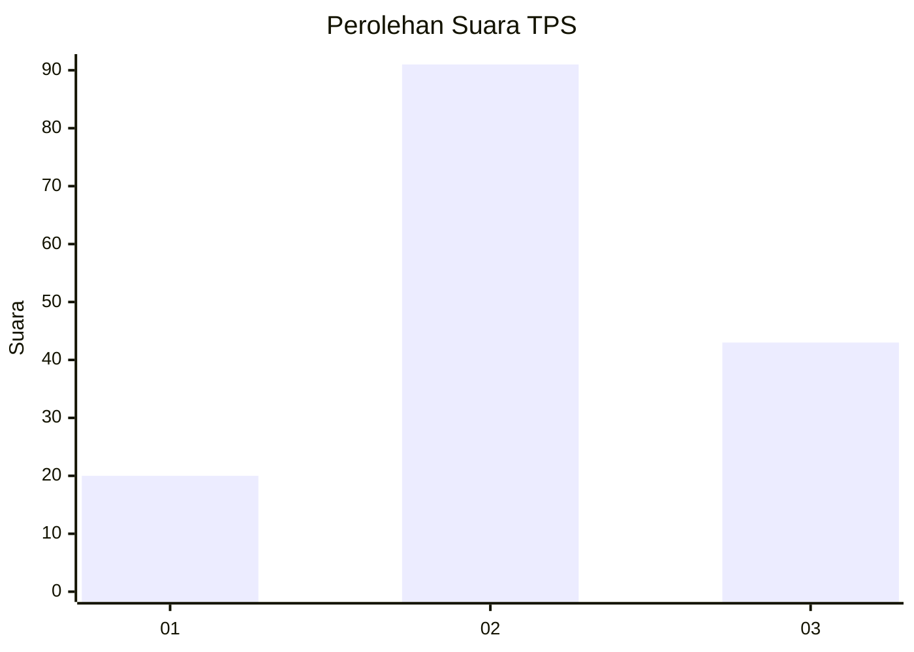
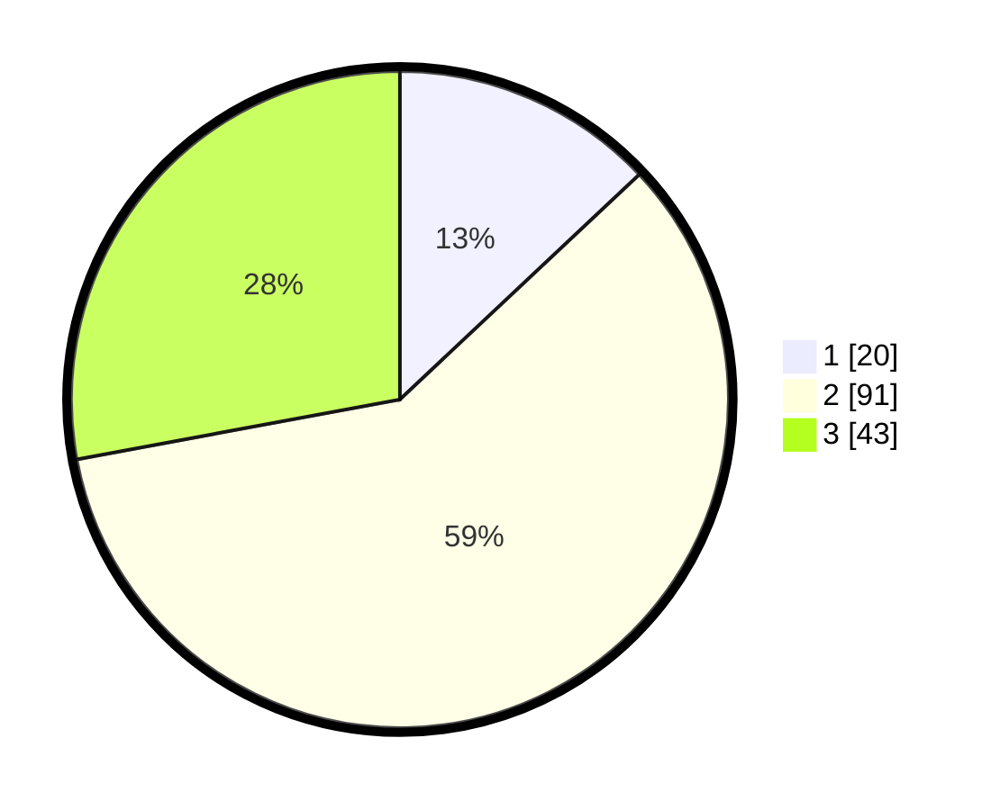

# Hasil

## Grafik

## Tabel

| No. | Nama Paslon    | Suara | Suara (raw) | Persentase |
|:--- |:-------------- | -----:| -----------:| ----------:|
| 1   | ANIES MUHAIMIN | 20    | [20][p-1]   | 12,99      |
| 2   | PRABOWO GIBRAN | 91    | [91][p-2]   | 59,09      |
| 3   | GANJAR MAHFUD  | 43    | [43][p-3]   | 27,92      |

[p-1]: https://github.com/gigit-pemilu/pemilu-2024/blob/main/pilpres/hitung-suara/sub/33-jawa-tengah/sub/28-tegal/sub/09-pangkah/sub/2001-dermasuci/sub/004-tps/sub/paslon-1.txt
[p-2]: https://github.com/gigit-pemilu/pemilu-2024/blob/main/pilpres/hitung-suara/sub/33-jawa-tengah/sub/28-tegal/sub/09-pangkah/sub/2001-dermasuci/sub/004-tps/sub/paslon-2.txt
[p-3]: https://github.com/gigit-pemilu/pemilu-2024/blob/main/pilpres/hitung-suara/sub/33-jawa-tengah/sub/28-tegal/sub/09-pangkah/sub/2001-dermasuci/sub/004-tps/sub/paslon-3.txt

## Foto C Plano

https://sirekap-obj-formc.kpu.go.id/f3a2/pemilu/ppwp/33/28/09/20/01/3328092001004-20240219-200258--13e9861d-edfd-43f9-81bb-70e3eb6f0206.jpg

https://sirekap-obj-formc.kpu.go.id/f3a2/pemilu/ppwp/33/28/09/20/01/3328092001004-20240215-010602--0c50e3d7-5397-4e53-bf77-56f4d3400fe7.jpg

https://sirekap-obj-formc.kpu.go.id/f3a2/pemilu/ppwp/33/28/09/20/01/3328092001004-20240215-011202--32b21c1c-f21d-4f25-883f-d08289a89cf1.jpg

## Metadata

| Key        | Value               |
| ---------- | ------------------- |
| Time Stamp | 2024-02-19 21:00:00 |

