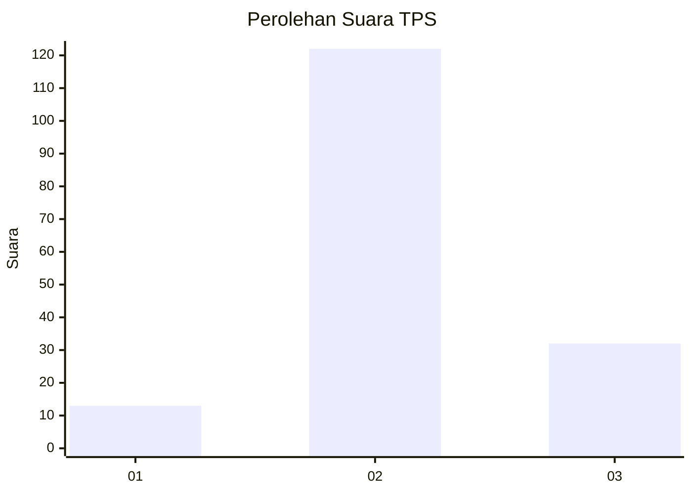
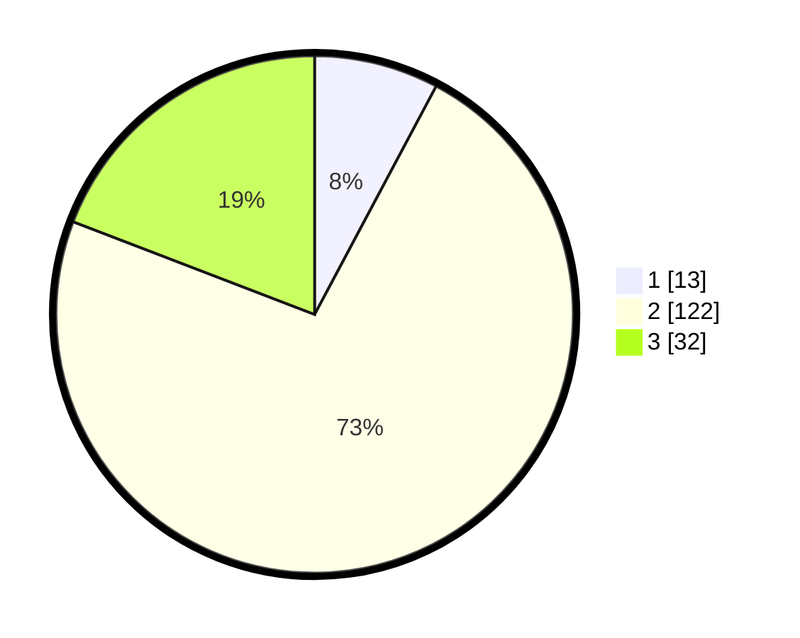

# Hasil

## Grafik

## Tabel

| No. | Nama Paslon    | Suara | Suara (raw) | Persentase |
|:--- |:-------------- | -----:| -----------:| ----------:|
| 1   | ANIES MUHAIMIN | 13    | [13][p-1]   | 7,78       |
| 2   | PRABOWO GIBRAN | 122   | [122][p-2]  | 73,05      |
| 3   | GANJAR MAHFUD  | 32    | [32][p-3]   | 19,16      |

[p-1]: https://github.com/gigit-pemilu/pemilu-2024-33-jawa-tengah/blob/main/pilpres/hitung-suara/sub/33-jawa-tengah/sub/28-tegal/sub/09-pangkah/sub/2001-dermasuci/sub/006-tps/sub/paslon-1.txt
[p-2]: https://github.com/gigit-pemilu/pemilu-2024-33-jawa-tengah/blob/main/pilpres/hitung-suara/sub/33-jawa-tengah/sub/28-tegal/sub/09-pangkah/sub/2001-dermasuci/sub/006-tps/sub/paslon-2.txt
[p-3]: https://github.com/gigit-pemilu/pemilu-2024-33-jawa-tengah/blob/main/pilpres/hitung-suara/sub/33-jawa-tengah/sub/28-tegal/sub/09-pangkah/sub/2001-dermasuci/sub/006-tps/sub/paslon-3.txt

## Foto C Plano

https://sirekap-obj-formc.kpu.go.id/5db1/pemilu/ppwp/33/28/09/20/01/3328092001006-20240214-223604--d0b2fde8-eed7-4b31-aead-3e850ce34703.jpg

https://sirekap-obj-formc.kpu.go.id/5db1/pemilu/ppwp/33/28/09/20/01/3328092001006-20240224-210617--6772df06-5aa2-46e0-b524-3f290cf4df9b.jpg

https://sirekap-obj-formc.kpu.go.id/5db1/pemilu/ppwp/33/28/09/20/01/3328092001006-20240224-210616--2947a2eb-2e79-4dc6-9006-19a4513d0061.jpg

## Metadata

| Key        | Value               |
| ---------- | ------------------- |
| Time Stamp | 2024-02-25 11:00:00 |

