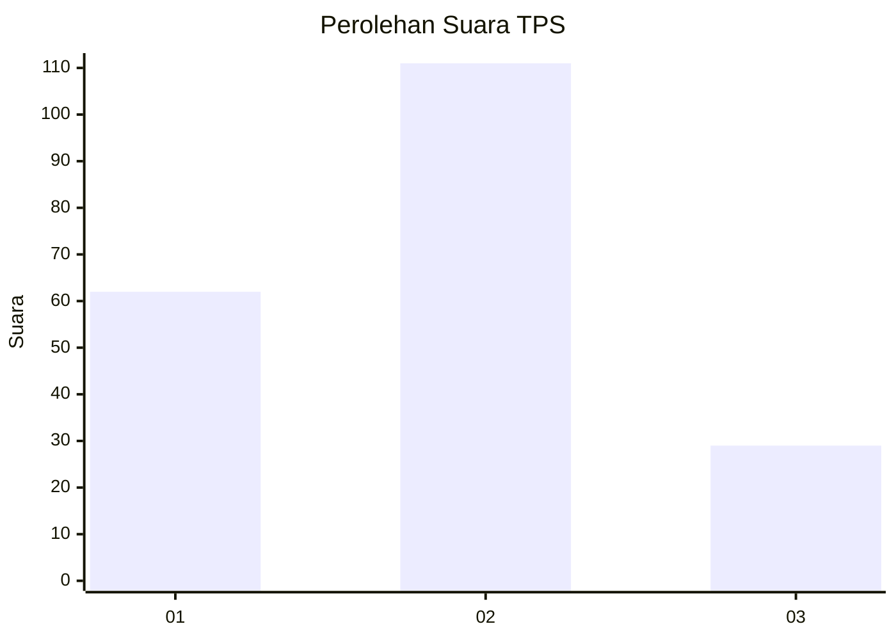
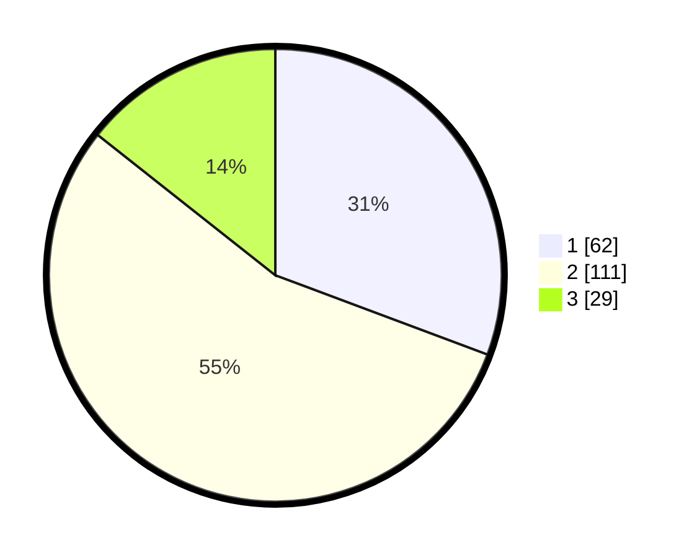

# Hasil

## Grafik

## Tabel

| No. | Nama Paslon    | Suara | Suara (raw) | Persentase |
|:--- |:-------------- | -----:| -----------:| ----------:|
| 1   | ANIES MUHAIMIN | 62    | [62][p-1]   | 30,69      |
| 2   | PRABOWO GIBRAN | 111   | [111][p-2]  | 54,95      |
| 3   | GANJAR MAHFUD  | 29    | [29][p-3]   | 14,36      |

[p-1]: https://github.com/gigit-pemilu/pemilu-2024/blob/main/pilpres/hitung-suara/sub/33-jawa-tengah/sub/28-tegal/sub/09-pangkah/sub/2005-penusupan/sub/002-tps/sub/paslon-1.txt
[p-2]: https://github.com/gigit-pemilu/pemilu-2024/blob/main/pilpres/hitung-suara/sub/33-jawa-tengah/sub/28-tegal/sub/09-pangkah/sub/2005-penusupan/sub/002-tps/sub/paslon-2.txt
[p-3]: https://github.com/gigit-pemilu/pemilu-2024/blob/main/pilpres/hitung-suara/sub/33-jawa-tengah/sub/28-tegal/sub/09-pangkah/sub/2005-penusupan/sub/002-tps/sub/paslon-3.txt

## Foto C Plano

https://sirekap-obj-formc.kpu.go.id/e0f8/pemilu/ppwp/33/28/09/20/05/3328092005002-20240222-184658--424e2453-1316-4871-891d-969929be5fb0.jpg

https://sirekap-obj-formc.kpu.go.id/e0f8/pemilu/ppwp/33/28/09/20/05/3328092005002-20240222-185340--93d19309-00eb-4925-8cbf-d81b1b7a7531.jpg

https://sirekap-obj-formc.kpu.go.id/e0f8/pemilu/ppwp/33/28/09/20/05/3328092005002-20240222-185502--b4682ed3-b566-4e8d-ae26-e099170bb0f6.jpg

## Metadata

| Key        | Value               |
| ---------- | ------------------- |
| Time Stamp | 2024-02-26 09:00:00 |

## DATA PEMILIH TETAP

Jumlah pemilih dalam DPT: **275**.
 * L: **444**.
 * P: **675**.

## DATA PENGGUNA HAK PILIH

Jumlah pengguna hak pilih dalam DPT: **204**.
 * L: **842**.
 * P: **424**.

Jumlah pengguna hak pilih dalam DPTb: **800**.
 * L: **888**.
 * P: **88**.

Jumlah pengguna hak pilih dalam DPK: **87**.
 * L: **800**.
 * P: **88**.

Jumlah pengguna hak pilih: **280**.
 * L: **848**.
 * P: **420**.

## JUMLAH SUARA SAH DAN TIDAK SAH

JUMLAH SELURUH SUARA SAH: **202**.

JUMLAH SUARA TIDAK SAH: **8**.

JUMLAH SELURUH SUARA SAH DAN SUARA TIDAK SAH: **210**.

