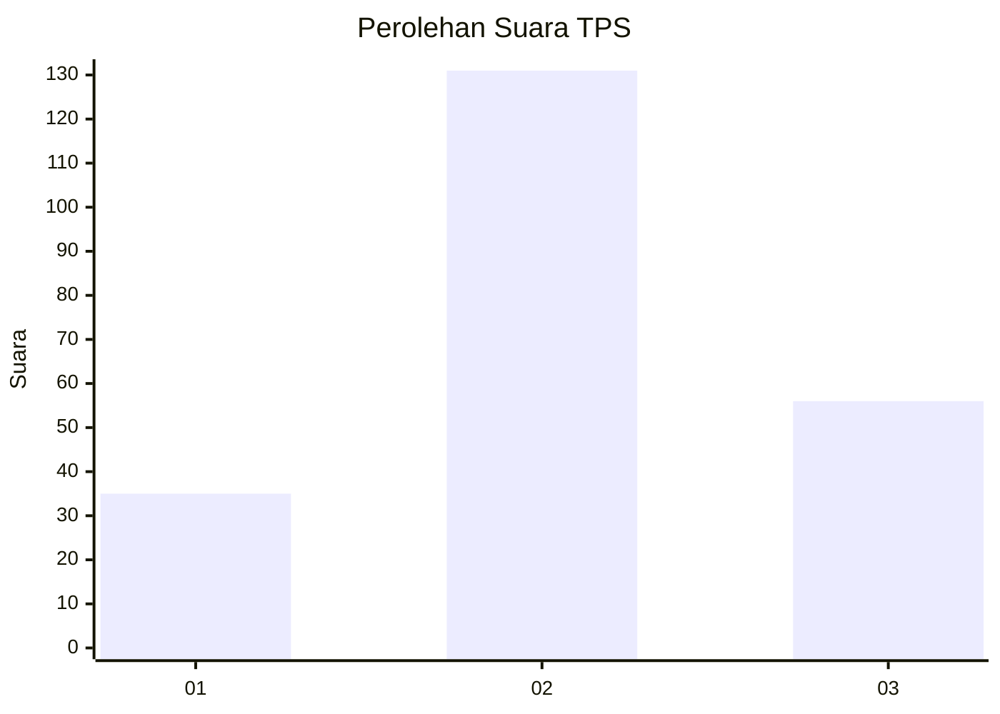
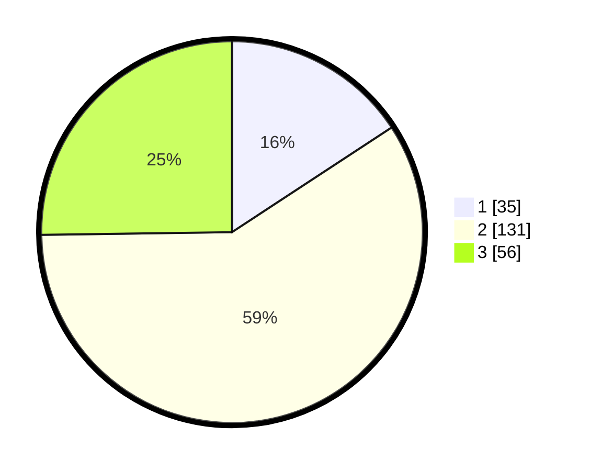

# Hasil

## Grafik

## Tabel

| No. | Nama Paslon    | Suara | Suara (raw) | Persentase |
|:--- |:-------------- | -----:| -----------:| ----------:|
| 1   | ANIES MUHAIMIN | 35    | [35][p-1]   | 15,77      |
| 2   | PRABOWO GIBRAN | 131   | [131][p-2]  | 59,01      |
| 3   | GANJAR MAHFUD  | 56    | [56][p-3]   | 25,23      |

[p-1]: https://github.com/gigit-pemilu/pemilu-2024/blob/main/pilpres/hitung-suara/sub/33-jawa-tengah/sub/28-tegal/sub/09-pangkah/sub/2005-penusupan/sub/015-tps/sub/paslon-1.txt
[p-2]: https://github.com/gigit-pemilu/pemilu-2024/blob/main/pilpres/hitung-suara/sub/33-jawa-tengah/sub/28-tegal/sub/09-pangkah/sub/2005-penusupan/sub/015-tps/sub/paslon-2.txt
[p-3]: https://github.com/gigit-pemilu/pemilu-2024/blob/main/pilpres/hitung-suara/sub/33-jawa-tengah/sub/28-tegal/sub/09-pangkah/sub/2005-penusupan/sub/015-tps/sub/paslon-3.txt

## Foto C Plano

https://sirekap-obj-formc.kpu.go.id/f6b4/pemilu/ppwp/33/28/09/20/05/3328092005015-20240222-202734--c1e315ac-b113-4b3a-9bf6-df2d86dc0475.jpg

https://sirekap-obj-formc.kpu.go.id/f6b4/pemilu/ppwp/33/28/09/20/05/3328092005015-20240222-202149--7b15ae5a-ad53-420a-97fd-250cde40ca1b.jpg

https://sirekap-obj-formc.kpu.go.id/f6b4/pemilu/ppwp/33/28/09/20/05/3328092005015-20240222-202403--12b8f1fa-83d9-4d12-a511-14b7229e1188.jpg

## Metadata

| Key        | Value               |
| ---------- | ------------------- |
| Time Stamp | 2024-02-24 22:31:28 |

## DATA PEMILIH TETAP

Jumlah pemilih dalam DPT: **276**.
 * L: **224**.
 * P: **444**.

## DATA PENGGUNA HAK PILIH

Jumlah pengguna hak pilih dalam DPT: **290**.
 * L: **772**.
 * P: **242**.

Jumlah pengguna hak pilih dalam DPTb: **521**.
 * L: **400**.
 * P: **77**.

Jumlah pengguna hak pilih dalam DPK: **754**.
 * L: **1**.
 * P: **127**.

Jumlah pengguna hak pilih: **221**.
 * L: **231**.
 * P: **0**.

## JUMLAH SUARA SAH DAN TIDAK SAH

JUMLAH SELURUH SUARA SAH: **222**.

JUMLAH SUARA TIDAK SAH: **9**.

JUMLAH SELURUH SUARA SAH DAN SUARA TIDAK SAH: **231**.

