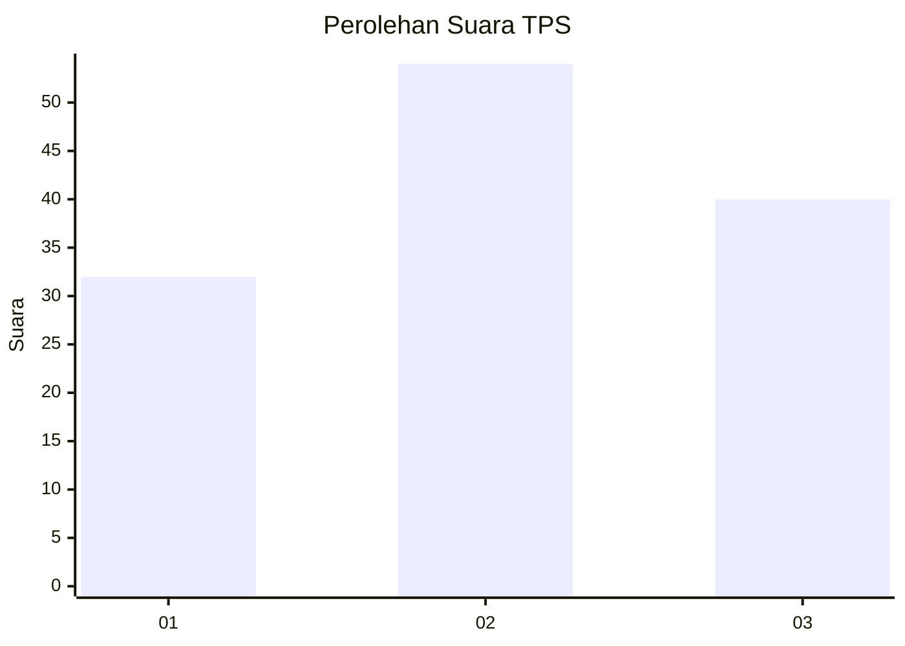
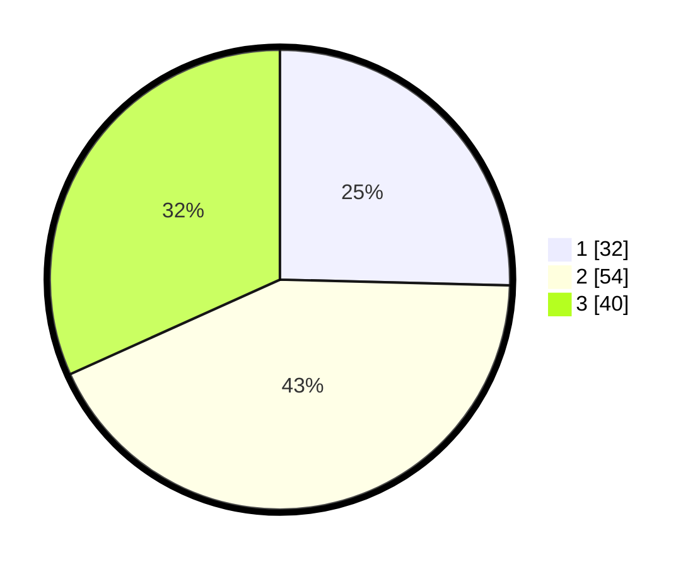

# Hasil

## Grafik

## Tabel

| No. | Nama Paslon    | Suara | Suara (raw) | Persentase |
|:--- |:-------------- | -----:| -----------:| ----------:|
| 1   | ANIES MUHAIMIN | 32    | [32][p-1]   | 25,40      |
| 2   | PRABOWO GIBRAN | 54    | [54][p-2]   | 42,86      |
| 3   | GANJAR MAHFUD  | 40    | [40][p-3]   | 31,75      |

[p-1]: https://github.com/gigit-pemilu/pemilu-2024/blob/main/pilpres/hitung-suara/sub/33-jawa-tengah/sub/28-tegal/sub/09-pangkah/sub/2005-penusupan/sub/024-tps/sub/paslon-1.txt
[p-2]: https://github.com/gigit-pemilu/pemilu-2024/blob/main/pilpres/hitung-suara/sub/33-jawa-tengah/sub/28-tegal/sub/09-pangkah/sub/2005-penusupan/sub/024-tps/sub/paslon-2.txt
[p-3]: https://github.com/gigit-pemilu/pemilu-2024/blob/main/pilpres/hitung-suara/sub/33-jawa-tengah/sub/28-tegal/sub/09-pangkah/sub/2005-penusupan/sub/024-tps/sub/paslon-3.txt

## Foto C Plano

https://sirekap-obj-formc.kpu.go.id/005e/pemilu/ppwp/33/28/09/20/05/3328092005024-20240222-203837--8f0d6860-3469-4732-842f-ba4d72e64667.jpg

https://sirekap-obj-formc.kpu.go.id/005e/pemilu/ppwp/33/28/09/20/05/3328092005024-20240222-203909--f0412e09-9939-481c-802a-ea62098b27a7.jpg

https://sirekap-obj-formc.kpu.go.id/005e/pemilu/ppwp/33/28/09/20/05/3328092005024-20240222-203944--d42136b8-b8cc-4a2b-b5b5-2f4245162fe4.jpg

## Metadata

| Key        | Value               |
| ---------- | ------------------- |
| Time Stamp | 2024-02-25 15:00:00 |

