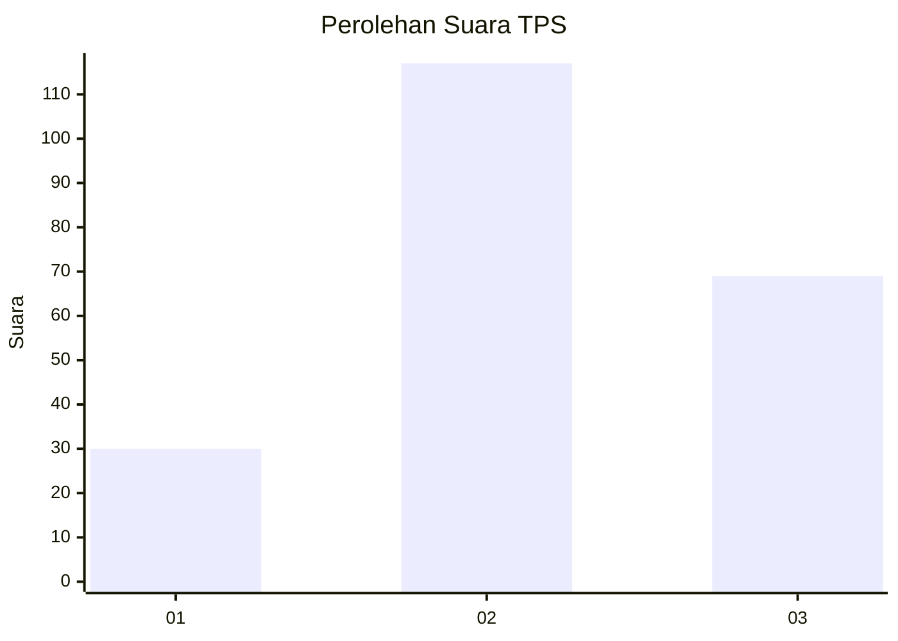
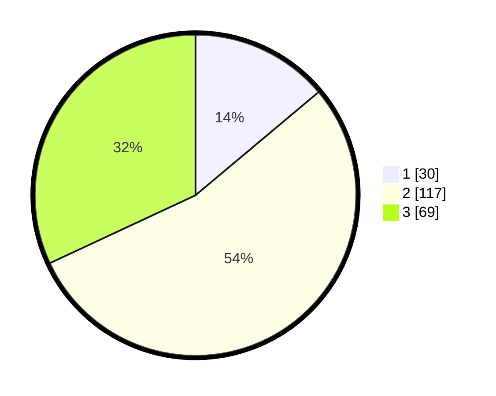

# Hasil

## Grafik

## Tabel

| No. | Nama Paslon    | Suara | Suara (raw) | Persentase |
|:--- |:-------------- | -----:| -----------:| ----------:|
| 1   | ANIES MUHAIMIN | 30    | [30][p-1]   | 13,89      |
| 2   | PRABOWO GIBRAN | 117   | [117][p-2]  | 54,17      |
| 3   | GANJAR MAHFUD  | 69    | [69][p-3]   | 31,94      |

[p-1]: https://github.com/gigit-pemilu/pemilu-2024/blob/main/pilpres/hitung-suara/sub/33-jawa-tengah/sub/28-tegal/sub/09-pangkah/sub/2019-jenggawur/sub/003-tps/sub/paslon-1.txt
[p-2]: https://github.com/gigit-pemilu/pemilu-2024/blob/main/pilpres/hitung-suara/sub/33-jawa-tengah/sub/28-tegal/sub/09-pangkah/sub/2019-jenggawur/sub/003-tps/sub/paslon-2.txt
[p-3]: https://github.com/gigit-pemilu/pemilu-2024/blob/main/pilpres/hitung-suara/sub/33-jawa-tengah/sub/28-tegal/sub/09-pangkah/sub/2019-jenggawur/sub/003-tps/sub/paslon-3.txt

## Foto C Plano

https://sirekap-obj-formc.kpu.go.id/d588/pemilu/ppwp/33/28/09/20/19/3328092019003-20240214-224845--d4fafb89-78bd-4bb4-891d-8e00061936ea.jpg

https://sirekap-obj-formc.kpu.go.id/d588/pemilu/ppwp/33/28/09/20/19/3328092019003-20240214-231344--6649b7c5-1e09-4ab7-bfcb-9a66120c3bd8.jpg

https://sirekap-obj-formc.kpu.go.id/d588/pemilu/ppwp/33/28/09/20/19/3328092019003-20240214-231349--5d692027-0c92-4a17-af22-6c64ae2849aa.jpg

## Metadata

| Key        | Value               |
| ---------- | ------------------- |
| Time Stamp | 2024-02-19 10:00:00 |

