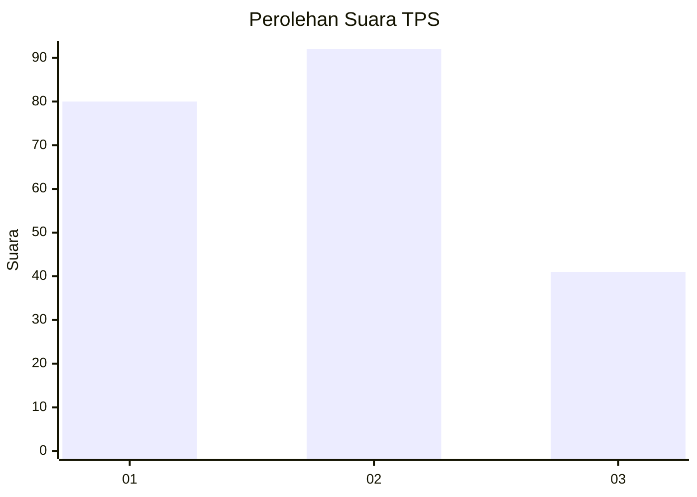
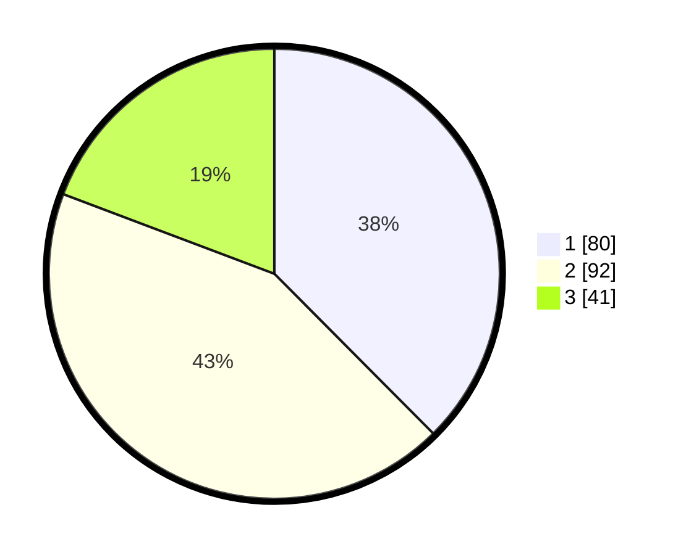

# Hasil

## Grafik

## Tabel

| No. | Nama Paslon    | Suara | Suara (raw) | Persentase |
|:--- |:-------------- | -----:| -----------:| ----------:|
| 1   | ANIES MUHAIMIN | 80    | [80][p-1]   | 37,56      |
| 2   | PRABOWO GIBRAN | 92    | [92][p-2]   | 43,19      |
| 3   | GANJAR MAHFUD  | 41    | [41][p-3]   | 19,25      |

[p-1]: https://github.com/gigit-pemilu/pemilu-2024-33-jawa-tengah/blob/main/pilpres/hitung-suara/sub/33-jawa-tengah/sub/28-tegal/sub/10-slawi/sub/1006-pakembaran/sub/001-tps/sub/paslon-1.txt
[p-2]: https://github.com/gigit-pemilu/pemilu-2024-33-jawa-tengah/blob/main/pilpres/hitung-suara/sub/33-jawa-tengah/sub/28-tegal/sub/10-slawi/sub/1006-pakembaran/sub/001-tps/sub/paslon-2.txt
[p-3]: https://github.com/gigit-pemilu/pemilu-2024-33-jawa-tengah/blob/main/pilpres/hitung-suara/sub/33-jawa-tengah/sub/28-tegal/sub/10-slawi/sub/1006-pakembaran/sub/001-tps/sub/paslon-3.txt

## Foto C Plano

https://sirekap-obj-formc.kpu.go.id/8639/pemilu/ppwp/33/28/10/10/06/3328101006001-20240220-115009--23d606c6-b848-4c1d-b590-16876f2ee74c.jpg

https://sirekap-obj-formc.kpu.go.id/8639/pemilu/ppwp/33/28/10/10/06/3328101006001-20240220-115157--b6d7bd5c-89e5-4b13-828a-d786966c5c80.jpg

https://sirekap-obj-formc.kpu.go.id/8639/pemilu/ppwp/33/28/10/10/06/3328101006001-20240220-115243--af034d64-8f20-494f-98ed-de3f8e89ddb5.jpg

## Metadata

| Key        | Value               |
| ---------- | ------------------- |
| Time Stamp | 2024-02-25 17:00:00 |

