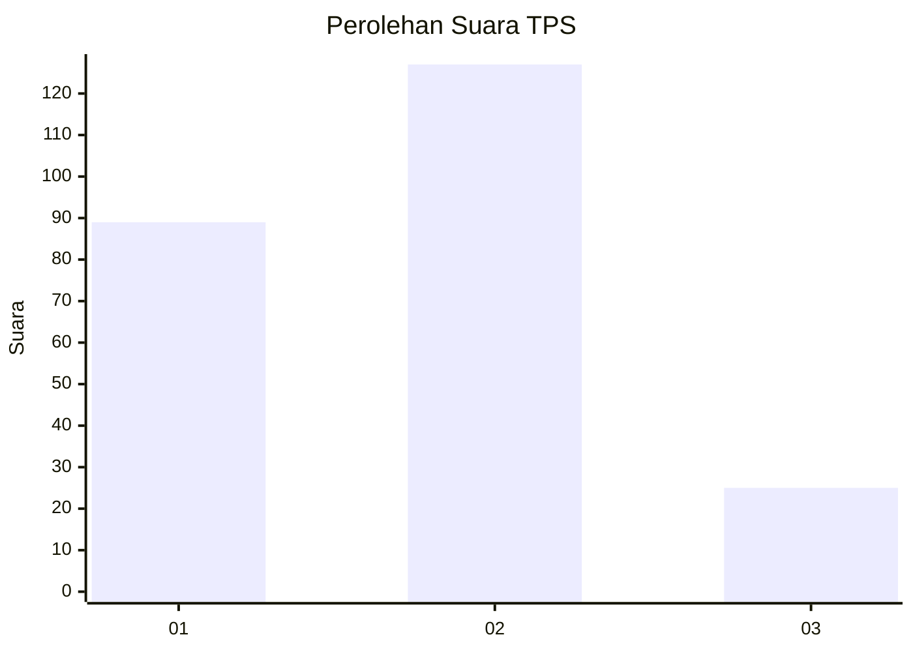

# Hasil

## Grafik

## Tabel

| No. | Nama Paslon    | Suara | Suara (raw) | Persentase |
|:--- |:-------------- | -----:| -----------:| ----------:|
| 1   | ANIES MUHAIMIN | 89    | [89][p-1]   | 36,93      |
| 2   | PRABOWO GIBRAN | 127   | [127][p-2]  | 52,70      |
| 3   | GANJAR MAHFUD  | 25    | [25][p-3]   | 10,37      |

[p-1]: https://github.com/gigit-pemilu/pemilu-2024/blob/main/pilpres/hitung-suara/sub/33-jawa-tengah/sub/28-tegal/sub/10-slawi/sub/1007-kagok/sub/005-tps/sub/paslon-1.txt
[p-2]: https://github.com/gigit-pemilu/pemilu-2024/blob/main/pilpres/hitung-suara/sub/33-jawa-tengah/sub/28-tegal/sub/10-slawi/sub/1007-kagok/sub/005-tps/sub/paslon-2.txt
[p-3]: https://github.com/gigit-pemilu/pemilu-2024/blob/main/pilpres/hitung-suara/sub/33-jawa-tengah/sub/28-tegal/sub/10-slawi/sub/1007-kagok/sub/005-tps/sub/paslon-3.txt

## Foto C Plano

https://sirekap-obj-formc.kpu.go.id/ea6f/pemilu/ppwp/33/28/10/10/07/3328101007005-20240214-212508--ccfc5854-c6e0-40ac-ab2f-027904b6f7df.jpg

https://sirekap-obj-formc.kpu.go.id/ea6f/pemilu/ppwp/33/28/10/10/07/3328101007005-20240214-212702--2fc5ce75-34d9-4cb7-a2cb-fe2158ff44de.jpg

https://sirekap-obj-formc.kpu.go.id/ea6f/pemilu/ppwp/33/28/10/10/07/3328101007005-20240214-204330--91aeb8e6-dfa4-4b68-a529-2f86474c36ef.jpg

## Metadata

| Key        | Value               |
| ---------- | ------------------- |
| Time Stamp | 2024-02-15 19:30:26 |

