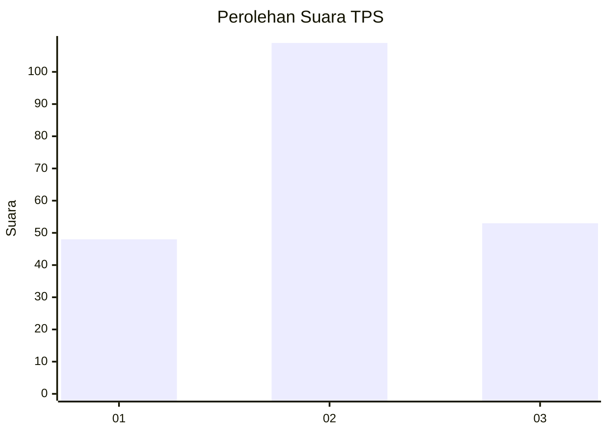
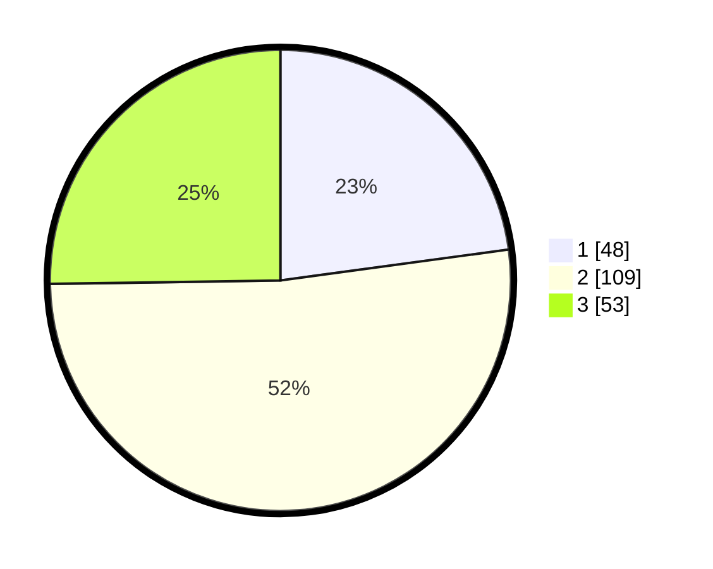

# Hasil

## Grafik

## Tabel

| No. | Nama Paslon    | Suara | Suara (raw) | Persentase |
|:--- |:-------------- | -----:| -----------:| ----------:|
| 1   | ANIES MUHAIMIN | 48    | [48][p-1]   | 22,86      |
| 2   | PRABOWO GIBRAN | 109   | [109][p-2]  | 51,90      |
| 3   | GANJAR MAHFUD  | 53    | [53][p-3]   | 25,24      |

[p-1]: https://github.com/gigit-pemilu/pemilu-2024/blob/main/pilpres/hitung-suara/sub/33-jawa-tengah/sub/28-tegal/sub/10-slawi/sub/1009-kudaile/sub/004-tps/sub/paslon-1.txt
[p-2]: https://github.com/gigit-pemilu/pemilu-2024/blob/main/pilpres/hitung-suara/sub/33-jawa-tengah/sub/28-tegal/sub/10-slawi/sub/1009-kudaile/sub/004-tps/sub/paslon-2.txt
[p-3]: https://github.com/gigit-pemilu/pemilu-2024/blob/main/pilpres/hitung-suara/sub/33-jawa-tengah/sub/28-tegal/sub/10-slawi/sub/1009-kudaile/sub/004-tps/sub/paslon-3.txt

## Foto C Plano

https://sirekap-obj-formc.kpu.go.id/063d/pemilu/ppwp/33/28/10/10/09/3328101009004-20240215-030201--2cd1d283-e34a-495e-8bc2-729ce666758e.jpg

https://sirekap-obj-formc.kpu.go.id/063d/pemilu/ppwp/33/28/10/10/09/3328101009004-20240215-030639--7eb5ff70-d4f7-431c-8b44-794f5a6b7da6.jpg

https://sirekap-obj-formc.kpu.go.id/063d/pemilu/ppwp/33/28/10/10/09/3328101009004-20240215-030709--133671dd-7f29-484a-9d74-045a3c88fc35.jpg

## Metadata

| Key        | Value               |
| ---------- | ------------------- |
| Time Stamp | 2024-02-17 16:00:02 |

