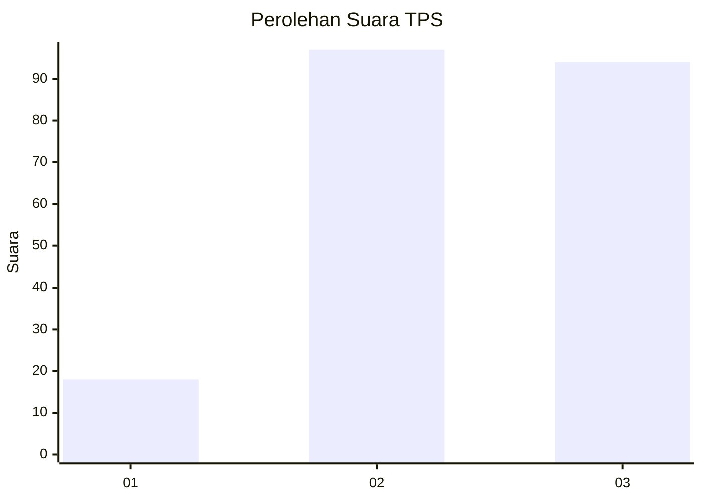
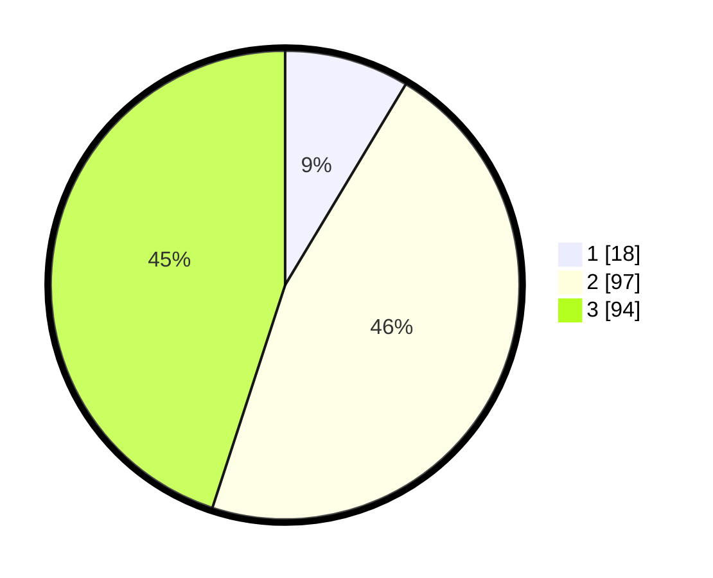

# Hasil

## Grafik

## Tabel

| No. | Nama Paslon    | Suara | Suara (raw) | Persentase |
|:--- |:-------------- | -----:| -----------:| ----------:|
| 1   | ANIES MUHAIMIN | 18    | [18][p-1]   | 8,61       |
| 2   | PRABOWO GIBRAN | 97    | [97][p-2]   | 46,41      |
| 3   | GANJAR MAHFUD  | 94    | [94][p-3]   | 44,98      |

[p-1]: https://github.com/gigit-pemilu/pemilu-2024/blob/main/pilpres/hitung-suara/sub/33-jawa-tengah/sub/28-tegal/sub/10-slawi/sub/2002-dukuhwringin/sub/003-tps/sub/paslon-1.txt
[p-2]: https://github.com/gigit-pemilu/pemilu-2024/blob/main/pilpres/hitung-suara/sub/33-jawa-tengah/sub/28-tegal/sub/10-slawi/sub/2002-dukuhwringin/sub/003-tps/sub/paslon-2.txt
[p-3]: https://github.com/gigit-pemilu/pemilu-2024/blob/main/pilpres/hitung-suara/sub/33-jawa-tengah/sub/28-tegal/sub/10-slawi/sub/2002-dukuhwringin/sub/003-tps/sub/paslon-3.txt

## Foto C Plano

https://sirekap-obj-formc.kpu.go.id/435a/pemilu/ppwp/33/28/10/20/02/3328102002003-20240215-014629--3918ddce-cd5d-4dca-a497-dee428d77e92.jpg

https://sirekap-obj-formc.kpu.go.id/435a/pemilu/ppwp/33/28/10/20/02/3328102002003-20240215-014731--2de69b03-9aa4-41a9-af21-463e2fec3101.jpg

https://sirekap-obj-formc.kpu.go.id/435a/pemilu/ppwp/33/28/10/20/02/3328102002003-20240215-014835--9b9ca65e-3d9a-49fd-adcf-5daabf0138d9.jpg

## Metadata

| Key        | Value               |
| ---------- | ------------------- |
| Time Stamp | 2024-02-17 13:37:34 |

