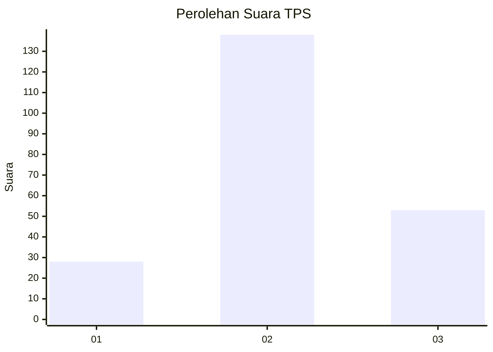
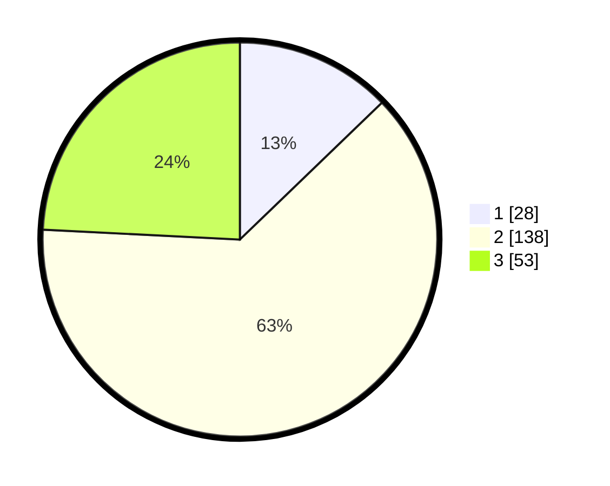

# Hasil

## Grafik

## Tabel

| No. | Nama Paslon    | Suara | Suara (raw) | Persentase |
|:--- |:-------------- | -----:| -----------:| ----------:|
| 1   | ANIES MUHAIMIN | 28    | [28][p-1]   | 12,79      |
| 2   | PRABOWO GIBRAN | 138   | [138][p-2]  | 63,01      |
| 3   | GANJAR MAHFUD  | 53    | [53][p-3]   | 24,20      |

[p-1]: https://github.com/gigit-pemilu/pemilu-2024/blob/main/pilpres/hitung-suara/sub/33-jawa-tengah/sub/28-tegal/sub/11-adiwerna/sub/2006-harjosari-lor/sub/007-tps/sub/paslon-1.txt
[p-2]: https://github.com/gigit-pemilu/pemilu-2024/blob/main/pilpres/hitung-suara/sub/33-jawa-tengah/sub/28-tegal/sub/11-adiwerna/sub/2006-harjosari-lor/sub/007-tps/sub/paslon-2.txt
[p-3]: https://github.com/gigit-pemilu/pemilu-2024/blob/main/pilpres/hitung-suara/sub/33-jawa-tengah/sub/28-tegal/sub/11-adiwerna/sub/2006-harjosari-lor/sub/007-tps/sub/paslon-3.txt

## Foto C Plano

https://sirekap-obj-formc.kpu.go.id/f78c/pemilu/ppwp/33/28/11/20/06/3328112006007-20240217-174527--f83ba7bb-281d-4858-8728-1625fd94f882.jpg

https://sirekap-obj-formc.kpu.go.id/f78c/pemilu/ppwp/33/28/11/20/06/3328112006007-20240217-174021--68f53395-0fdf-4cf6-afd4-ed93d95f9718.jpg

https://sirekap-obj-formc.kpu.go.id/f78c/pemilu/ppwp/33/28/11/20/06/3328112006007-20240217-174119--6c3bffe6-08d2-46f3-b4ef-f38921d5754e.jpg

## Metadata

| Key        | Value               |
| ---------- | ------------------- |
| Time Stamp | 2024-02-17 18:00:00 |

## DATA PEMILIH TETAP

Jumlah pemilih dalam DPT: **297**.
 * L: **645**.
 * P: **152**.

## DATA PENGGUNA HAK PILIH

Jumlah pengguna hak pilih dalam DPT: **225**.
 * L: **102**.
 * P: **127**.

Jumlah pengguna hak pilih dalam DPTb: **88**.
 * L: **401**.
 * P: **888**.

Jumlah pengguna hak pilih dalam DPK: **802**.
 * L: **488**.
 * P: **808**.

Jumlah pengguna hak pilih: **227**.
 * L: **193**.
 * P: **524**.

## JUMLAH SUARA SAH DAN TIDAK SAH

JUMLAH SELURUH SUARA SAH: **219**.

JUMLAH SUARA TIDAK SAH: **8**.

JUMLAH SELURUH SUARA SAH DAN SUARA TIDAK SAH: **227**.

