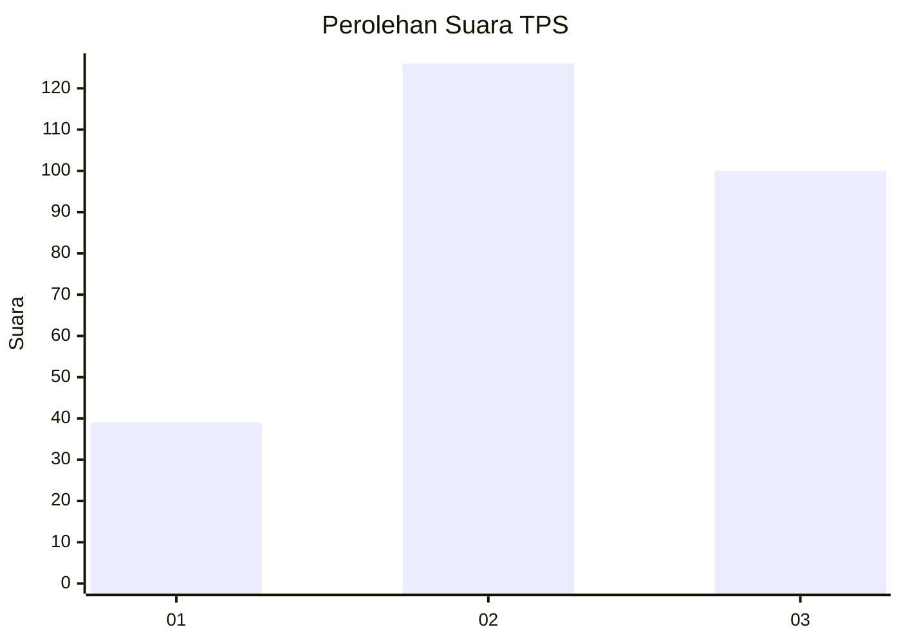
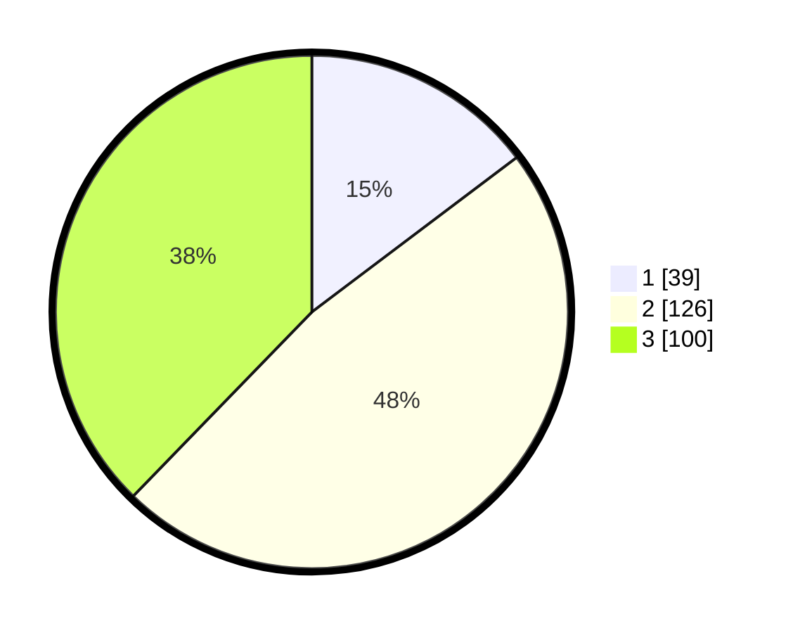

# Hasil

## Grafik

## Tabel

| No. | Nama Paslon    | Suara | Suara (raw) | Persentase |
|:--- |:-------------- | -----:| -----------:| ----------:|
| 1   | ANIES MUHAIMIN | 39    | [39][p-1]   | 14,72      |
| 2   | PRABOWO GIBRAN | 126   | [126][p-2]  | 47,55      |
| 3   | GANJAR MAHFUD  | 100   | [100][p-3]  | 37,74      |

[p-1]: https://github.com/gigit-pemilu/pemilu-2024/blob/main/pilpres/hitung-suara/sub/33-jawa-tengah/sub/28-tegal/sub/12-talang/sub/2007-dukuhmalang/sub/002-tps/sub/paslon-1.txt
[p-2]: https://github.com/gigit-pemilu/pemilu-2024/blob/main/pilpres/hitung-suara/sub/33-jawa-tengah/sub/28-tegal/sub/12-talang/sub/2007-dukuhmalang/sub/002-tps/sub/paslon-2.txt
[p-3]: https://github.com/gigit-pemilu/pemilu-2024/blob/main/pilpres/hitung-suara/sub/33-jawa-tengah/sub/28-tegal/sub/12-talang/sub/2007-dukuhmalang/sub/002-tps/sub/paslon-3.txt

## Foto C Plano

https://sirekap-obj-formc.kpu.go.id/8397/pemilu/ppwp/33/28/12/20/07/3328122007002-20240214-223959--3890d09f-46c8-4aa1-a2ac-c87ab54ed77b.jpg

https://sirekap-obj-formc.kpu.go.id/8397/pemilu/ppwp/33/28/12/20/07/3328122007002-20240221-163344--b844fa83-fbd4-4ad3-8d86-df1160361b29.jpg

https://sirekap-obj-formc.kpu.go.id/8397/pemilu/ppwp/33/28/12/20/07/3328122007002-20240220-222711--4d8f2f71-1a7d-45a0-8d31-a166042dc7e2.jpg

## Metadata

| Key        | Value               |
| ---------- | ------------------- |
| Time Stamp | 2024-02-24 22:31:28 |

