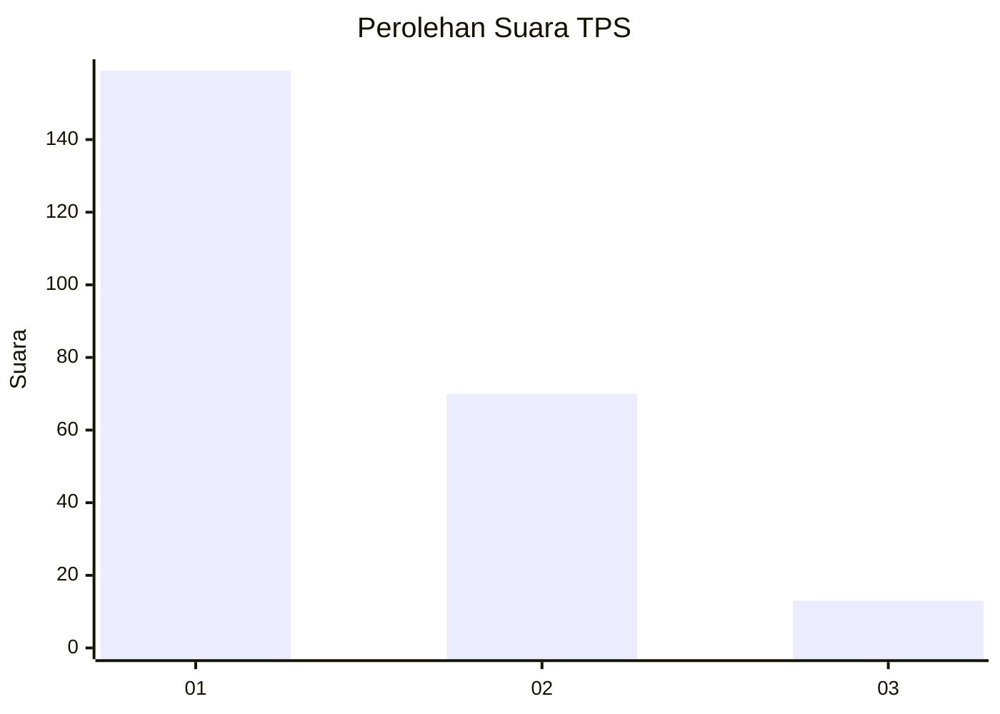
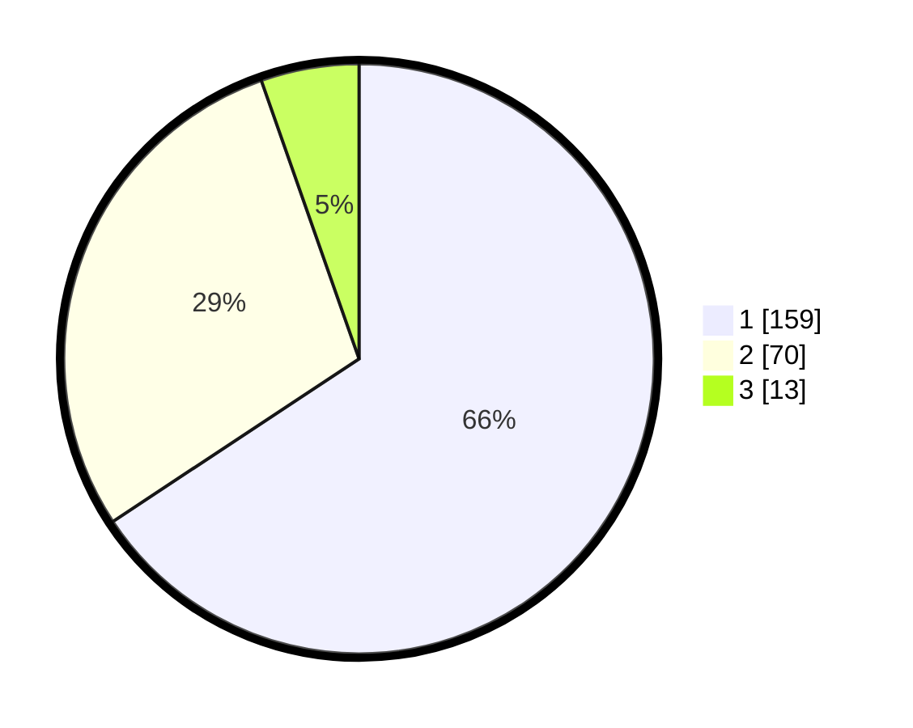

# Hasil

## Grafik

## Tabel

| No. | Nama Paslon    | Suara | Suara (raw) | Persentase |
|:--- |:-------------- | -----:| -----------:| ----------:|
| 1   | ANIES MUHAIMIN | 159   | [159][p-1]  | 65,70      |
| 2   | PRABOWO GIBRAN | 70    | [70][p-2]   | 28,93      |
| 3   | GANJAR MAHFUD  | 13    | [13][p-3]   | 5,37       |

[p-1]: https://github.com/gigit-pemilu/pemilu-2024/blob/main/pilpres/hitung-suara/sub/33-jawa-tengah/sub/28-tegal/sub/12-talang/sub/2008-pesayangan/sub/002-tps/sub/paslon-1.txt
[p-2]: https://github.com/gigit-pemilu/pemilu-2024/blob/main/pilpres/hitung-suara/sub/33-jawa-tengah/sub/28-tegal/sub/12-talang/sub/2008-pesayangan/sub/002-tps/sub/paslon-2.txt
[p-3]: https://github.com/gigit-pemilu/pemilu-2024/blob/main/pilpres/hitung-suara/sub/33-jawa-tengah/sub/28-tegal/sub/12-talang/sub/2008-pesayangan/sub/002-tps/sub/paslon-3.txt

## Foto C Plano

https://sirekap-obj-formc.kpu.go.id/73eb/pemilu/ppwp/33/28/12/20/08/3328122008002-20240214-194827--532b76db-cce0-49a2-89fc-362fb3ca4ae4.jpg

https://sirekap-obj-formc.kpu.go.id/73eb/pemilu/ppwp/33/28/12/20/08/3328122008002-20240214-195308--1d6f0174-9347-4bad-b813-599facce3470.jpg

https://sirekap-obj-formc.kpu.go.id/73eb/pemilu/ppwp/33/28/12/20/08/3328122008002-20240214-195523--95d5ff3d-1cb9-4054-8e01-bf5639256ee8.jpg

## Metadata

| Key        | Value               |
| ---------- | ------------------- |
| Time Stamp | 2024-02-17 16:52:47 |

