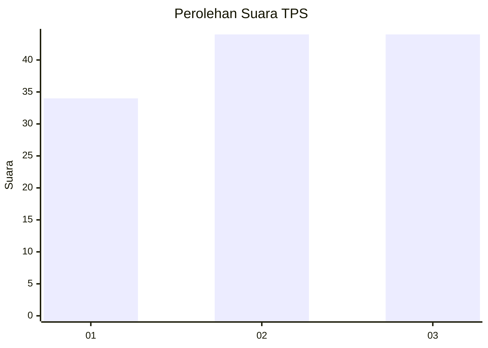
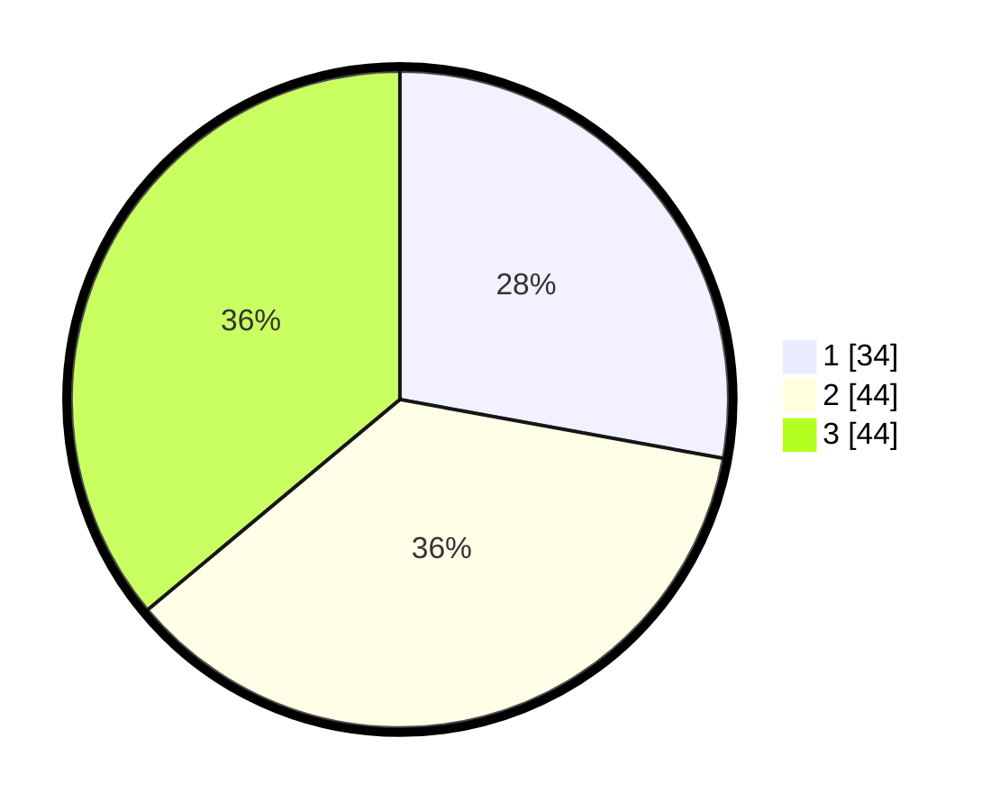

# Hasil

## Grafik

## Tabel

| No. | Nama Paslon    | Suara | Suara (raw) | Persentase |
|:--- |:-------------- | -----:| -----------:| ----------:|
| 1   | ANIES MUHAIMIN | 34    | [34][p-1]   | 27,87      |
| 2   | PRABOWO GIBRAN | 44    | [44][p-2]   | 36,07      |
| 3   | GANJAR MAHFUD  | 44    | [44][p-3]   | 36,07      |

[p-1]: https://github.com/gigit-pemilu/pemilu-2024-33-jawa-tengah/blob/main/pilpres/hitung-suara/sub/33-jawa-tengah/sub/28-tegal/sub/12-talang/sub/2012-kaligayam/sub/019-tps/sub/paslon-1.txt
[p-2]: https://github.com/gigit-pemilu/pemilu-2024-33-jawa-tengah/blob/main/pilpres/hitung-suara/sub/33-jawa-tengah/sub/28-tegal/sub/12-talang/sub/2012-kaligayam/sub/019-tps/sub/paslon-2.txt
[p-3]: https://github.com/gigit-pemilu/pemilu-2024-33-jawa-tengah/blob/main/pilpres/hitung-suara/sub/33-jawa-tengah/sub/28-tegal/sub/12-talang/sub/2012-kaligayam/sub/019-tps/sub/paslon-3.txt

## Foto C Plano

https://sirekap-obj-formc.kpu.go.id/a1fc/pemilu/ppwp/33/28/12/20/12/3328122012019-20240219-110452--d5531df6-31db-4ccb-a692-6d75796fae30.jpg

https://sirekap-obj-formc.kpu.go.id/a1fc/pemilu/ppwp/33/28/12/20/12/3328122012019-20240219-110140--db246d18-9520-4d93-a276-6943c52fefea.jpg

https://sirekap-obj-formc.kpu.go.id/a1fc/pemilu/ppwp/33/28/12/20/12/3328122012019-20240219-214614--cdd5bfb3-6048-4d1e-b673-50837aeb0392.jpg

## Metadata

| Key        | Value               |
| ---------- | ------------------- |
| Time Stamp | 2024-02-19 22:00:00 |

