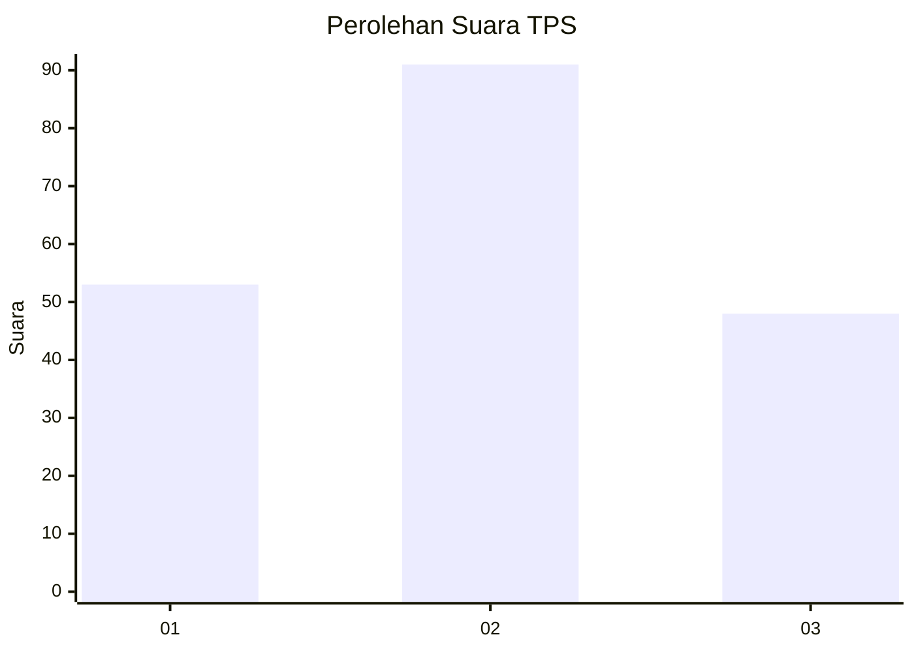
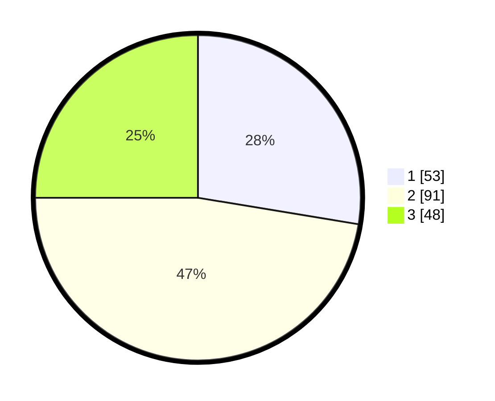

# Hasil

## Grafik

## Tabel

| No. | Nama Paslon    | Suara | Suara (raw) | Persentase |
|:--- |:-------------- | -----:| -----------:| ----------:|
| 1   | ANIES MUHAIMIN | 53    | [53][p-1]   | 27,60      |
| 2   | PRABOWO GIBRAN | 91    | [91][p-2]   | 47,40      |
| 3   | GANJAR MAHFUD  | 48    | [48][p-3]   | 25,00      |

[p-1]: https://github.com/gigit-pemilu/pemilu-2024/blob/main/pilpres/hitung-suara/sub/33-jawa-tengah/sub/28-tegal/sub/13-dukuhturi/sub/2001-ketanggungan/sub/001-tps/sub/paslon-1.txt
[p-2]: https://github.com/gigit-pemilu/pemilu-2024/blob/main/pilpres/hitung-suara/sub/33-jawa-tengah/sub/28-tegal/sub/13-dukuhturi/sub/2001-ketanggungan/sub/001-tps/sub/paslon-2.txt
[p-3]: https://github.com/gigit-pemilu/pemilu-2024/blob/main/pilpres/hitung-suara/sub/33-jawa-tengah/sub/28-tegal/sub/13-dukuhturi/sub/2001-ketanggungan/sub/001-tps/sub/paslon-3.txt

## Foto C Plano

https://sirekap-obj-formc.kpu.go.id/8e44/pemilu/ppwp/33/28/13/20/01/3328132001001-20240215-002236--42dfb104-f64f-4132-b7fe-b3db74aafe03.jpg

https://sirekap-obj-formc.kpu.go.id/8e44/pemilu/ppwp/33/28/13/20/01/3328132001001-20240215-004112--b4e6460e-c50b-4fab-8953-e865405c64ed.jpg

https://sirekap-obj-formc.kpu.go.id/8e44/pemilu/ppwp/33/28/13/20/01/3328132001001-20240215-005558--b6a2ad33-0650-4e6f-91a6-8d6b595b7904.jpg

## Metadata

| Key        | Value               |
| ---------- | ------------------- |
| Time Stamp | 2024-02-15 12:00:28 |

