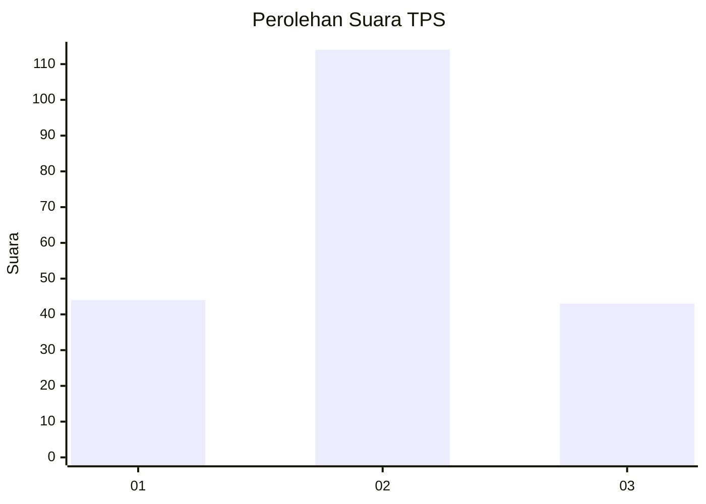
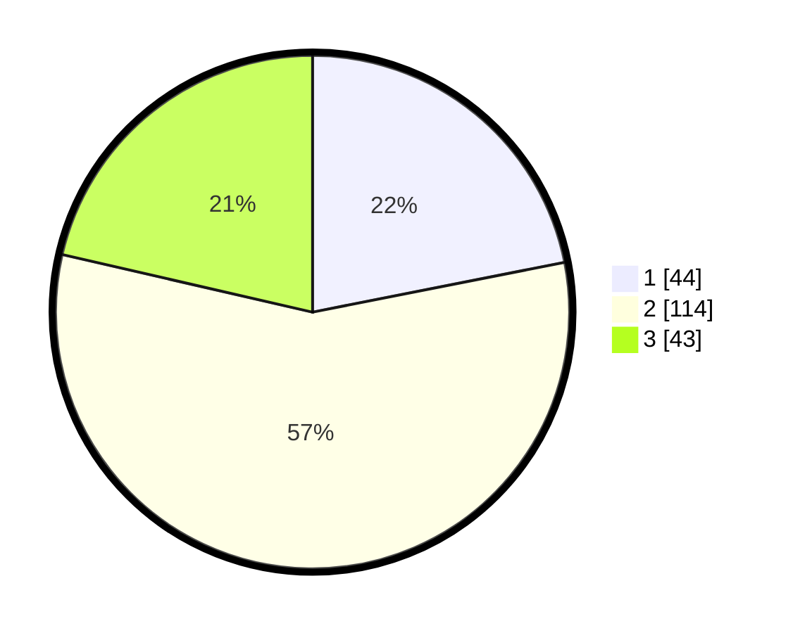

# Hasil

## Grafik

## Tabel

| No. | Nama Paslon    | Suara | Suara (raw) | Persentase |
|:--- |:-------------- | -----:| -----------:| ----------:|
| 1   | ANIES MUHAIMIN | 44    | [44][p-1]   | 21,89      |
| 2   | PRABOWO GIBRAN | 114   | [114][p-2]  | 56,72      |
| 3   | GANJAR MAHFUD  | 43    | [43][p-3]   | 21,39      |

[p-1]: https://github.com/gigit-pemilu/pemilu-2024/blob/main/pilpres/hitung-suara/sub/33-jawa-tengah/sub/28-tegal/sub/13-dukuhturi/sub/2001-ketanggungan/sub/004-tps/sub/paslon-1.txt
[p-2]: https://github.com/gigit-pemilu/pemilu-2024/blob/main/pilpres/hitung-suara/sub/33-jawa-tengah/sub/28-tegal/sub/13-dukuhturi/sub/2001-ketanggungan/sub/004-tps/sub/paslon-2.txt
[p-3]: https://github.com/gigit-pemilu/pemilu-2024/blob/main/pilpres/hitung-suara/sub/33-jawa-tengah/sub/28-tegal/sub/13-dukuhturi/sub/2001-ketanggungan/sub/004-tps/sub/paslon-3.txt

## Foto C Plano

https://sirekap-obj-formc.kpu.go.id/5912/pemilu/ppwp/33/28/13/20/01/3328132001004-20240215-001630--ca5dbd6a-0c33-4368-a981-4f293eb9bf2d.jpg

https://sirekap-obj-formc.kpu.go.id/5912/pemilu/ppwp/33/28/13/20/01/3328132001004-20240215-001649--61edcaea-2a69-4fab-8d55-205702ba2750.jpg

https://sirekap-obj-formc.kpu.go.id/5912/pemilu/ppwp/33/28/13/20/01/3328132001004-20240215-001933--62ccfb6a-dac5-4030-bfeb-f741517acd09.jpg

## Metadata

| Key        | Value               |
| ---------- | ------------------- |
| Time Stamp | 2024-02-15 21:01:18 |

