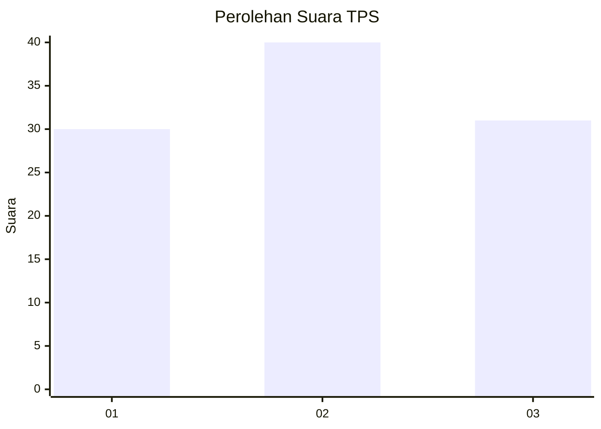
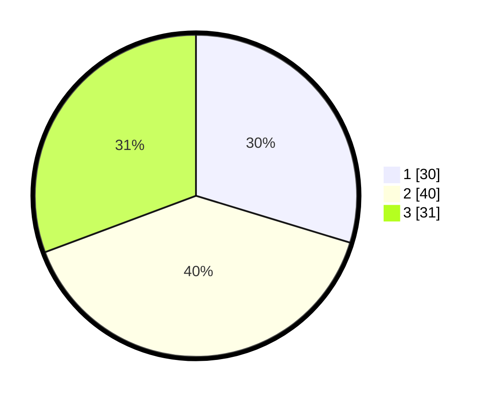

# Hasil

## Grafik

## Tabel

| No. | Nama Paslon    | Suara | Suara (raw) | Persentase |
|:--- |:-------------- | -----:| -----------:| ----------:|
| 1   | ANIES MUHAIMIN | 30    | [30][p-1]   | 29,70      |
| 2   | PRABOWO GIBRAN | 40    | [40][p-2]   | 39,60      |
| 3   | GANJAR MAHFUD  | 31    | [31][p-3]   | 30,69      |

[p-1]: https://github.com/gigit-pemilu/pemilu-2024/blob/main/pilpres/hitung-suara/sub/33-jawa-tengah/sub/28-tegal/sub/13-dukuhturi/sub/2002-kupu/sub/004-tps/sub/paslon-1.txt
[p-2]: https://github.com/gigit-pemilu/pemilu-2024/blob/main/pilpres/hitung-suara/sub/33-jawa-tengah/sub/28-tegal/sub/13-dukuhturi/sub/2002-kupu/sub/004-tps/sub/paslon-2.txt
[p-3]: https://github.com/gigit-pemilu/pemilu-2024/blob/main/pilpres/hitung-suara/sub/33-jawa-tengah/sub/28-tegal/sub/13-dukuhturi/sub/2002-kupu/sub/004-tps/sub/paslon-3.txt

## Foto C Plano

https://sirekap-obj-formc.kpu.go.id/5689/pemilu/ppwp/33/28/13/20/02/3328132002004-20240215-014029--1b67fb99-5843-4e61-b41c-ab1a1733328d.jpg

https://sirekap-obj-formc.kpu.go.id/5689/pemilu/ppwp/33/28/13/20/02/3328132002004-20240215-014416--b4c99d12-8010-4c49-95d8-8b9d07e13d20.jpg

https://sirekap-obj-formc.kpu.go.id/5689/pemilu/ppwp/33/28/13/20/02/3328132002004-20240215-014711--98d61c4c-5317-41cc-b60a-b41e23490e41.jpg

## Metadata

| Key        | Value               |
| ---------- | ------------------- |
| Time Stamp | 2024-02-15 17:00:25 |

