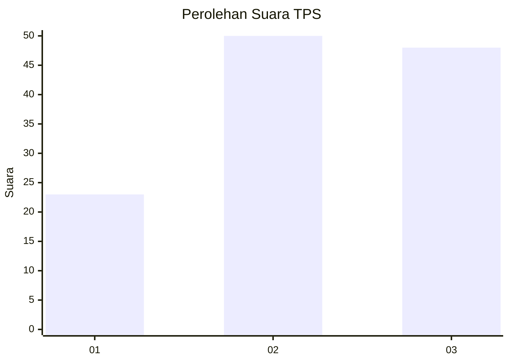
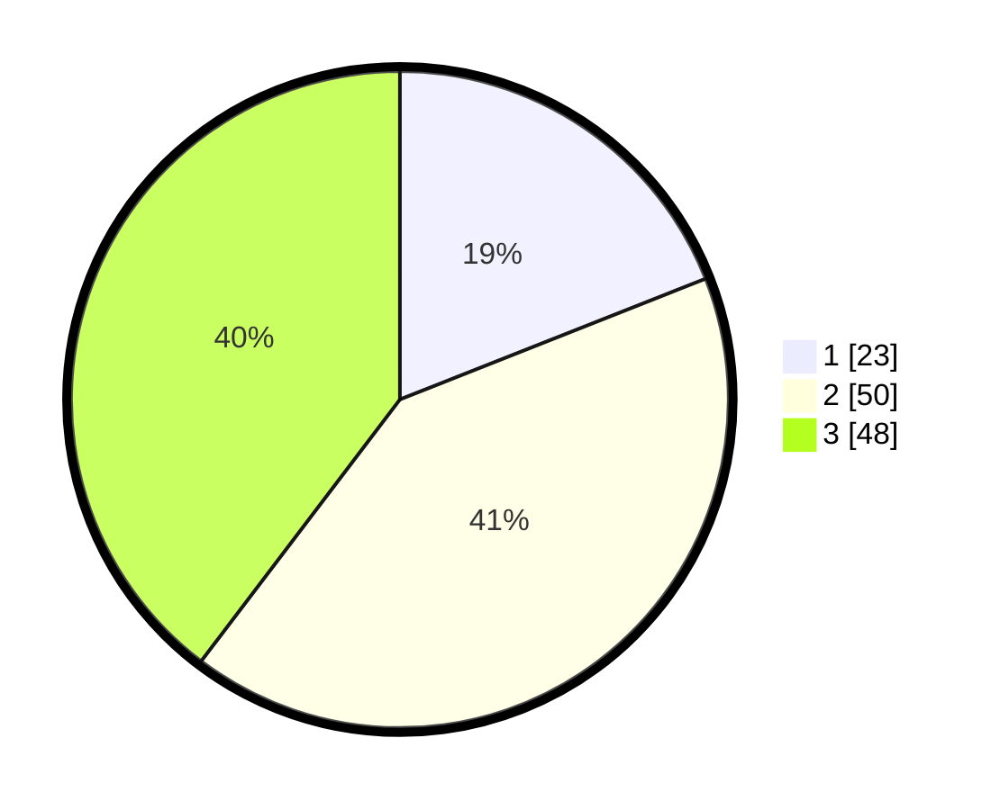

# Hasil

## Grafik

## Tabel

| No. | Nama Paslon    | Suara | Suara (raw) | Persentase |
|:--- |:-------------- | -----:| -----------:| ----------:|
| 1   | ANIES MUHAIMIN | 23    | [23][p-1]   | 19,01      |
| 2   | PRABOWO GIBRAN | 50    | [50][p-2]   | 41,32      |
| 3   | GANJAR MAHFUD  | 48    | [48][p-3]   | 39,67      |

[p-1]: https://github.com/gigit-pemilu/pemilu-2024/blob/main/pilpres/hitung-suara/sub/33-jawa-tengah/sub/28-tegal/sub/13-dukuhturi/sub/2003-sidakaton/sub/015-tps/sub/paslon-1.txt
[p-2]: https://github.com/gigit-pemilu/pemilu-2024/blob/main/pilpres/hitung-suara/sub/33-jawa-tengah/sub/28-tegal/sub/13-dukuhturi/sub/2003-sidakaton/sub/015-tps/sub/paslon-2.txt
[p-3]: https://github.com/gigit-pemilu/pemilu-2024/blob/main/pilpres/hitung-suara/sub/33-jawa-tengah/sub/28-tegal/sub/13-dukuhturi/sub/2003-sidakaton/sub/015-tps/sub/paslon-3.txt

## Foto C Plano

https://sirekap-obj-formc.kpu.go.id/91db/pemilu/ppwp/33/28/13/20/03/3328132003015-20240214-191713--dabe3f26-17db-406d-b233-e1dcfc9ced6b.jpg

https://sirekap-obj-formc.kpu.go.id/91db/pemilu/ppwp/33/28/13/20/03/3328132003015-20240214-192047--8bed5c9e-a9d3-4a1b-91d0-01d1ca9bb6c2.jpg

https://sirekap-obj-formc.kpu.go.id/91db/pemilu/ppwp/33/28/13/20/03/3328132003015-20240214-192141--eac09ef2-d599-4b13-a1aa-2dab7a975289.jpg

## Metadata

| Key        | Value               |
| ---------- | ------------------- |
| Time Stamp | 2024-02-15 17:00:25 |

