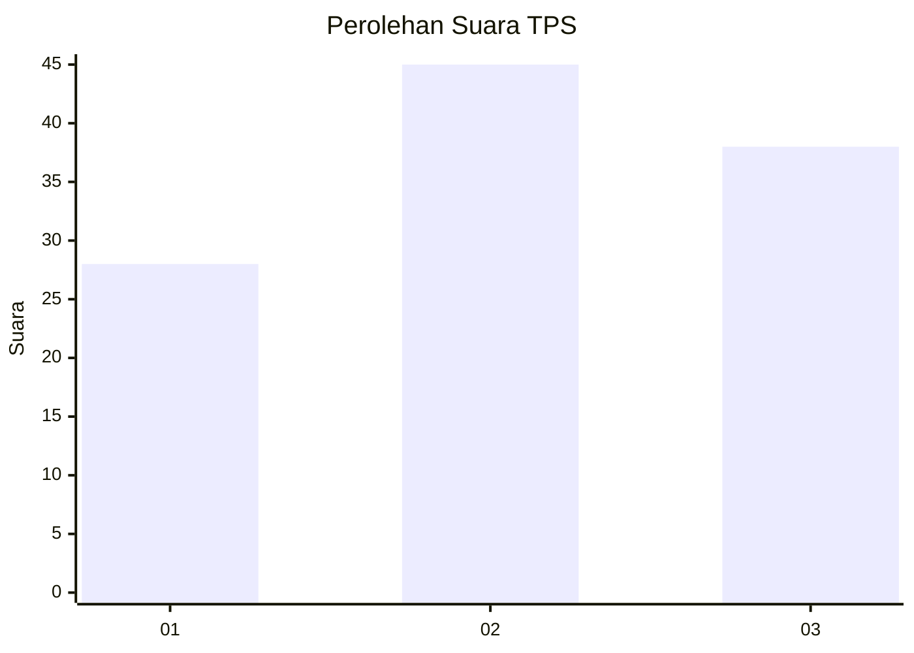
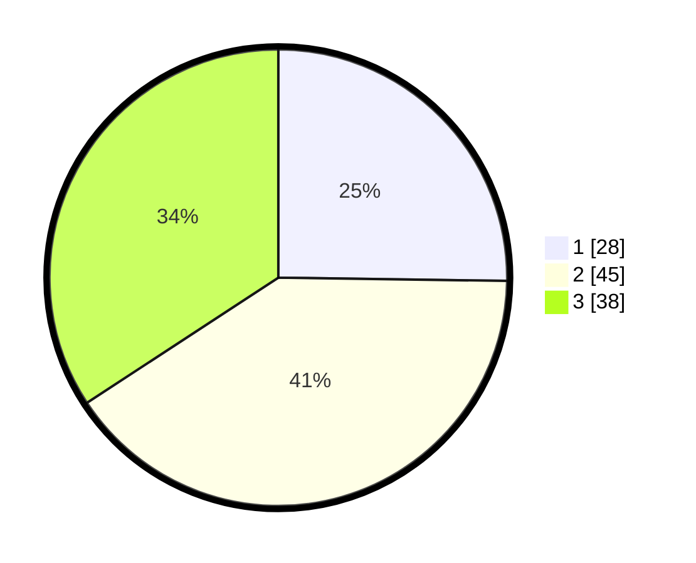

# Hasil

## Grafik

## Tabel

| No. | Nama Paslon    | Suara | Suara (raw) | Persentase |
|:--- |:-------------- | -----:| -----------:| ----------:|
| 1   | ANIES MUHAIMIN | 28    | [28][p-1]   | 25,23      |
| 2   | PRABOWO GIBRAN | 45    | [45][p-2]   | 40,54      |
| 3   | GANJAR MAHFUD  | 38    | [38][p-3]   | 34,23      |

[p-1]: https://github.com/gigit-pemilu/pemilu-2024-33-jawa-tengah/blob/main/pilpres/hitung-suara/sub/33-jawa-tengah/sub/28-tegal/sub/13-dukuhturi/sub/2003-sidakaton/sub/028-tps/sub/paslon-1.txt
[p-2]: https://github.com/gigit-pemilu/pemilu-2024-33-jawa-tengah/blob/main/pilpres/hitung-suara/sub/33-jawa-tengah/sub/28-tegal/sub/13-dukuhturi/sub/2003-sidakaton/sub/028-tps/sub/paslon-2.txt
[p-3]: https://github.com/gigit-pemilu/pemilu-2024-33-jawa-tengah/blob/main/pilpres/hitung-suara/sub/33-jawa-tengah/sub/28-tegal/sub/13-dukuhturi/sub/2003-sidakaton/sub/028-tps/sub/paslon-3.txt

## Foto C Plano

https://sirekap-obj-formc.kpu.go.id/579b/pemilu/ppwp/33/28/13/20/03/3328132003028-20240215-025524--b511c1c0-90f1-49a1-9c93-e5f5004d343f.jpg

https://sirekap-obj-formc.kpu.go.id/579b/pemilu/ppwp/33/28/13/20/03/3328132003028-20240215-025934--256d64b9-492e-4abd-8851-843f79924b82.jpg

https://sirekap-obj-formc.kpu.go.id/579b/pemilu/ppwp/33/28/13/20/03/3328132003028-20240215-030104--07998066-7b0d-439b-adfa-0ccf60ccb31b.jpg

## Metadata

| Key        | Value               |
| ---------- | ------------------- |
| Time Stamp | 2024-02-15 17:00:25 |

