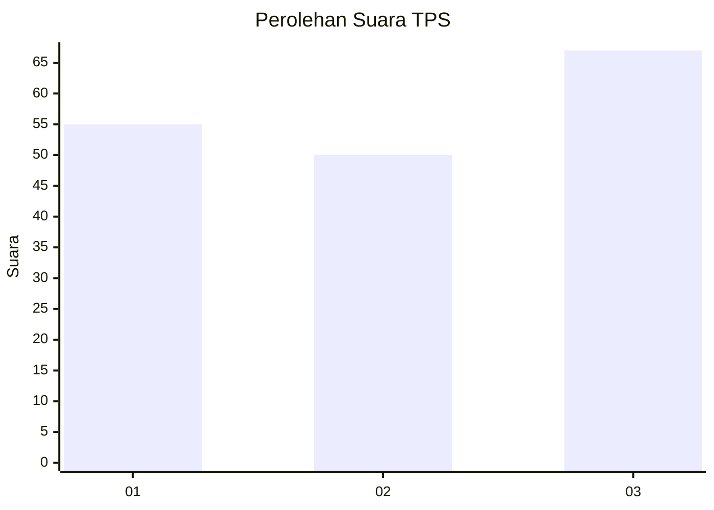
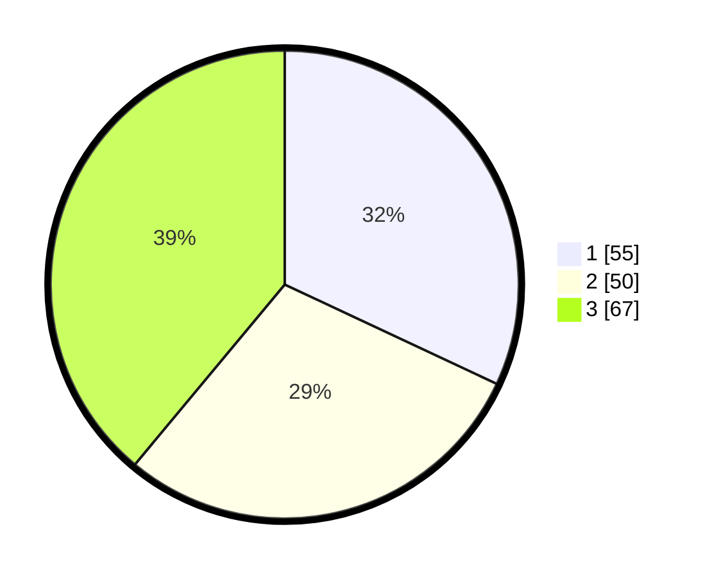

# Hasil

## Grafik

## Tabel

| No. | Nama Paslon    | Suara | Suara (raw) | Persentase |
|:--- |:-------------- | -----:| -----------:| ----------:|
| 1   | ANIES MUHAIMIN | 55    | [55][p-1]   | 31,98      |
| 2   | PRABOWO GIBRAN | 50    | [50][p-2]   | 29,07      |
| 3   | GANJAR MAHFUD  | 67    | [67][p-3]   | 38,95      |

[p-1]: https://github.com/gigit-pemilu/pemilu-2024/blob/main/pilpres/hitung-suara/sub/33-jawa-tengah/sub/28-tegal/sub/13-dukuhturi/sub/2005-pepedan/sub/003-tps/sub/paslon-1.txt
[p-2]: https://github.com/gigit-pemilu/pemilu-2024/blob/main/pilpres/hitung-suara/sub/33-jawa-tengah/sub/28-tegal/sub/13-dukuhturi/sub/2005-pepedan/sub/003-tps/sub/paslon-2.txt
[p-3]: https://github.com/gigit-pemilu/pemilu-2024/blob/main/pilpres/hitung-suara/sub/33-jawa-tengah/sub/28-tegal/sub/13-dukuhturi/sub/2005-pepedan/sub/003-tps/sub/paslon-3.txt

## Foto C Plano

https://sirekap-obj-formc.kpu.go.id/5322/pemilu/ppwp/33/28/13/20/05/3328132005003-20240214-221158--94d03347-8ccd-4853-a8bd-360c93ffc938.jpg

https://sirekap-obj-formc.kpu.go.id/5322/pemilu/ppwp/33/28/13/20/05/3328132005003-20240220-215838--2eb8f29e-1833-42fd-8739-ea56e73ef7bc.jpg

https://sirekap-obj-formc.kpu.go.id/5322/pemilu/ppwp/33/28/13/20/05/3328132005003-20240214-232907--7318ac42-7d64-48f7-8b92-a1c620852bf7.jpg

## Metadata

| Key        | Value               |
| ---------- | ------------------- |
| Time Stamp | 2024-02-20 22:00:00 |

