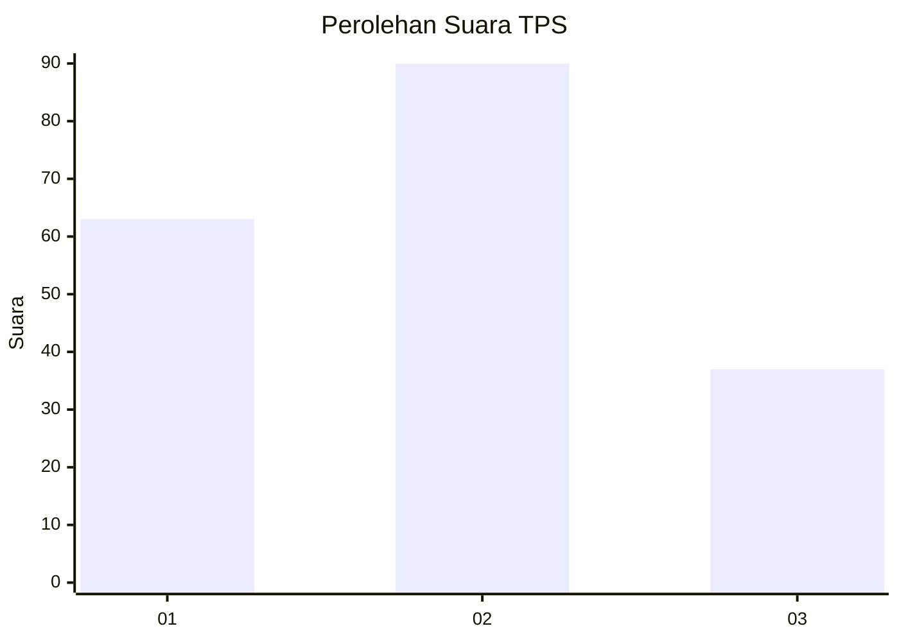
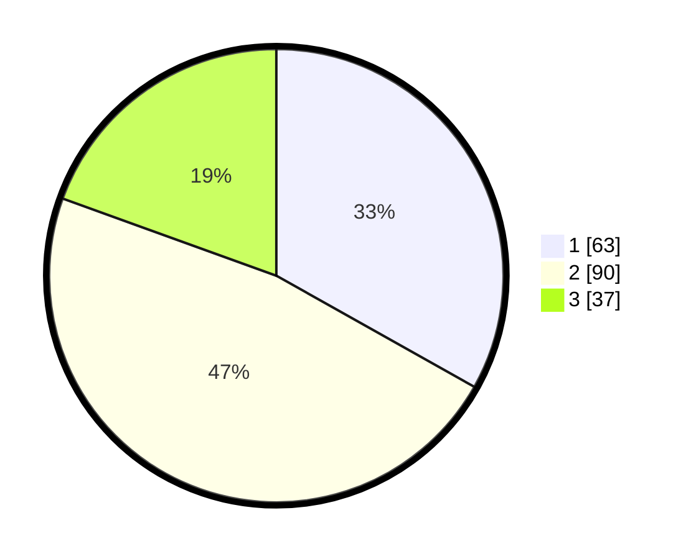

# Hasil

## Grafik

## Tabel

| No. | Nama Paslon    | Suara | Suara (raw) | Persentase |
|:--- |:-------------- | -----:| -----------:| ----------:|
| 1   | ANIES MUHAIMIN | 63    | [63][p-1]   | 33,16      |
| 2   | PRABOWO GIBRAN | 90    | [90][p-2]   | 47,37      |
| 3   | GANJAR MAHFUD  | 37    | [37][p-3]   | 19,47      |

[p-1]: https://github.com/gigit-pemilu/pemilu-2024/blob/main/pilpres/hitung-suara/sub/33-jawa-tengah/sub/28-tegal/sub/13-dukuhturi/sub/2008-dukuhturi/sub/001-tps/sub/paslon-1.txt
[p-2]: https://github.com/gigit-pemilu/pemilu-2024/blob/main/pilpres/hitung-suara/sub/33-jawa-tengah/sub/28-tegal/sub/13-dukuhturi/sub/2008-dukuhturi/sub/001-tps/sub/paslon-2.txt
[p-3]: https://github.com/gigit-pemilu/pemilu-2024/blob/main/pilpres/hitung-suara/sub/33-jawa-tengah/sub/28-tegal/sub/13-dukuhturi/sub/2008-dukuhturi/sub/001-tps/sub/paslon-3.txt

## Foto C Plano

https://sirekap-obj-formc.kpu.go.id/1ad0/pemilu/ppwp/33/28/13/20/08/3328132008001-20240221-072446--9cab787d-b62f-48e5-b343-5fe5ff258687.jpg

https://sirekap-obj-formc.kpu.go.id/1ad0/pemilu/ppwp/33/28/13/20/08/3328132008001-20240214-185151--5f65e01d-fdd9-43ce-8f0d-4ffe7a334993.jpg

https://sirekap-obj-formc.kpu.go.id/1ad0/pemilu/ppwp/33/28/13/20/08/3328132008001-20240214-184520--984ef69d-0aa7-412f-9953-05afcb2c66ae.jpg

## Metadata

| Key        | Value               |
| ---------- | ------------------- |
| Time Stamp | 2024-02-21 08:00:00 |

