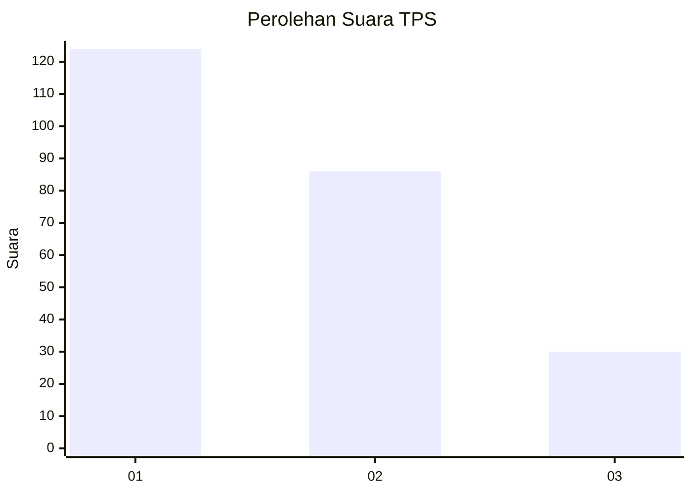
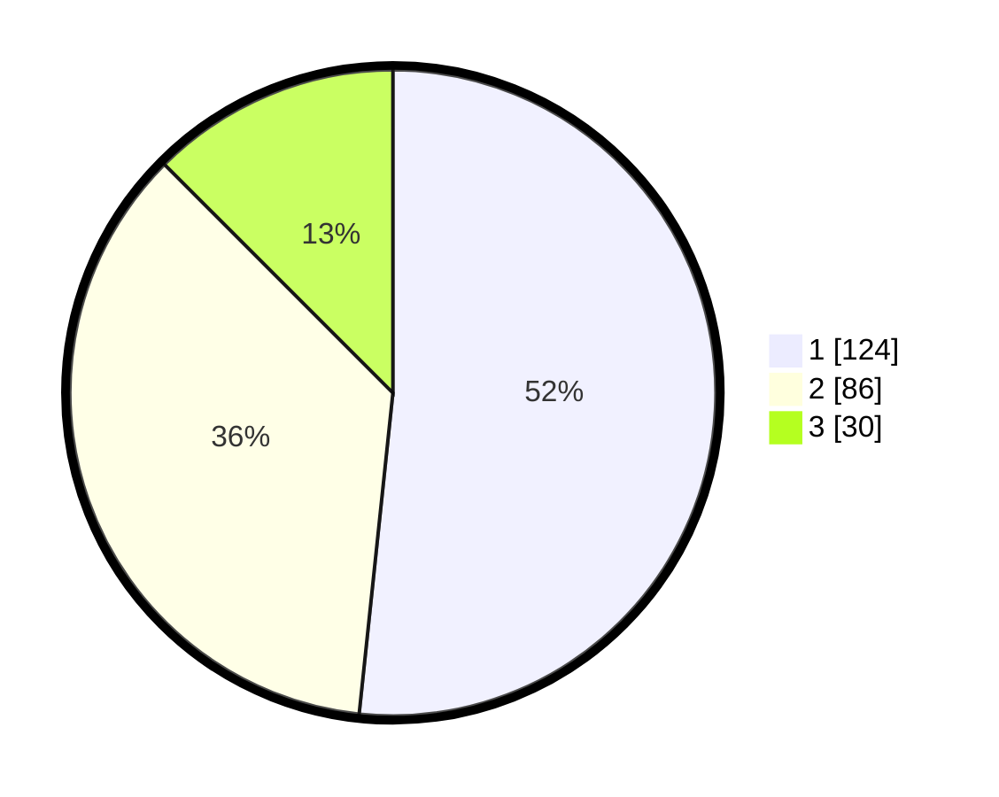

# Hasil

## Grafik

## Tabel

| No. | Nama Paslon    | Suara | Suara (raw) | Persentase |
|:--- |:-------------- | -----:| -----------:| ----------:|
| 1   | ANIES MUHAIMIN | 124   | [124][p-1]  | 51,67      |
| 2   | PRABOWO GIBRAN | 86    | [86][p-2]   | 35,83      |
| 3   | GANJAR MAHFUD  | 30    | [30][p-3]   | 12,50      |

[p-1]: https://github.com/gigit-pemilu/pemilu-2024/blob/main/pilpres/hitung-suara/sub/33-jawa-tengah/sub/28-tegal/sub/13-dukuhturi/sub/2012-kepandean/sub/012-tps/sub/paslon-1.txt
[p-2]: https://github.com/gigit-pemilu/pemilu-2024/blob/main/pilpres/hitung-suara/sub/33-jawa-tengah/sub/28-tegal/sub/13-dukuhturi/sub/2012-kepandean/sub/012-tps/sub/paslon-2.txt
[p-3]: https://github.com/gigit-pemilu/pemilu-2024/blob/main/pilpres/hitung-suara/sub/33-jawa-tengah/sub/28-tegal/sub/13-dukuhturi/sub/2012-kepandean/sub/012-tps/sub/paslon-3.txt

## Foto C Plano

https://sirekap-obj-formc.kpu.go.id/88d6/pemilu/ppwp/33/28/13/20/12/3328132012012-20240214-213952--4752c697-058d-48e1-a7b6-c7c1c79a8be6.jpg

https://sirekap-obj-formc.kpu.go.id/88d6/pemilu/ppwp/33/28/13/20/12/3328132012012-20240214-214039--7c297067-4d73-4daa-8f18-3600e8c4d885.jpg

https://sirekap-obj-formc.kpu.go.id/88d6/pemilu/ppwp/33/28/13/20/12/3328132012012-20240214-214139--18e8b9d0-7119-4779-9c7b-8b34635cec34.jpg

## Metadata

| Key        | Value               |
| ---------- | ------------------- |
| Time Stamp | 2024-02-15 18:00:26 |

