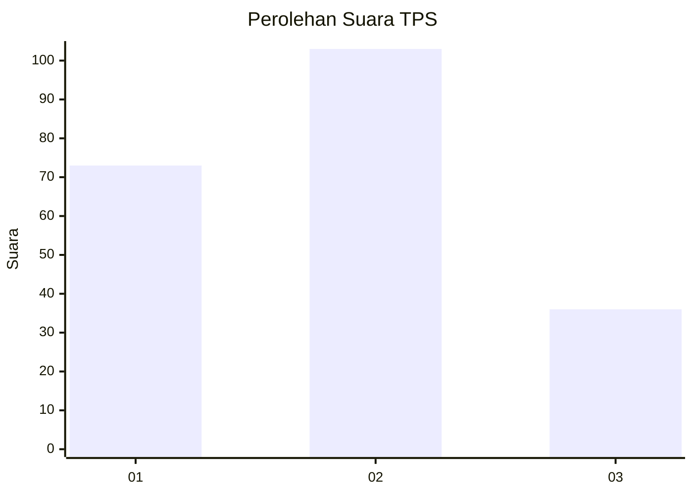
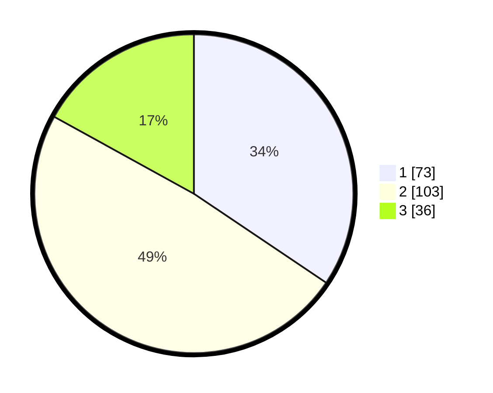

# Hasil

## Grafik

## Tabel

| No. | Nama Paslon    | Suara | Suara (raw) | Persentase |
|:--- |:-------------- | -----:| -----------:| ----------:|
| 1   | ANIES MUHAIMIN | 73    | [73][p-1]   | 34,43      |
| 2   | PRABOWO GIBRAN | 103   | [103][p-2]  | 48,58      |
| 3   | GANJAR MAHFUD  | 36    | [36][p-3]   | 16,98      |

[p-1]: https://github.com/gigit-pemilu/pemilu-2024/blob/main/pilpres/hitung-suara/sub/33-jawa-tengah/sub/28-tegal/sub/14-tarub/sub/2001-jatirawa/sub/002-tps/sub/paslon-1.txt
[p-2]: https://github.com/gigit-pemilu/pemilu-2024/blob/main/pilpres/hitung-suara/sub/33-jawa-tengah/sub/28-tegal/sub/14-tarub/sub/2001-jatirawa/sub/002-tps/sub/paslon-2.txt
[p-3]: https://github.com/gigit-pemilu/pemilu-2024/blob/main/pilpres/hitung-suara/sub/33-jawa-tengah/sub/28-tegal/sub/14-tarub/sub/2001-jatirawa/sub/002-tps/sub/paslon-3.txt

## Foto C Plano

https://sirekap-obj-formc.kpu.go.id/1f01/pemilu/ppwp/33/28/14/20/01/3328142001002-20240214-204823--3f3d971f-79f5-4f85-aa14-56f43b9e8d4c.jpg

https://sirekap-obj-formc.kpu.go.id/1f01/pemilu/ppwp/33/28/14/20/01/3328142001002-20240217-171302--5142fb0f-bab0-45c4-9d82-80aeb9494fdb.jpg

https://sirekap-obj-formc.kpu.go.id/1f01/pemilu/ppwp/33/28/14/20/01/3328142001002-20240214-204507--70938c47-1a96-4032-bae0-4c97a5746a4a.jpg

## Metadata

| Key        | Value               |
| ---------- | ------------------- |
| Time Stamp | 2024-02-17 17:30:00 |

