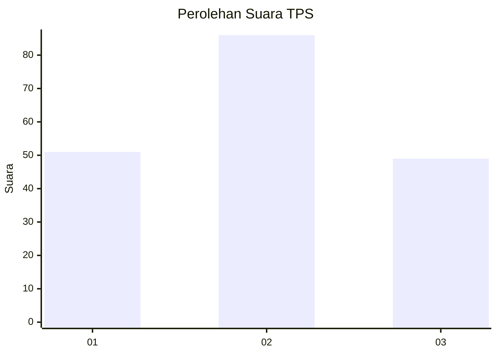
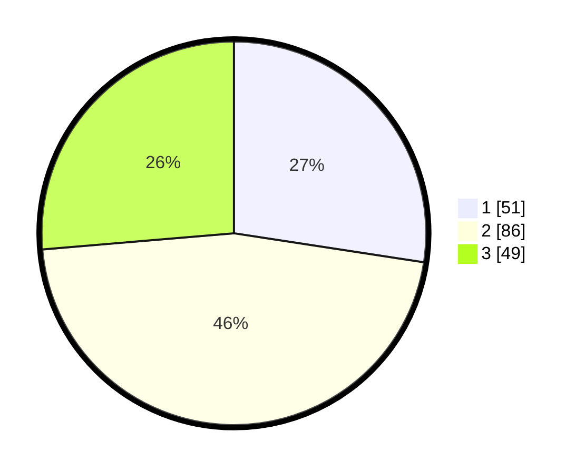

# Hasil

## Grafik

## Tabel

| No. | Nama Paslon    | Suara | Suara (raw) | Persentase |
|:--- |:-------------- | -----:| -----------:| ----------:|
| 1   | ANIES MUHAIMIN | 51    | [51][p-1]   | 27,42      |
| 2   | PRABOWO GIBRAN | 86    | [86][p-2]   | 46,24      |
| 3   | GANJAR MAHFUD  | 49    | [49][p-3]   | 26,34      |

[p-1]: https://github.com/gigit-pemilu/pemilu-2024/blob/main/pilpres/hitung-suara/sub/33-jawa-tengah/sub/28-tegal/sub/15-kramat/sub/2005-kertaharja/sub/001-tps/sub/paslon-1.txt
[p-2]: https://github.com/gigit-pemilu/pemilu-2024/blob/main/pilpres/hitung-suara/sub/33-jawa-tengah/sub/28-tegal/sub/15-kramat/sub/2005-kertaharja/sub/001-tps/sub/paslon-2.txt
[p-3]: https://github.com/gigit-pemilu/pemilu-2024/blob/main/pilpres/hitung-suara/sub/33-jawa-tengah/sub/28-tegal/sub/15-kramat/sub/2005-kertaharja/sub/001-tps/sub/paslon-3.txt

## Foto C Plano

https://sirekap-obj-formc.kpu.go.id/969d/pemilu/ppwp/33/28/15/20/05/3328152005001-20240214-222038--c0797f00-4de3-484e-8a46-cb31249d76f6.jpg

https://sirekap-obj-formc.kpu.go.id/969d/pemilu/ppwp/33/28/15/20/05/3328152005001-20240214-222253--8f7a6208-d31b-4bcf-8e38-ac0d4b71e482.jpg

https://sirekap-obj-formc.kpu.go.id/969d/pemilu/ppwp/33/28/15/20/05/3328152005001-20240214-232315--2766fd91-f1bd-4326-a41e-421de6e1df3c.jpg

## Metadata

| Key        | Value               |
| ---------- | ------------------- |
| Time Stamp | 2024-02-16 17:00:00 |

