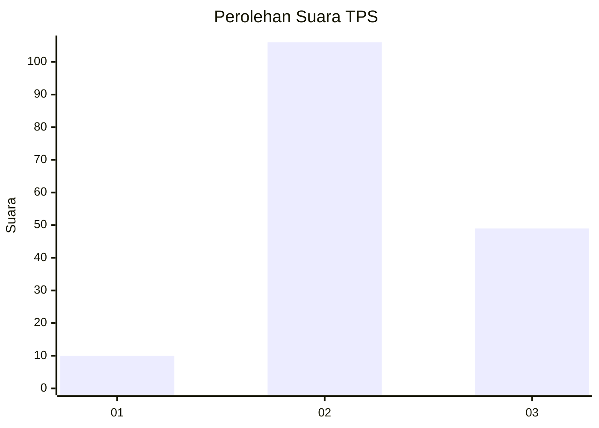

# Hasil

## Grafik

## Tabel

| No. | Nama Paslon    | Suara | Suara (raw) | Persentase |
|:--- |:-------------- | -----:| -----------:| ----------:|
| 1   | ANIES MUHAIMIN | 10    | [10][p-1]   | 6,06       |
| 2   | PRABOWO GIBRAN | 106   | [106][p-2]  | 64,24      |
| 3   | GANJAR MAHFUD  | 49    | [49][p-3]   | 29,70      |

[p-1]: https://github.com/gigit-pemilu/pemilu-2024-33-jawa-tengah/blob/main/pilpres/hitung-suara/sub/33-jawa-tengah/sub/28-tegal/sub/16-suradadi/sub/2001-karangwuluh/sub/005-tps/sub/paslon-1.txt
[p-2]: https://github.com/gigit-pemilu/pemilu-2024-33-jawa-tengah/blob/main/pilpres/hitung-suara/sub/33-jawa-tengah/sub/28-tegal/sub/16-suradadi/sub/2001-karangwuluh/sub/005-tps/sub/paslon-2.txt
[p-3]: https://github.com/gigit-pemilu/pemilu-2024-33-jawa-tengah/blob/main/pilpres/hitung-suara/sub/33-jawa-tengah/sub/28-tegal/sub/16-suradadi/sub/2001-karangwuluh/sub/005-tps/sub/paslon-3.txt

## Foto C Plano

https://sirekap-obj-formc.kpu.go.id/89ad/pemilu/ppwp/33/28/16/20/01/3328162001005-20240215-013520--36466dbc-596c-4f8e-a59d-a98fca30976f.jpg

https://sirekap-obj-formc.kpu.go.id/89ad/pemilu/ppwp/33/28/16/20/01/3328162001005-20240215-013736--f4d705b3-1aee-4257-9167-e4f596367c37.jpg

https://sirekap-obj-formc.kpu.go.id/89ad/pemilu/ppwp/33/28/16/20/01/3328162001005-20240215-014104--99817cd8-3ea6-46d2-b360-1766c1d626a5.jpg

## Metadata

| Key        | Value               |
| ---------- | ------------------- |
| Time Stamp | 2024-02-16 21:01:00 |

