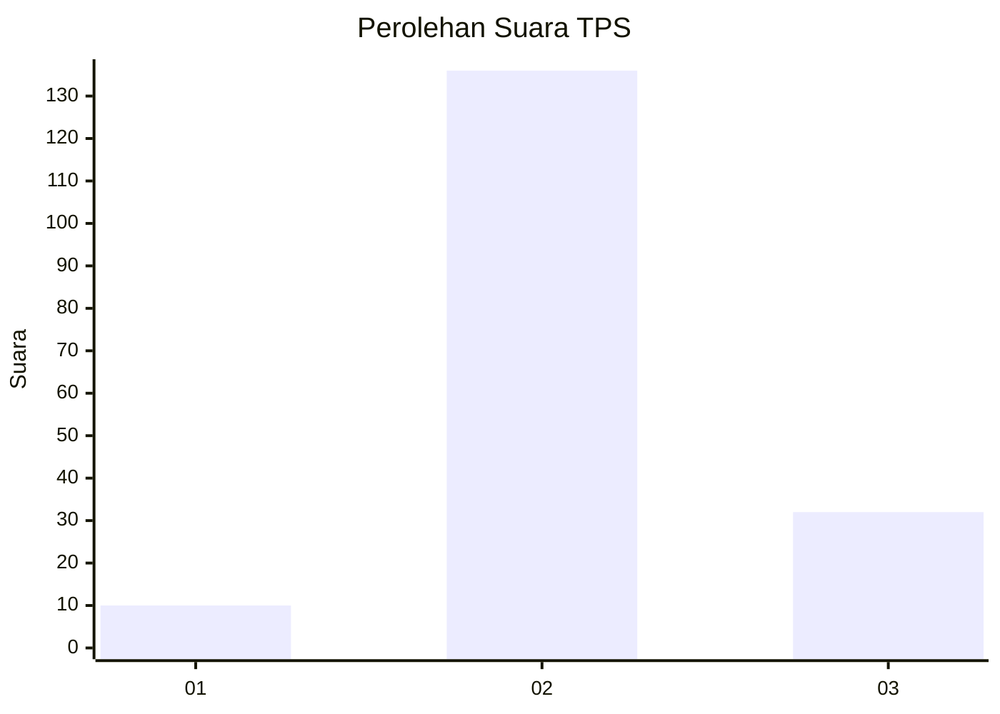

# Hasil

## Grafik

## Tabel

| No. | Nama Paslon    | Suara | Suara (raw) | Persentase |
|:--- |:-------------- | -----:| -----------:| ----------:|
| 1   | ANIES MUHAIMIN | 10    | [10][p-1]   | 5,62       |
| 2   | PRABOWO GIBRAN | 136   | [136][p-2]  | 76,40      |
| 3   | GANJAR MAHFUD  | 32    | [32][p-3]   | 17,98      |

[p-1]: https://github.com/gigit-pemilu/pemilu-2024-33-jawa-tengah/blob/main/pilpres/hitung-suara/sub/33-jawa-tengah/sub/28-tegal/sub/17-warureja/sub/2001-sidamulya/sub/001-tps/sub/paslon-1.txt
[p-2]: https://github.com/gigit-pemilu/pemilu-2024-33-jawa-tengah/blob/main/pilpres/hitung-suara/sub/33-jawa-tengah/sub/28-tegal/sub/17-warureja/sub/2001-sidamulya/sub/001-tps/sub/paslon-2.txt
[p-3]: https://github.com/gigit-pemilu/pemilu-2024-33-jawa-tengah/blob/main/pilpres/hitung-suara/sub/33-jawa-tengah/sub/28-tegal/sub/17-warureja/sub/2001-sidamulya/sub/001-tps/sub/paslon-3.txt

## Foto C Plano

https://sirekap-obj-formc.kpu.go.id/72a0/pemilu/ppwp/33/28/17/20/01/3328172001001-20240217-104633--d29edf05-905a-490c-ac49-41c49f9fd9ba.jpg

https://sirekap-obj-formc.kpu.go.id/72a0/pemilu/ppwp/33/28/17/20/01/3328172001001-20240217-104421--f4780fab-87dd-425a-a194-6f7c3f735473.jpg

https://sirekap-obj-formc.kpu.go.id/72a0/pemilu/ppwp/33/28/17/20/01/3328172001001-20240217-104524--d50f2f7b-13b1-4eaf-8d69-408408bc596e.jpg

## Metadata

| Key        | Value               |
| ---------- | ------------------- |
| Time Stamp | 2024-02-17 11:30:03 |

