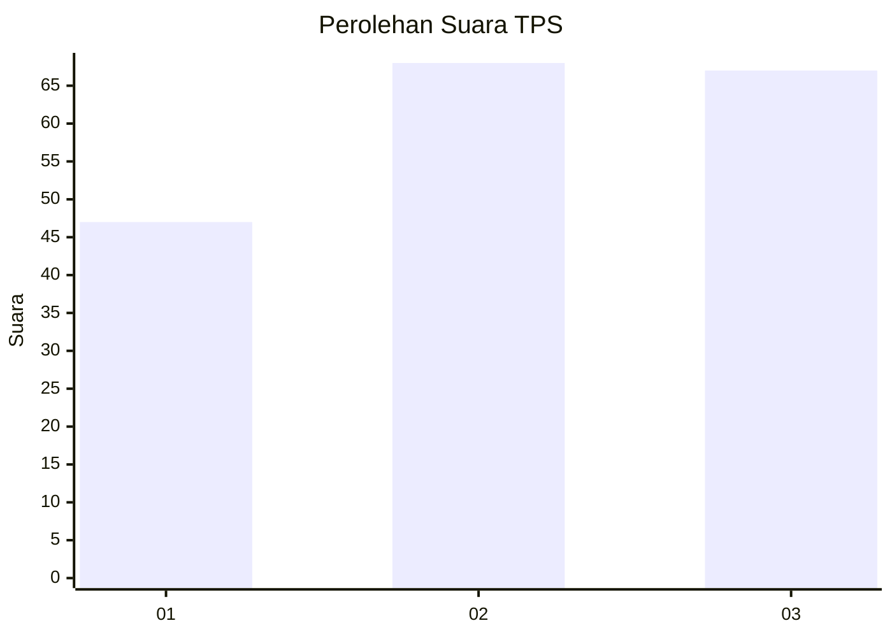
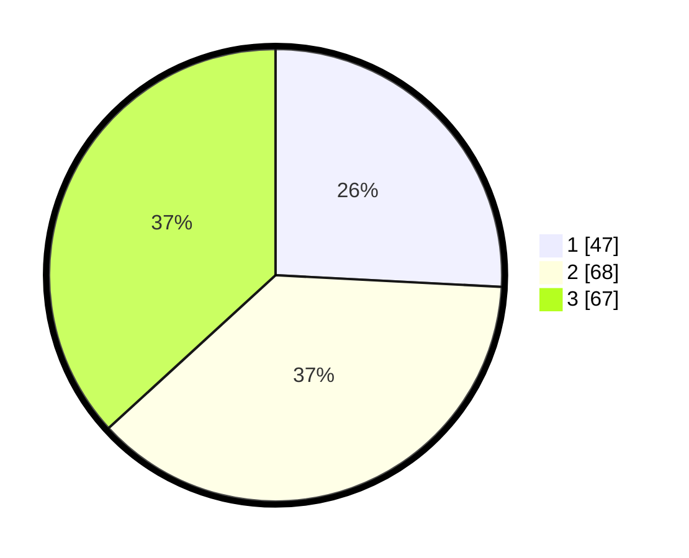

# Hasil

## Grafik

## Tabel

| No. | Nama Paslon    | Suara | Suara (raw) | Persentase |
|:--- |:-------------- | -----:| -----------:| ----------:|
| 1   | ANIES MUHAIMIN | 47    | [47][p-1]   | 25,82      |
| 2   | PRABOWO GIBRAN | 68    | [68][p-2]   | 37,36      |
| 3   | GANJAR MAHFUD  | 67    | [67][p-3]   | 36,81      |

[p-1]: https://github.com/gigit-pemilu/pemilu-2024/blob/main/pilpres/hitung-suara/sub/33-jawa-tengah/sub/29-brebes/sub/01-salem/sub/2001-banjaran/sub/005-tps/sub/paslon-1.txt
[p-2]: https://github.com/gigit-pemilu/pemilu-2024/blob/main/pilpres/hitung-suara/sub/33-jawa-tengah/sub/29-brebes/sub/01-salem/sub/2001-banjaran/sub/005-tps/sub/paslon-2.txt
[p-3]: https://github.com/gigit-pemilu/pemilu-2024/blob/main/pilpres/hitung-suara/sub/33-jawa-tengah/sub/29-brebes/sub/01-salem/sub/2001-banjaran/sub/005-tps/sub/paslon-3.txt

## Foto C Plano

https://sirekap-obj-formc.kpu.go.id/1eb3/pemilu/ppwp/33/29/01/20/01/3329012001005-20240221-172617--add2690a-19c4-4e23-9196-0b5bd63385f5.jpg

https://sirekap-obj-formc.kpu.go.id/1eb3/pemilu/ppwp/33/29/01/20/01/3329012001005-20240214-222601--800b366b-146f-4be2-be83-03c29203d6e1.jpg

https://sirekap-obj-formc.kpu.go.id/1eb3/pemilu/ppwp/33/29/01/20/01/3329012001005-20240214-222650--88d1a959-a0fe-4c62-ac75-06e1119f73f7.jpg

## Metadata

| Key        | Value               |
| ---------- | ------------------- |
| Time Stamp | 2024-02-21 18:00:00 |

