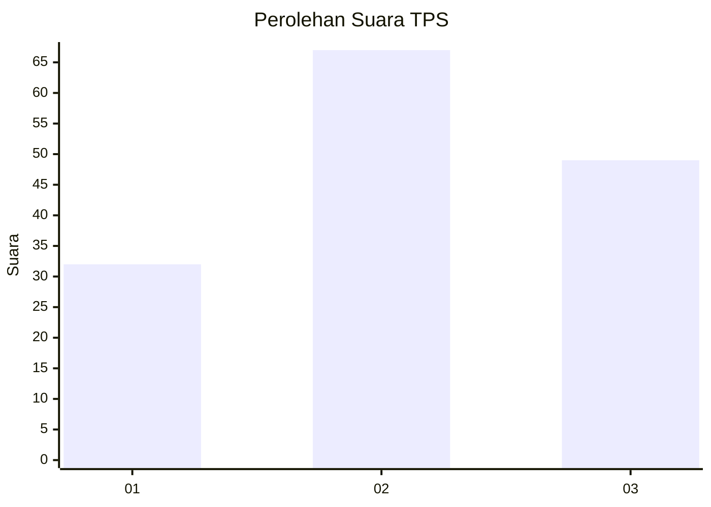
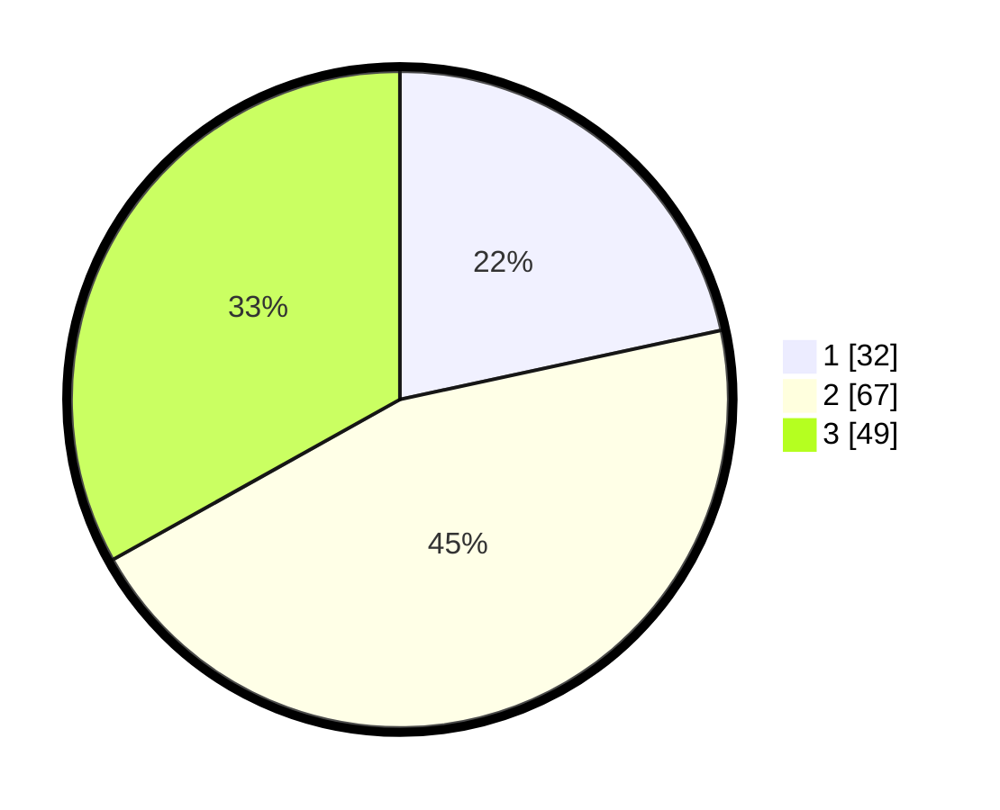

# Hasil

## Grafik

## Tabel

| No. | Nama Paslon    | Suara | Suara (raw) | Persentase |
|:--- |:-------------- | -----:| -----------:| ----------:|
| 1   | ANIES MUHAIMIN | 32    | [32][p-1]   | 21,62      |
| 2   | PRABOWO GIBRAN | 67    | [67][p-2]   | 45,27      |
| 3   | GANJAR MAHFUD  | 49    | [49][p-3]   | 33,11      |

[p-1]: https://github.com/gigit-pemilu/pemilu-2024-33-jawa-tengah/blob/main/pilpres/hitung-suara/sub/33-jawa-tengah/sub/29-brebes/sub/01-salem/sub/2001-banjaran/sub/006-tps/sub/paslon-1.txt
[p-2]: https://github.com/gigit-pemilu/pemilu-2024-33-jawa-tengah/blob/main/pilpres/hitung-suara/sub/33-jawa-tengah/sub/29-brebes/sub/01-salem/sub/2001-banjaran/sub/006-tps/sub/paslon-2.txt
[p-3]: https://github.com/gigit-pemilu/pemilu-2024-33-jawa-tengah/blob/main/pilpres/hitung-suara/sub/33-jawa-tengah/sub/29-brebes/sub/01-salem/sub/2001-banjaran/sub/006-tps/sub/paslon-3.txt

## Foto C Plano

https://sirekap-obj-formc.kpu.go.id/0c7a/pemilu/ppwp/33/29/01/20/01/3329012001006-20240215-012542--6f587726-2eff-47dc-b420-fd9bae5f4d44.jpg

https://sirekap-obj-formc.kpu.go.id/0c7a/pemilu/ppwp/33/29/01/20/01/3329012001006-20240215-013016--4a3581ea-232c-4a88-be7d-ba963406e311.jpg

https://sirekap-obj-formc.kpu.go.id/0c7a/pemilu/ppwp/33/29/01/20/01/3329012001006-20240215-013253--a5136352-55f8-40fd-89a8-e2f4a87c20f0.jpg

## Metadata

| Key        | Value               |
| ---------- | ------------------- |
| Time Stamp | 2024-02-15 16:30:25 |

