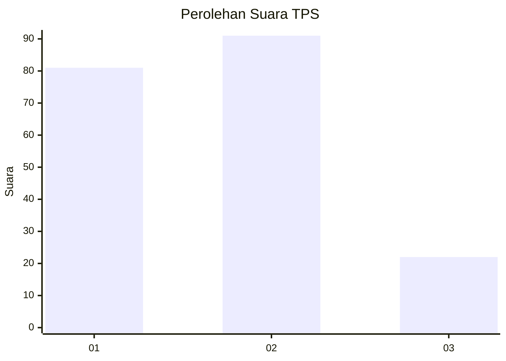
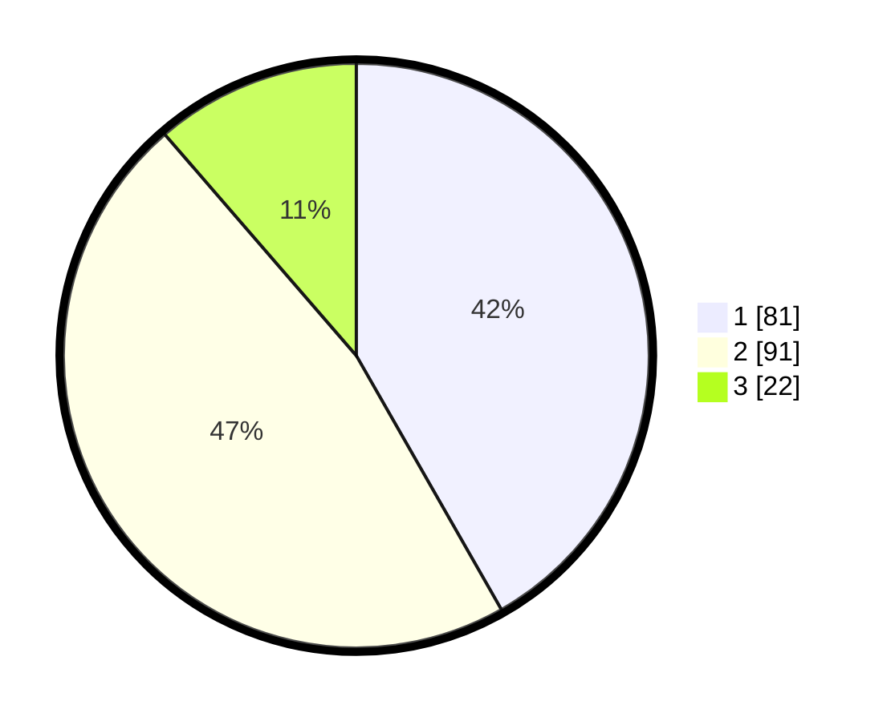

# Hasil

## Grafik

## Tabel

| No. | Nama Paslon    | Suara | Suara (raw) | Persentase |
|:--- |:-------------- | -----:| -----------:| ----------:|
| 1   | ANIES MUHAIMIN | 81    | [81][p-1]   | 41,75      |
| 2   | PRABOWO GIBRAN | 91    | [91][p-2]   | 46,91      |
| 3   | GANJAR MAHFUD  | 22    | [22][p-3]   | 11,34      |

[p-1]: https://github.com/gigit-pemilu/pemilu-2024/blob/main/pilpres/hitung-suara/sub/33-jawa-tengah/sub/29-brebes/sub/01-salem/sub/2011-gunungsugih/sub/001-tps/sub/paslon-1.txt
[p-2]: https://github.com/gigit-pemilu/pemilu-2024/blob/main/pilpres/hitung-suara/sub/33-jawa-tengah/sub/29-brebes/sub/01-salem/sub/2011-gunungsugih/sub/001-tps/sub/paslon-2.txt
[p-3]: https://github.com/gigit-pemilu/pemilu-2024/blob/main/pilpres/hitung-suara/sub/33-jawa-tengah/sub/29-brebes/sub/01-salem/sub/2011-gunungsugih/sub/001-tps/sub/paslon-3.txt

## Foto C Plano

https://sirekap-obj-formc.kpu.go.id/7ca7/pemilu/ppwp/33/29/01/20/11/3329012011001-20240215-050659--75f6f554-a920-43d3-8931-b1bb959456a6.jpg

https://sirekap-obj-formc.kpu.go.id/7ca7/pemilu/ppwp/33/29/01/20/11/3329012011001-20240215-101707--a475ba5e-0544-4846-8046-7708cd427c56.jpg

https://sirekap-obj-formc.kpu.go.id/7ca7/pemilu/ppwp/33/29/01/20/11/3329012011001-20240215-101824--5415ab1a-82a8-4a82-bdcb-73ad9d2ca31b.jpg

## Metadata

| Key        | Value               |
| ---------- | ------------------- |
| Time Stamp | 2024-02-15 19:00:26 |

