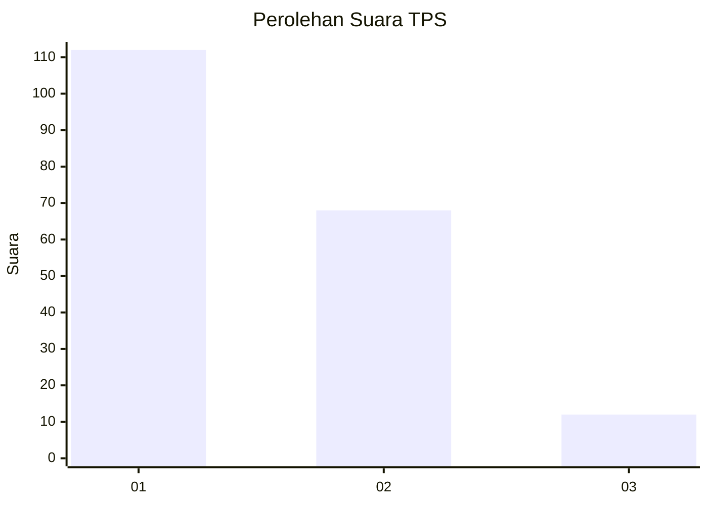
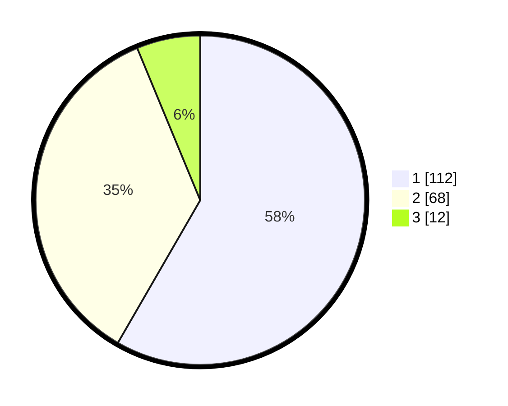

# Hasil

## Grafik

## Tabel

| No. | Nama Paslon    | Suara | Suara (raw) | Persentase |
|:--- |:-------------- | -----:| -----------:| ----------:|
| 1   | ANIES MUHAIMIN | 112   | [112][p-1]  | 58,33      |
| 2   | PRABOWO GIBRAN | 68    | [68][p-2]   | 35,42      |
| 3   | GANJAR MAHFUD  | 12    | [12][p-3]   | 6,25       |

[p-1]: https://github.com/gigit-pemilu/pemilu-2024/blob/main/pilpres/hitung-suara/sub/33-jawa-tengah/sub/29-brebes/sub/01-salem/sub/2011-gunungsugih/sub/006-tps/sub/paslon-1.txt
[p-2]: https://github.com/gigit-pemilu/pemilu-2024/blob/main/pilpres/hitung-suara/sub/33-jawa-tengah/sub/29-brebes/sub/01-salem/sub/2011-gunungsugih/sub/006-tps/sub/paslon-2.txt
[p-3]: https://github.com/gigit-pemilu/pemilu-2024/blob/main/pilpres/hitung-suara/sub/33-jawa-tengah/sub/29-brebes/sub/01-salem/sub/2011-gunungsugih/sub/006-tps/sub/paslon-3.txt

## Foto C Plano

https://sirekap-obj-formc.kpu.go.id/5d54/pemilu/ppwp/33/29/01/20/11/3329012011006-20240215-080142--ed3430cf-df7c-4884-b3ff-3a164d261913.jpg

https://sirekap-obj-formc.kpu.go.id/5d54/pemilu/ppwp/33/29/01/20/11/3329012011006-20240215-080241--c92f53ba-cd6a-459c-bb23-e80bda3dcd9c.jpg

https://sirekap-obj-formc.kpu.go.id/5d54/pemilu/ppwp/33/29/01/20/11/3329012011006-20240215-080337--9311a61b-0a6f-4ff1-8362-71007d6f87c4.jpg

## Metadata

| Key        | Value               |
| ---------- | ------------------- |
| Time Stamp | 2024-02-24 22:31:28 |

