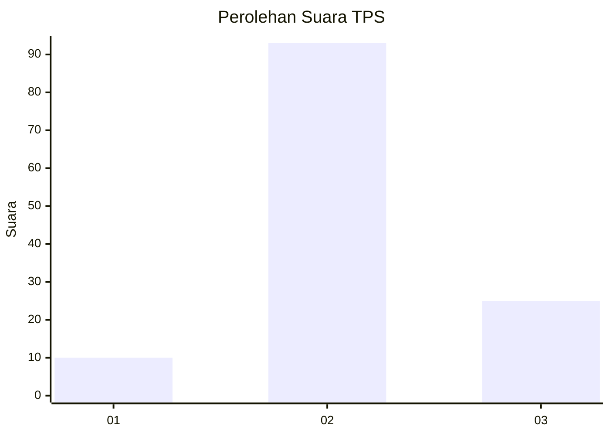
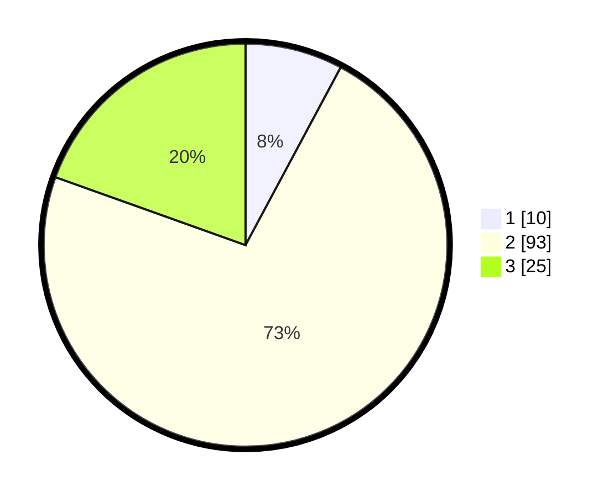

# Hasil

## Grafik

## Tabel

| No. | Nama Paslon    | Suara | Suara (raw) | Persentase |
|:--- |:-------------- | -----:| -----------:| ----------:|
| 1   | ANIES MUHAIMIN | 10    | [10][p-1]   | 7,81       |
| 2   | PRABOWO GIBRAN | 93    | [93][p-2]   | 72,66      |
| 3   | GANJAR MAHFUD  | 25    | [25][p-3]   | 19,53      |

[p-1]: https://github.com/gigit-pemilu/pemilu-2024/blob/main/pilpres/hitung-suara/sub/33-jawa-tengah/sub/29-brebes/sub/01-salem/sub/2017-salem/sub/005-tps/sub/paslon-1.txt
[p-2]: https://github.com/gigit-pemilu/pemilu-2024/blob/main/pilpres/hitung-suara/sub/33-jawa-tengah/sub/29-brebes/sub/01-salem/sub/2017-salem/sub/005-tps/sub/paslon-2.txt
[p-3]: https://github.com/gigit-pemilu/pemilu-2024/blob/main/pilpres/hitung-suara/sub/33-jawa-tengah/sub/29-brebes/sub/01-salem/sub/2017-salem/sub/005-tps/sub/paslon-3.txt

## Foto C Plano

https://sirekap-obj-formc.kpu.go.id/217c/pemilu/ppwp/33/29/01/20/17/3329012017005-20240214-220050--cbd1cb62-2fef-4eac-9d01-efeab58bd484.jpg

https://sirekap-obj-formc.kpu.go.id/217c/pemilu/ppwp/33/29/01/20/17/3329012017005-20240215-211039--ab13b996-e8da-4c4a-9dc1-c56e79ec09d6.jpg

https://sirekap-obj-formc.kpu.go.id/217c/pemilu/ppwp/33/29/01/20/17/3329012017005-20240215-211038--86b52eb8-03a5-4fe5-ba87-d8b7b89232c8.jpg

## Metadata

| Key        | Value               |
| ---------- | ------------------- |
| Time Stamp | 2024-02-15 22:00:27 |

