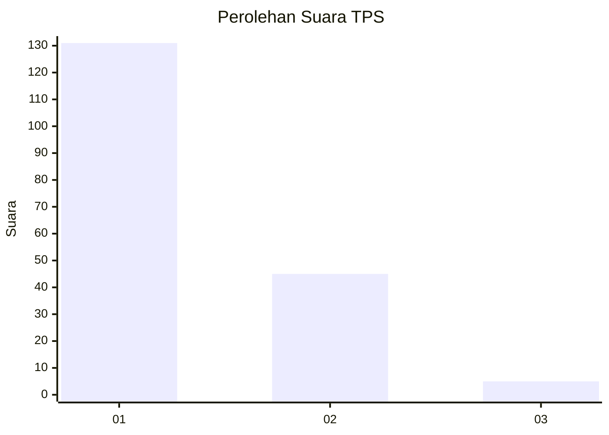
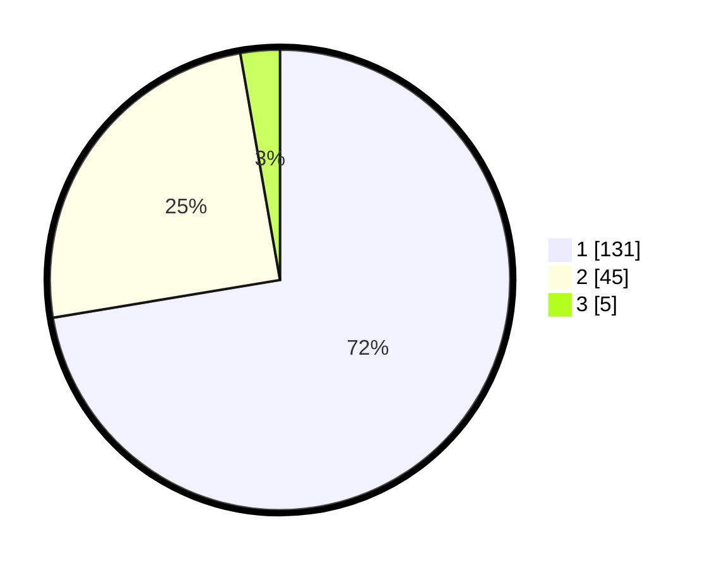

# Hasil

## Grafik

## Tabel

| No. | Nama Paslon    | Suara | Suara (raw) | Persentase |
|:--- |:-------------- | -----:| -----------:| ----------:|
| 1   | ANIES MUHAIMIN | 131   | [131][p-1]  | 72,38      |
| 2   | PRABOWO GIBRAN | 45    | [45][p-2]   | 24,86      |
| 3   | GANJAR MAHFUD  | 5     | [5][p-3]    | 2,76       |

[p-1]: https://github.com/gigit-pemilu/pemilu-2024-33-jawa-tengah/blob/main/pilpres/hitung-suara/sub/33-jawa-tengah/sub/29-brebes/sub/01-salem/sub/2018-tembongraja/sub/006-tps/sub/paslon-1.txt
[p-2]: https://github.com/gigit-pemilu/pemilu-2024-33-jawa-tengah/blob/main/pilpres/hitung-suara/sub/33-jawa-tengah/sub/29-brebes/sub/01-salem/sub/2018-tembongraja/sub/006-tps/sub/paslon-2.txt
[p-3]: https://github.com/gigit-pemilu/pemilu-2024-33-jawa-tengah/blob/main/pilpres/hitung-suara/sub/33-jawa-tengah/sub/29-brebes/sub/01-salem/sub/2018-tembongraja/sub/006-tps/sub/paslon-3.txt

## Foto C Plano

https://sirekap-obj-formc.kpu.go.id/bf31/pemilu/ppwp/33/29/01/20/18/3329012018006-20240215-061205--2f9ec1c5-ae0e-4fa4-ba12-9c244f8d74d0.jpg

https://sirekap-obj-formc.kpu.go.id/bf31/pemilu/ppwp/33/29/01/20/18/3329012018006-20240214-214909--94a47b0f-1a46-465e-9218-e530e3434977.jpg

https://sirekap-obj-formc.kpu.go.id/bf31/pemilu/ppwp/33/29/01/20/18/3329012018006-20240215-055324--9ce31328-18d2-4abe-ac6f-055e76437401.jpg

## Metadata

| Key        | Value               |
| ---------- | ------------------- |
| Time Stamp | 2024-02-15 19:30:26 |

