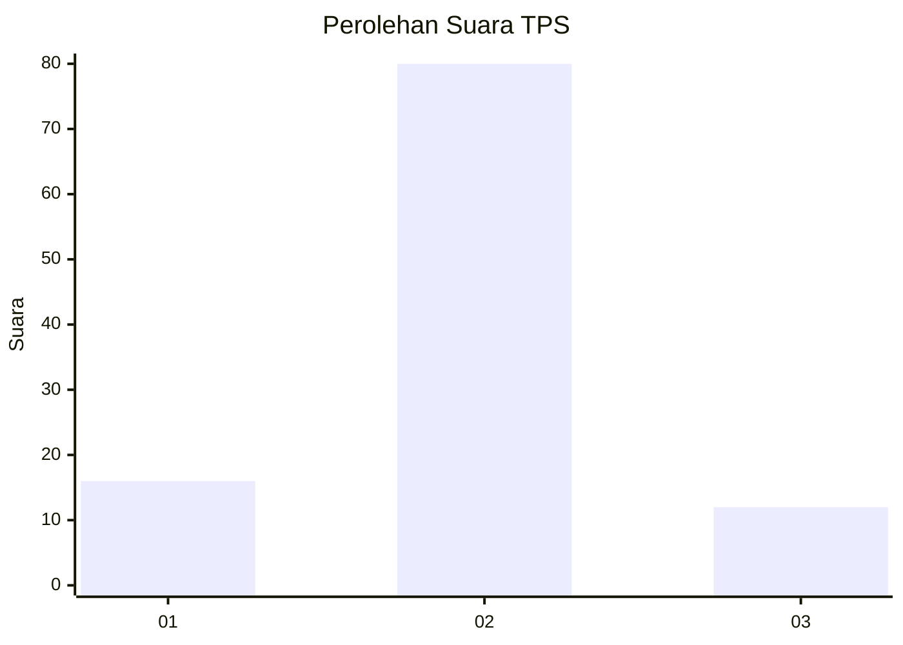
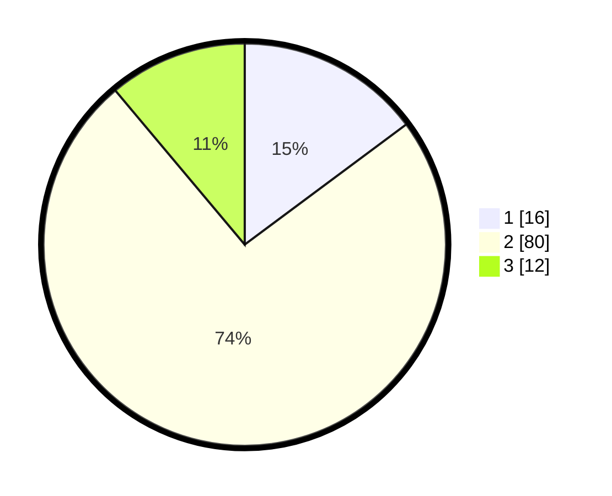

# Hasil

## Grafik

## Tabel

| No. | Nama Paslon    | Suara | Suara (raw) | Persentase |
|:--- |:-------------- | -----:| -----------:| ----------:|
| 1   | ANIES MUHAIMIN | 16    | [16][p-1]   | 14,81      |
| 2   | PRABOWO GIBRAN | 80    | [80][p-2]   | 74,07      |
| 3   | GANJAR MAHFUD  | 12    | [12][p-3]   | 11,11      |

[p-1]: https://github.com/gigit-pemilu/pemilu-2024-33-jawa-tengah/blob/main/pilpres/hitung-suara/sub/33-jawa-tengah/sub/29-brebes/sub/02-bantarkawung/sub/2002-banjarsari/sub/001-tps/sub/paslon-1.txt
[p-2]: https://github.com/gigit-pemilu/pemilu-2024-33-jawa-tengah/blob/main/pilpres/hitung-suara/sub/33-jawa-tengah/sub/29-brebes/sub/02-bantarkawung/sub/2002-banjarsari/sub/001-tps/sub/paslon-2.txt
[p-3]: https://github.com/gigit-pemilu/pemilu-2024-33-jawa-tengah/blob/main/pilpres/hitung-suara/sub/33-jawa-tengah/sub/29-brebes/sub/02-bantarkawung/sub/2002-banjarsari/sub/001-tps/sub/paslon-3.txt

## Foto C Plano

https://sirekap-obj-formc.kpu.go.id/5e43/pemilu/ppwp/33/29/02/20/02/3329022002001-20240215-075544--aad393e7-e4cc-43d9-a428-9ecf02b0894f.jpg

https://sirekap-obj-formc.kpu.go.id/5e43/pemilu/ppwp/33/29/02/20/02/3329022002001-20240215-080206--7a23f516-c2c1-4719-8ae1-a8dce98147d2.jpg

https://sirekap-obj-formc.kpu.go.id/5e43/pemilu/ppwp/33/29/02/20/02/3329022002001-20240215-080433--2177d00c-eccf-4595-af74-6e4b2152d0a9.jpg

## Metadata

| Key        | Value               |
| ---------- | ------------------- |
| Time Stamp | 2024-02-15 20:00:44 |

