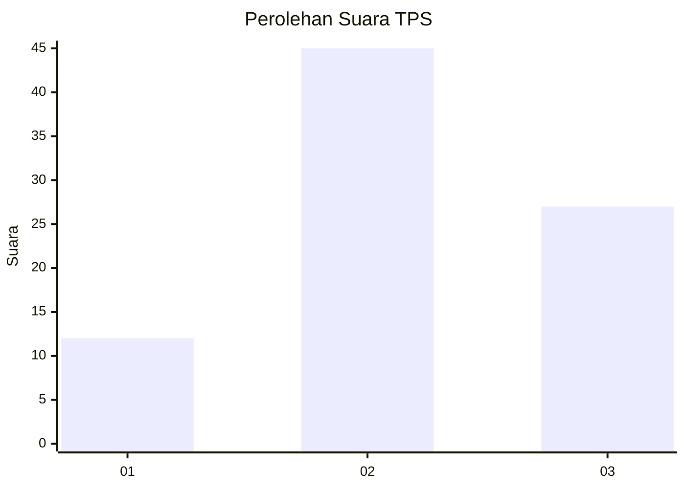
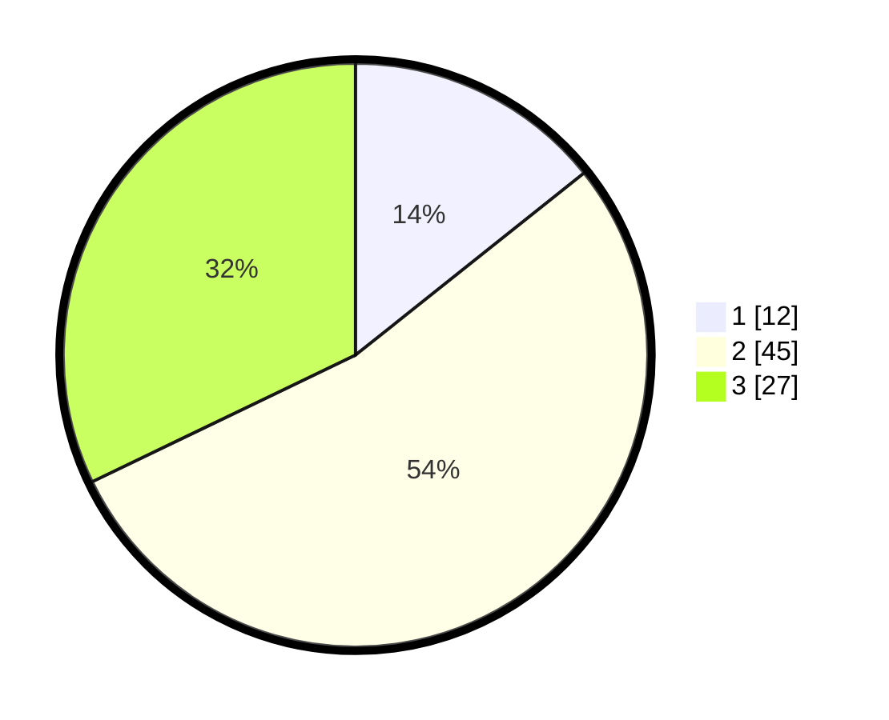

# Hasil

## Grafik

## Tabel

| No. | Nama Paslon    | Suara | Suara (raw) | Persentase |
|:--- |:-------------- | -----:| -----------:| ----------:|
| 1   | ANIES MUHAIMIN | 12    | [12][p-1]   | 14,29      |
| 2   | PRABOWO GIBRAN | 45    | [45][p-2]   | 53,57      |
| 3   | GANJAR MAHFUD  | 27    | [27][p-3]   | 32,14      |

[p-1]: https://github.com/gigit-pemilu/pemilu-2024-33-jawa-tengah/blob/main/pilpres/hitung-suara/sub/33-jawa-tengah/sub/29-brebes/sub/02-bantarkawung/sub/2006-cinanas/sub/003-tps/sub/paslon-1.txt
[p-2]: https://github.com/gigit-pemilu/pemilu-2024-33-jawa-tengah/blob/main/pilpres/hitung-suara/sub/33-jawa-tengah/sub/29-brebes/sub/02-bantarkawung/sub/2006-cinanas/sub/003-tps/sub/paslon-2.txt
[p-3]: https://github.com/gigit-pemilu/pemilu-2024-33-jawa-tengah/blob/main/pilpres/hitung-suara/sub/33-jawa-tengah/sub/29-brebes/sub/02-bantarkawung/sub/2006-cinanas/sub/003-tps/sub/paslon-3.txt

## Foto C Plano

https://sirekap-obj-formc.kpu.go.id/30cb/pemilu/ppwp/33/29/02/20/06/3329022006003-20240215-015937--e28ebc02-9693-4f1a-a501-692f4fa6537a.jpg

https://sirekap-obj-formc.kpu.go.id/30cb/pemilu/ppwp/33/29/02/20/06/3329022006003-20240215-015345--91bd20bd-77aa-462c-be13-d185eaf6c80d.jpg

https://sirekap-obj-formc.kpu.go.id/30cb/pemilu/ppwp/33/29/02/20/06/3329022006003-20240215-020452--07dba6cf-978b-473f-b7e3-743bb257e4b6.jpg

## Metadata

| Key        | Value               |
| ---------- | ------------------- |
| Time Stamp | 2024-02-15 15:00:29 |

