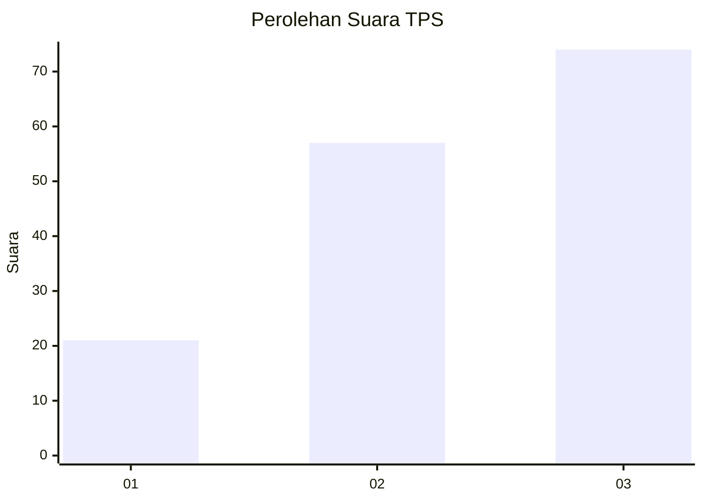
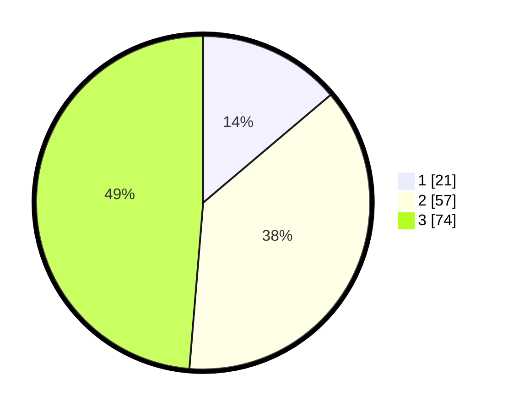

# Hasil

## Grafik

## Tabel

| No. | Nama Paslon    | Suara | Suara (raw) | Persentase |
|:--- |:-------------- | -----:| -----------:| ----------:|
| 1   | ANIES MUHAIMIN | 21    | [21][p-1]   | 13,82      |
| 2   | PRABOWO GIBRAN | 57    | [57][p-2]   | 37,50      |
| 3   | GANJAR MAHFUD  | 74    | [74][p-3]   | 48,68      |

[p-1]: https://github.com/gigit-pemilu/pemilu-2024/blob/main/pilpres/hitung-suara/sub/33-jawa-tengah/sub/29-brebes/sub/02-bantarkawung/sub/2008-jipang/sub/001-tps/sub/paslon-1.txt
[p-2]: https://github.com/gigit-pemilu/pemilu-2024/blob/main/pilpres/hitung-suara/sub/33-jawa-tengah/sub/29-brebes/sub/02-bantarkawung/sub/2008-jipang/sub/001-tps/sub/paslon-2.txt
[p-3]: https://github.com/gigit-pemilu/pemilu-2024/blob/main/pilpres/hitung-suara/sub/33-jawa-tengah/sub/29-brebes/sub/02-bantarkawung/sub/2008-jipang/sub/001-tps/sub/paslon-3.txt

## Foto C Plano

https://sirekap-obj-formc.kpu.go.id/e350/pemilu/ppwp/33/29/02/20/08/3329022008001-20240217-090059--bfd16d36-cd3e-4fb7-bad5-1460abac50c7.jpg

https://sirekap-obj-formc.kpu.go.id/e350/pemilu/ppwp/33/29/02/20/08/3329022008001-20240221-213128--ff23dda8-5296-41c0-b64b-d7383c1bebc8.jpg

https://sirekap-obj-formc.kpu.go.id/e350/pemilu/ppwp/33/29/02/20/08/3329022008001-20240217-151018--57c1014a-d6bf-4e29-a1a0-31d50d7e1691.jpg

## Metadata

| Key        | Value               |
| ---------- | ------------------- |
| Time Stamp | 2024-02-22 14:00:00 |

