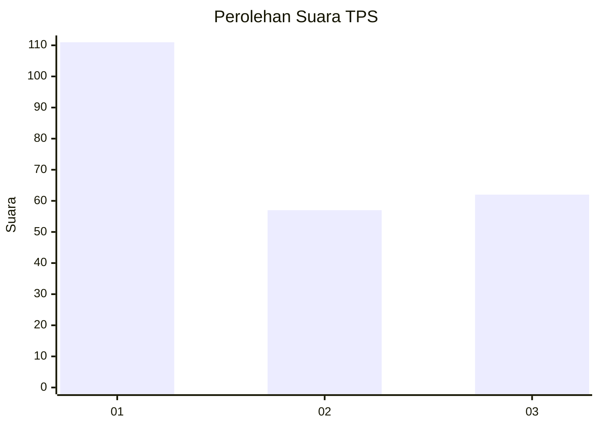
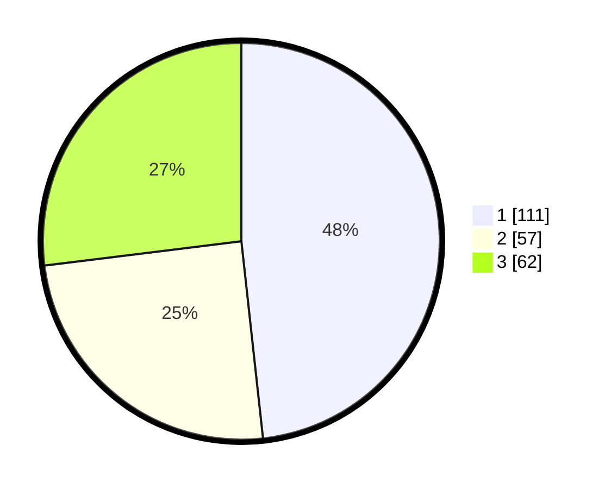

# Hasil

## Grafik

## Tabel

| No. | Nama Paslon    | Suara | Suara (raw) | Persentase |
|:--- |:-------------- | -----:| -----------:| ----------:|
| 1   | ANIES MUHAIMIN | 111   | [111][p-1]  | 48,26      |
| 2   | PRABOWO GIBRAN | 57    | [57][p-2]   | 24,78      |
| 3   | GANJAR MAHFUD  | 62    | [62][p-3]   | 26,96      |

[p-1]: https://github.com/gigit-pemilu/pemilu-2024/blob/main/pilpres/hitung-suara/sub/33-jawa-tengah/sub/29-brebes/sub/02-bantarkawung/sub/2009-karangpari/sub/018-tps/sub/paslon-1.txt
[p-2]: https://github.com/gigit-pemilu/pemilu-2024/blob/main/pilpres/hitung-suara/sub/33-jawa-tengah/sub/29-brebes/sub/02-bantarkawung/sub/2009-karangpari/sub/018-tps/sub/paslon-2.txt
[p-3]: https://github.com/gigit-pemilu/pemilu-2024/blob/main/pilpres/hitung-suara/sub/33-jawa-tengah/sub/29-brebes/sub/02-bantarkawung/sub/2009-karangpari/sub/018-tps/sub/paslon-3.txt

## Foto C Plano

https://sirekap-obj-formc.kpu.go.id/2fdc/pemilu/ppwp/33/29/02/20/09/3329022009018-20240214-191233--c7e3c281-2e07-4b57-b2d9-cf3d66531c1e.jpg

https://sirekap-obj-formc.kpu.go.id/2fdc/pemilu/ppwp/33/29/02/20/09/3329022009018-20240214-232457--020ab2f9-c220-4266-aa47-d8d7564af4f3.jpg

https://sirekap-obj-formc.kpu.go.id/2fdc/pemilu/ppwp/33/29/02/20/09/3329022009018-20240214-232718--8fbca8e1-c9c8-4a3f-b473-0ad5713d9765.jpg

## Metadata

| Key        | Value               |
| ---------- | ------------------- |
| Time Stamp | 2024-02-24 22:31:28 |

