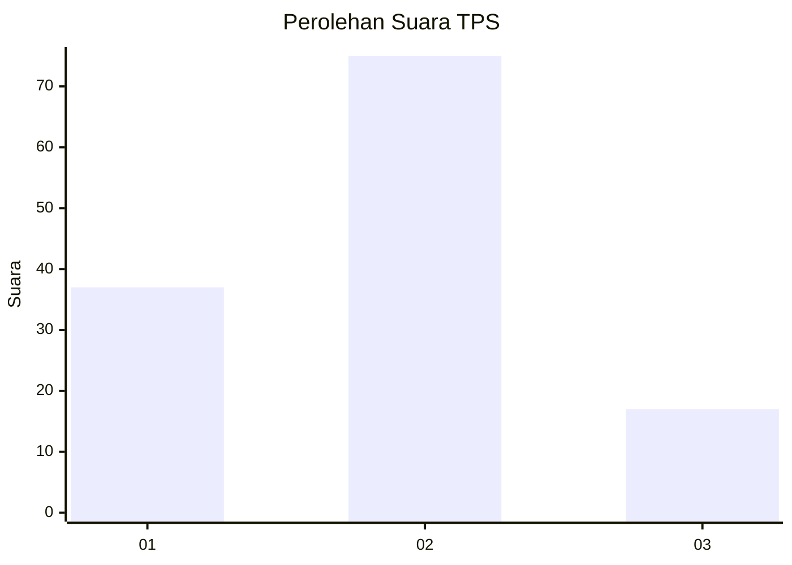
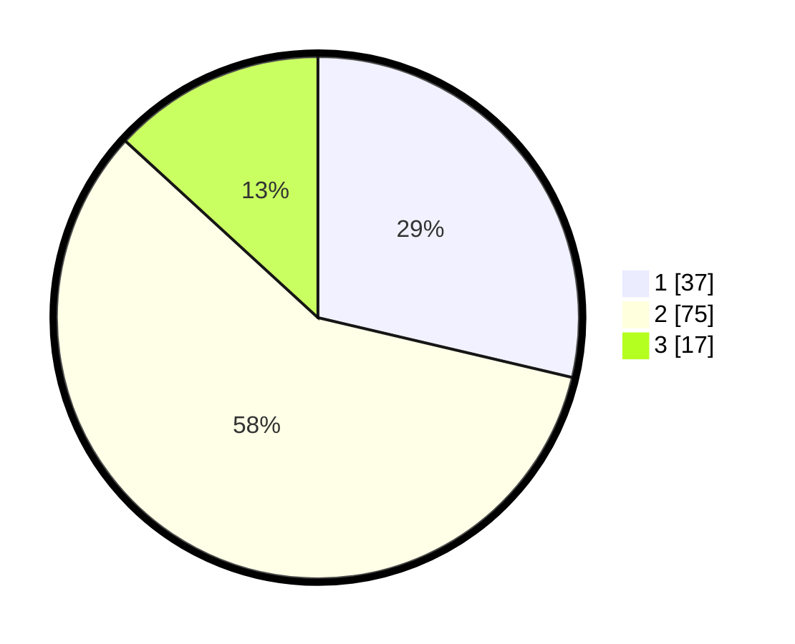

# Hasil

## Grafik

## Tabel

| No. | Nama Paslon    | Suara | Suara (raw) | Persentase |
|:--- |:-------------- | -----:| -----------:| ----------:|
| 1   | ANIES MUHAIMIN | 37    | [37][p-1]   | 28,68      |
| 2   | PRABOWO GIBRAN | 75    | [75][p-2]   | 58,14      |
| 3   | GANJAR MAHFUD  | 17    | [17][p-3]   | 13,18      |

[p-1]: https://github.com/gigit-pemilu/pemilu-2024/blob/main/pilpres/hitung-suara/sub/33-jawa-tengah/sub/29-brebes/sub/02-bantarkawung/sub/2012-pangebatan/sub/001-tps/sub/paslon-1.txt
[p-2]: https://github.com/gigit-pemilu/pemilu-2024/blob/main/pilpres/hitung-suara/sub/33-jawa-tengah/sub/29-brebes/sub/02-bantarkawung/sub/2012-pangebatan/sub/001-tps/sub/paslon-2.txt
[p-3]: https://github.com/gigit-pemilu/pemilu-2024/blob/main/pilpres/hitung-suara/sub/33-jawa-tengah/sub/29-brebes/sub/02-bantarkawung/sub/2012-pangebatan/sub/001-tps/sub/paslon-3.txt

## Foto C Plano

https://sirekap-obj-formc.kpu.go.id/9cb6/pemilu/ppwp/33/29/02/20/12/3329022012001-20240215-005417--ccf1d1b4-25ce-4637-9cc1-52cc61f21b2c.jpg

https://sirekap-obj-formc.kpu.go.id/9cb6/pemilu/ppwp/33/29/02/20/12/3329022012001-20240215-005630--d1cbbade-1ebc-4268-b8d3-9e849a9bdd33.jpg

https://sirekap-obj-formc.kpu.go.id/9cb6/pemilu/ppwp/33/29/02/20/12/3329022012001-20240215-122529--443a9698-ebeb-47e7-a57c-606328289951.jpg

## Metadata

| Key        | Value               |
| ---------- | ------------------- |
| Time Stamp | 2024-02-15 15:00:29 |

