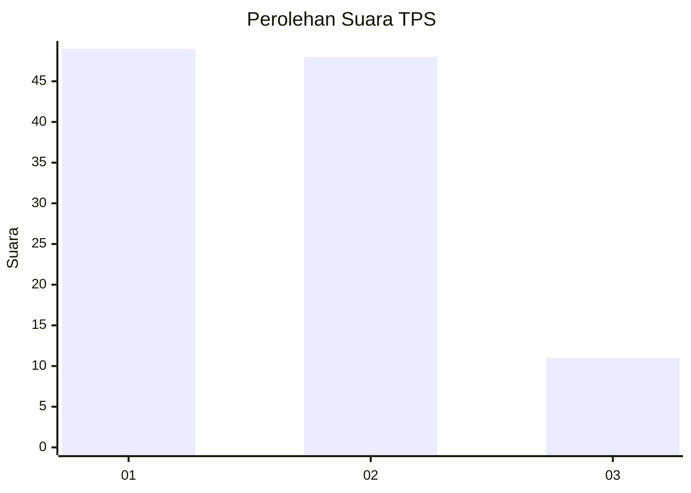
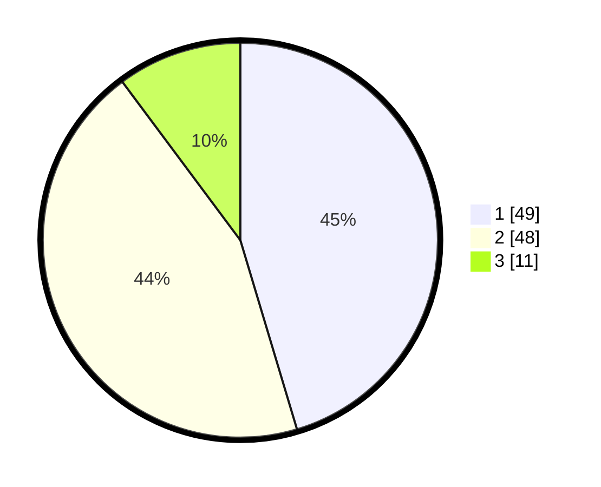

# Hasil

## Grafik

## Tabel

| No. | Nama Paslon    | Suara | Suara (raw) | Persentase |
|:--- |:-------------- | -----:| -----------:| ----------:|
| 1   | ANIES MUHAIMIN | 49    | [49][p-1]   | 45,37      |
| 2   | PRABOWO GIBRAN | 48    | [48][p-2]   | 44,44      |
| 3   | GANJAR MAHFUD  | 11    | [11][p-3]   | 10,19      |

[p-1]: https://github.com/gigit-pemilu/pemilu-2024/blob/main/pilpres/hitung-suara/sub/33-jawa-tengah/sub/29-brebes/sub/02-bantarkawung/sub/2012-pangebatan/sub/034-tps/sub/paslon-1.txt
[p-2]: https://github.com/gigit-pemilu/pemilu-2024/blob/main/pilpres/hitung-suara/sub/33-jawa-tengah/sub/29-brebes/sub/02-bantarkawung/sub/2012-pangebatan/sub/034-tps/sub/paslon-2.txt
[p-3]: https://github.com/gigit-pemilu/pemilu-2024/blob/main/pilpres/hitung-suara/sub/33-jawa-tengah/sub/29-brebes/sub/02-bantarkawung/sub/2012-pangebatan/sub/034-tps/sub/paslon-3.txt

## Foto C Plano

https://sirekap-obj-formc.kpu.go.id/5662/pemilu/ppwp/33/29/02/20/12/3329022012034-20240215-011824--bc984ca2-ca94-4092-97f0-c73a78a7b08f.jpg

https://sirekap-obj-formc.kpu.go.id/5662/pemilu/ppwp/33/29/02/20/12/3329022012034-20240215-011937--b87b428e-35e8-4b59-a3c3-dc7695d0a867.jpg

https://sirekap-obj-formc.kpu.go.id/5662/pemilu/ppwp/33/29/02/20/12/3329022012034-20240215-012058--612fd34a-6c98-451f-b3aa-62bd5b04ca38.jpg

## Metadata

| Key        | Value               |
| ---------- | ------------------- |
| Time Stamp | 2024-02-24 22:31:28 |

