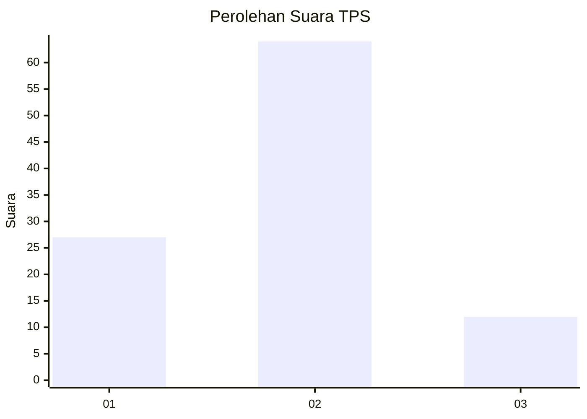
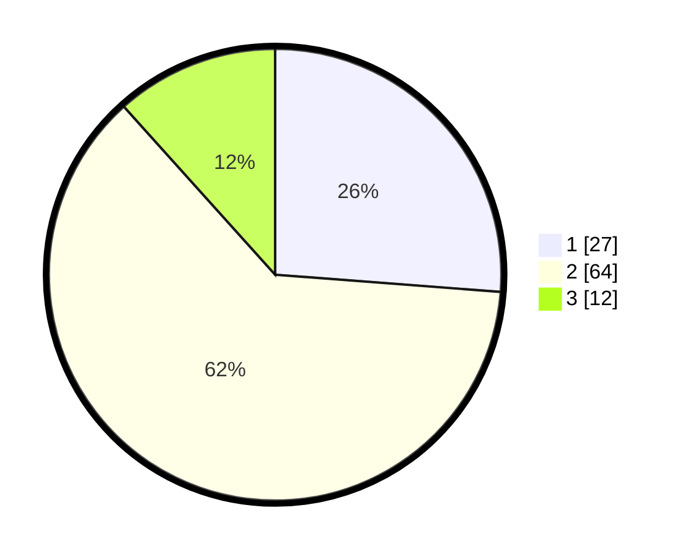

# Hasil

## Grafik

## Tabel

| No. | Nama Paslon    | Suara | Suara (raw) | Persentase |
|:--- |:-------------- | -----:| -----------:| ----------:|
| 1   | ANIES MUHAIMIN | 27    | [27][p-1]   | 26,21      |
| 2   | PRABOWO GIBRAN | 64    | [64][p-2]   | 62,14      |
| 3   | GANJAR MAHFUD  | 12    | [12][p-3]   | 11,65      |

[p-1]: https://github.com/gigit-pemilu/pemilu-2024-33-jawa-tengah/blob/main/pilpres/hitung-suara/sub/33-jawa-tengah/sub/29-brebes/sub/02-bantarkawung/sub/2012-pangebatan/sub/041-tps/sub/paslon-1.txt
[p-2]: https://github.com/gigit-pemilu/pemilu-2024-33-jawa-tengah/blob/main/pilpres/hitung-suara/sub/33-jawa-tengah/sub/29-brebes/sub/02-bantarkawung/sub/2012-pangebatan/sub/041-tps/sub/paslon-2.txt
[p-3]: https://github.com/gigit-pemilu/pemilu-2024-33-jawa-tengah/blob/main/pilpres/hitung-suara/sub/33-jawa-tengah/sub/29-brebes/sub/02-bantarkawung/sub/2012-pangebatan/sub/041-tps/sub/paslon-3.txt

## Foto C Plano

https://sirekap-obj-formc.kpu.go.id/7131/pemilu/ppwp/33/29/02/20/12/3329022012041-20240215-085343--9b52b694-149e-4ead-9605-16bdf1599f99.jpg

https://sirekap-obj-formc.kpu.go.id/7131/pemilu/ppwp/33/29/02/20/12/3329022012041-20240215-082403--807d69b5-342b-40da-8a71-6f9b64cb2a5e.jpg

https://sirekap-obj-formc.kpu.go.id/7131/pemilu/ppwp/33/29/02/20/12/3329022012041-20240215-082550--61c16dbc-b7f2-49e8-b0f2-f36e82b1cc3e.jpg

## Metadata

| Key        | Value               |
| ---------- | ------------------- |
| Time Stamp | 2024-02-16 09:30:28 |

