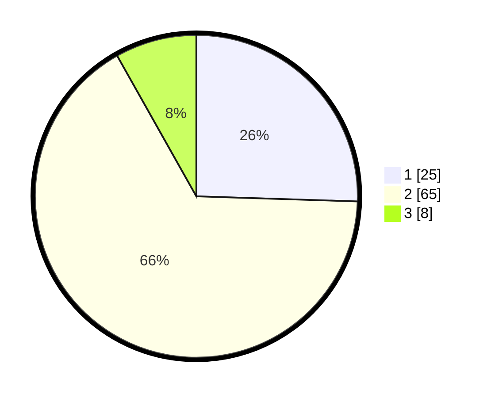

# Hasil

## Grafik

## Tabel

| No. | Nama Paslon    | Suara | Suara (raw) | Persentase |
|:--- |:-------------- | -----:| -----------:| ----------:|
| 1   | ANIES MUHAIMIN | 25    | [25][p-1]   | 25,51      |
| 2   | PRABOWO GIBRAN | 65    | [65][p-2]   | 66,33      |
| 3   | GANJAR MAHFUD  | 8     | [8][p-3]    | 8,16       |

[p-1]: https://github.com/gigit-pemilu/pemilu-2024-33-jawa-tengah/blob/main/pilpres/hitung-suara/sub/33-jawa-tengah/sub/29-brebes/sub/02-bantarkawung/sub/2012-pangebatan/sub/043-tps/sub/paslon-1.txt
[p-2]: https://github.com/gigit-pemilu/pemilu-2024-33-jawa-tengah/blob/main/pilpres/hitung-suara/sub/33-jawa-tengah/sub/29-brebes/sub/02-bantarkawung/sub/2012-pangebatan/sub/043-tps/sub/paslon-2.txt
[p-3]: https://github.com/gigit-pemilu/pemilu-2024-33-jawa-tengah/blob/main/pilpres/hitung-suara/sub/33-jawa-tengah/sub/29-brebes/sub/02-bantarkawung/sub/2012-pangebatan/sub/043-tps/sub/paslon-3.txt

## Foto C Plano

https://sirekap-obj-formc.kpu.go.id/2d7d/pemilu/ppwp/33/29/02/20/12/3329022012043-20240214-230623--4eebbbfe-23cd-4745-9b52-f0299c94a25c.jpg

https://sirekap-obj-formc.kpu.go.id/2d7d/pemilu/ppwp/33/29/02/20/12/3329022012043-20240215-081152--ac14b5d5-ff6d-401a-aed4-535cbed91df9.jpg

https://sirekap-obj-formc.kpu.go.id/2d7d/pemilu/ppwp/33/29/02/20/12/3329022012043-20240216-195341--b13b37bb-1a91-4829-b755-86e4fd245e2d.jpg

## Metadata

| Key        | Value               |
| ---------- | ------------------- |
| Time Stamp | 2024-02-25 22:00:00 |

