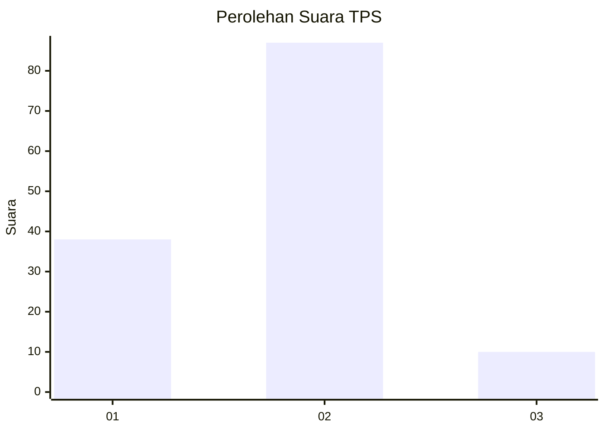
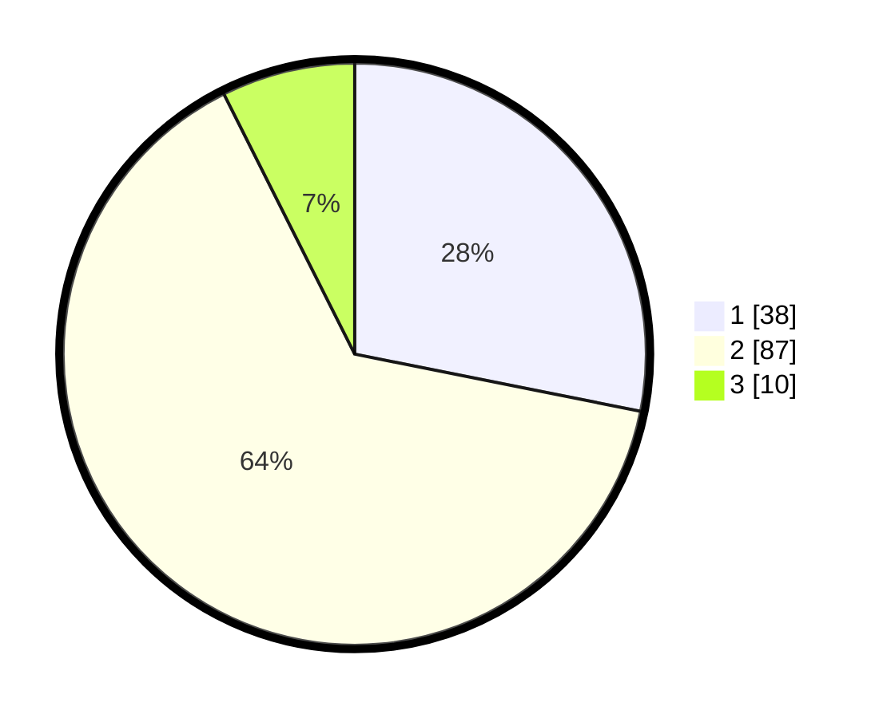

# Hasil

## Grafik

## Tabel

| No. | Nama Paslon    | Suara | Suara (raw) | Persentase |
|:--- |:-------------- | -----:| -----------:| ----------:|
| 1   | ANIES MUHAIMIN | 38    | [38][p-1]   | 28,15      |
| 2   | PRABOWO GIBRAN | 87    | [87][p-2]   | 64,44      |
| 3   | GANJAR MAHFUD  | 10    | [10][p-3]   | 7,41       |

[p-1]: https://github.com/gigit-pemilu/pemilu-2024/blob/main/pilpres/hitung-suara/sub/33-jawa-tengah/sub/29-brebes/sub/02-bantarkawung/sub/2013-pengarasan/sub/001-tps/sub/paslon-1.txt
[p-2]: https://github.com/gigit-pemilu/pemilu-2024/blob/main/pilpres/hitung-suara/sub/33-jawa-tengah/sub/29-brebes/sub/02-bantarkawung/sub/2013-pengarasan/sub/001-tps/sub/paslon-2.txt
[p-3]: https://github.com/gigit-pemilu/pemilu-2024/blob/main/pilpres/hitung-suara/sub/33-jawa-tengah/sub/29-brebes/sub/02-bantarkawung/sub/2013-pengarasan/sub/001-tps/sub/paslon-3.txt

## Foto C Plano

https://sirekap-obj-formc.kpu.go.id/009d/pemilu/ppwp/33/29/02/20/13/3329022013001-20240218-152437--84bfed19-089b-4340-bc37-00a969f81c11.jpg

https://sirekap-obj-formc.kpu.go.id/009d/pemilu/ppwp/33/29/02/20/13/3329022013001-20240218-151438--2823722e-1430-46f0-a98d-beb54d95337e.jpg

https://sirekap-obj-formc.kpu.go.id/009d/pemilu/ppwp/33/29/02/20/13/3329022013001-20240218-153211--d1c9b8f3-0d1f-40ac-a504-c0bf35e5e5dc.jpg

## Metadata

| Key        | Value               |
| ---------- | ------------------- |
| Time Stamp | 2024-02-19 17:00:00 |

