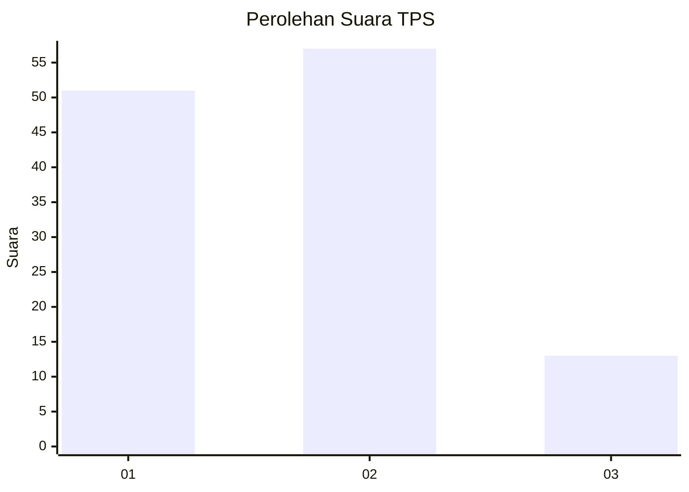
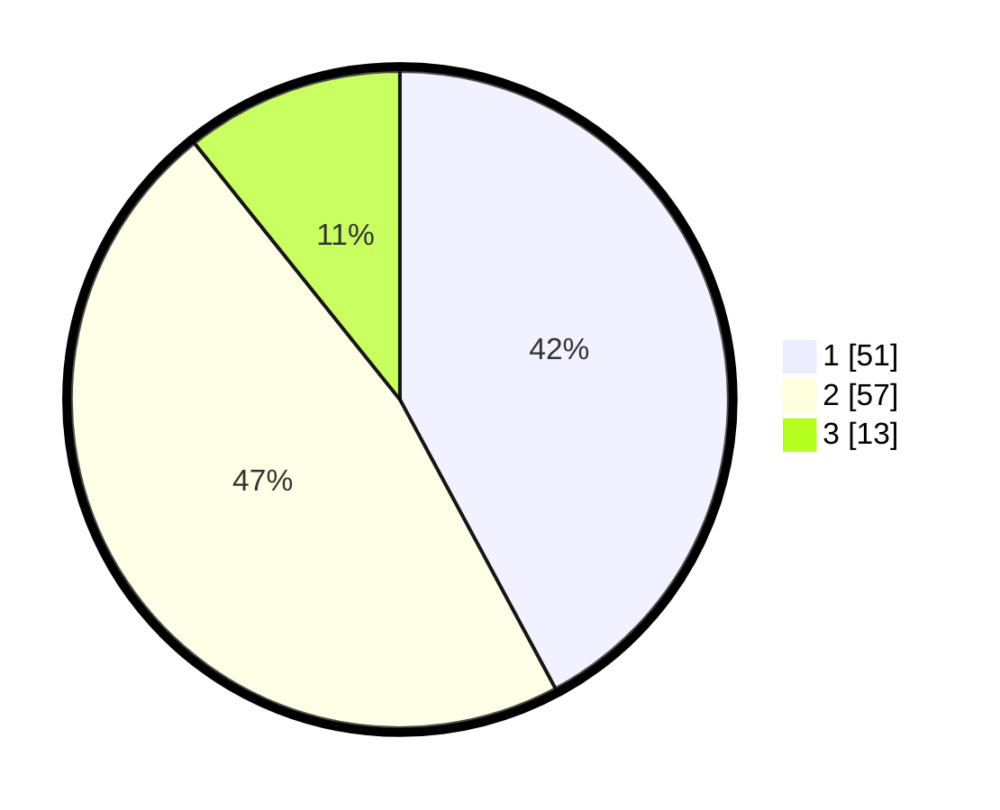

# Hasil

## Grafik

## Tabel

| No. | Nama Paslon    | Suara | Suara (raw) | Persentase |
|:--- |:-------------- | -----:| -----------:| ----------:|
| 1   | ANIES MUHAIMIN | 51    | [51][p-1]   | 42,15      |
| 2   | PRABOWO GIBRAN | 57    | [57][p-2]   | 47,11      |
| 3   | GANJAR MAHFUD  | 13    | [13][p-3]   | 10,74      |

[p-1]: https://github.com/gigit-pemilu/pemilu-2024-33-jawa-tengah/blob/main/pilpres/hitung-suara/sub/33-jawa-tengah/sub/29-brebes/sub/02-bantarkawung/sub/2013-pengarasan/sub/006-tps/sub/paslon-1.txt
[p-2]: https://github.com/gigit-pemilu/pemilu-2024-33-jawa-tengah/blob/main/pilpres/hitung-suara/sub/33-jawa-tengah/sub/29-brebes/sub/02-bantarkawung/sub/2013-pengarasan/sub/006-tps/sub/paslon-2.txt
[p-3]: https://github.com/gigit-pemilu/pemilu-2024-33-jawa-tengah/blob/main/pilpres/hitung-suara/sub/33-jawa-tengah/sub/29-brebes/sub/02-bantarkawung/sub/2013-pengarasan/sub/006-tps/sub/paslon-3.txt

## Foto C Plano

https://sirekap-obj-formc.kpu.go.id/37c3/pemilu/ppwp/33/29/02/20/13/3329022013006-20240214-220816--4068046f-9029-464e-8e4d-267d95cfa3b0.jpg

https://sirekap-obj-formc.kpu.go.id/37c3/pemilu/ppwp/33/29/02/20/13/3329022013006-20240214-211303--a59e8483-5045-47ca-acbd-77928241a5b7.jpg

https://sirekap-obj-formc.kpu.go.id/37c3/pemilu/ppwp/33/29/02/20/13/3329022013006-20240214-211406--22637425-5b2c-4bac-a1cd-7bbd6c439481.jpg

## Metadata

| Key        | Value               |
| ---------- | ------------------- |
| Time Stamp | 2024-02-15 00:41:44 |

