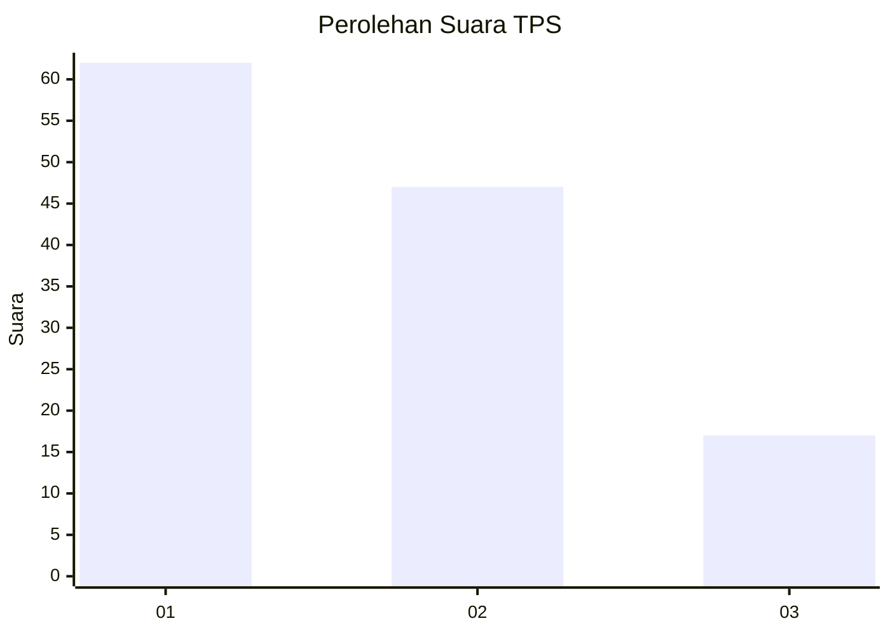
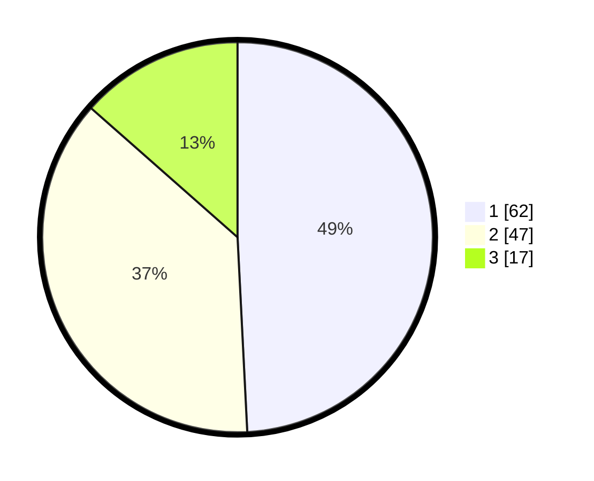

# Hasil

## Grafik

## Tabel

| No. | Nama Paslon    | Suara | Suara (raw) | Persentase |
|:--- |:-------------- | -----:| -----------:| ----------:|
| 1   | ANIES MUHAIMIN | 62    | [62][p-1]   | 49,21      |
| 2   | PRABOWO GIBRAN | 47    | [47][p-2]   | 37,30      |
| 3   | GANJAR MAHFUD  | 17    | [17][p-3]   | 13,49      |

[p-1]: https://github.com/gigit-pemilu/pemilu-2024/blob/main/pilpres/hitung-suara/sub/33-jawa-tengah/sub/29-brebes/sub/02-bantarkawung/sub/2013-pengarasan/sub/014-tps/sub/paslon-1.txt
[p-2]: https://github.com/gigit-pemilu/pemilu-2024/blob/main/pilpres/hitung-suara/sub/33-jawa-tengah/sub/29-brebes/sub/02-bantarkawung/sub/2013-pengarasan/sub/014-tps/sub/paslon-2.txt
[p-3]: https://github.com/gigit-pemilu/pemilu-2024/blob/main/pilpres/hitung-suara/sub/33-jawa-tengah/sub/29-brebes/sub/02-bantarkawung/sub/2013-pengarasan/sub/014-tps/sub/paslon-3.txt

## Foto C Plano

https://sirekap-obj-formc.kpu.go.id/4b34/pemilu/ppwp/33/29/02/20/13/3329022013014-20240214-141626--6427b8ed-3296-4963-90b4-4034e8b553be.jpg

https://sirekap-obj-formc.kpu.go.id/4b34/pemilu/ppwp/33/29/02/20/13/3329022013014-20240214-141751--bbd62f94-5256-4be6-ab45-babd476a5640.jpg

https://sirekap-obj-formc.kpu.go.id/4b34/pemilu/ppwp/33/29/02/20/13/3329022013014-20240216-101423--9c410056-7ba6-4ddc-9fda-b39a9da1b36d.jpg

## Metadata

| Key        | Value               |
| ---------- | ------------------- |
| Time Stamp | 2024-02-16 11:00:29 |

