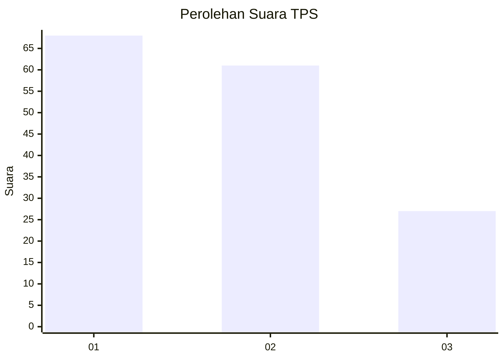
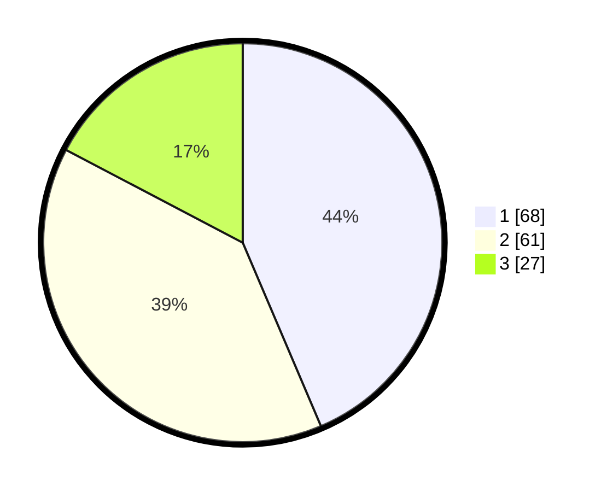

# Hasil

## Grafik

## Tabel

| No. | Nama Paslon    | Suara | Suara (raw) | Persentase |
|:--- |:-------------- | -----:| -----------:| ----------:|
| 1   | ANIES MUHAIMIN | 68    | [68][p-1]   | 43,59      |
| 2   | PRABOWO GIBRAN | 61    | [61][p-2]   | 39,10      |
| 3   | GANJAR MAHFUD  | 27    | [27][p-3]   | 17,31      |

[p-1]: https://github.com/gigit-pemilu/pemilu-2024-33-jawa-tengah/blob/main/pilpres/hitung-suara/sub/33-jawa-tengah/sub/29-brebes/sub/02-bantarkawung/sub/2014-sindangwangi/sub/012-tps/sub/paslon-1.txt
[p-2]: https://github.com/gigit-pemilu/pemilu-2024-33-jawa-tengah/blob/main/pilpres/hitung-suara/sub/33-jawa-tengah/sub/29-brebes/sub/02-bantarkawung/sub/2014-sindangwangi/sub/012-tps/sub/paslon-2.txt
[p-3]: https://github.com/gigit-pemilu/pemilu-2024-33-jawa-tengah/blob/main/pilpres/hitung-suara/sub/33-jawa-tengah/sub/29-brebes/sub/02-bantarkawung/sub/2014-sindangwangi/sub/012-tps/sub/paslon-3.txt

## Foto C Plano

https://sirekap-obj-formc.kpu.go.id/920f/pemilu/ppwp/33/29/02/20/14/3329022014012-20240215-093929--5562305b-9dce-4fee-bd78-d2b91dd6781c.jpg

https://sirekap-obj-formc.kpu.go.id/920f/pemilu/ppwp/33/29/02/20/14/3329022014012-20240215-094107--e77645d1-3da9-43d4-94db-aa364f5442ed.jpg

https://sirekap-obj-formc.kpu.go.id/920f/pemilu/ppwp/33/29/02/20/14/3329022014012-20240215-094205--b50e3610-6fca-47d3-a156-4bbaa93e34bc.jpg

## Metadata

| Key        | Value               |
| ---------- | ------------------- |
| Time Stamp | 2024-02-25 00:00:00 |

