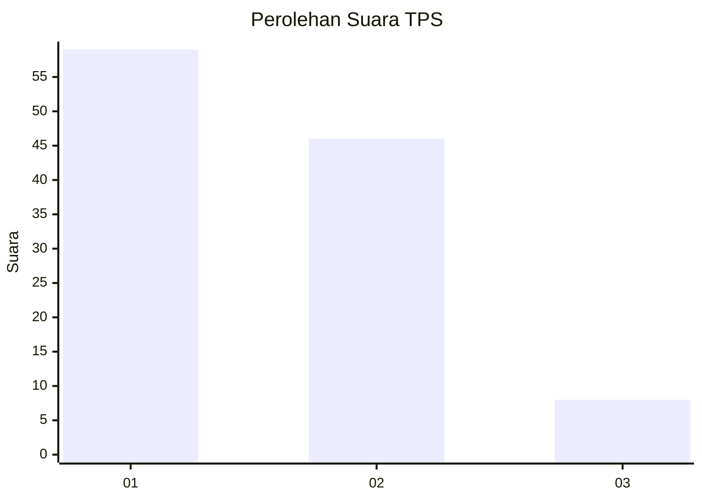
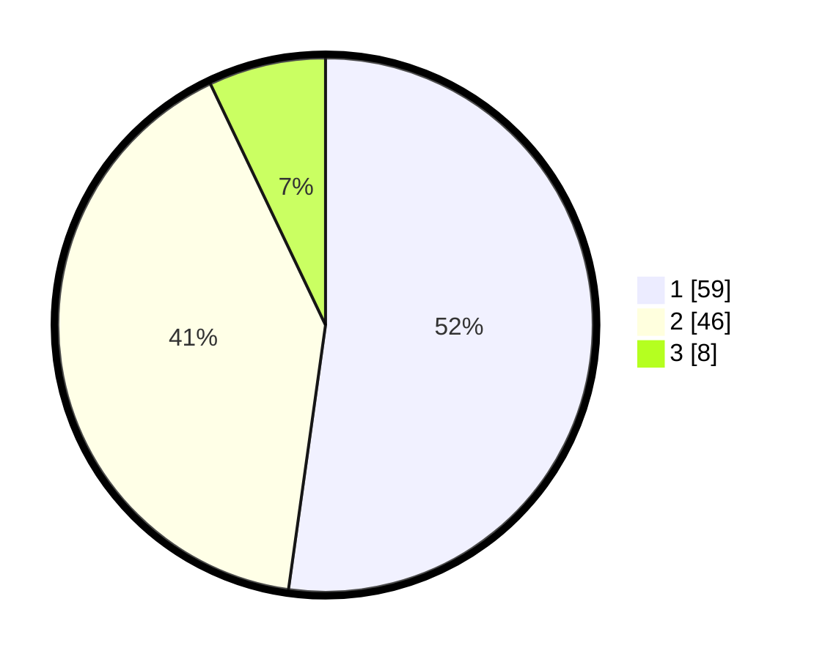

# Hasil

## Grafik

## Tabel

| No. | Nama Paslon    | Suara | Suara (raw) | Persentase |
|:--- |:-------------- | -----:| -----------:| ----------:|
| 1   | ANIES MUHAIMIN | 59    | [59][p-1]   | 52,21      |
| 2   | PRABOWO GIBRAN | 46    | [46][p-2]   | 40,71      |
| 3   | GANJAR MAHFUD  | 8     | [8][p-3]    | 7,08       |

[p-1]: https://github.com/gigit-pemilu/pemilu-2024-33-jawa-tengah/blob/main/pilpres/hitung-suara/sub/33-jawa-tengah/sub/29-brebes/sub/02-bantarkawung/sub/2015-tambakserang/sub/017-tps/sub/paslon-1.txt
[p-2]: https://github.com/gigit-pemilu/pemilu-2024-33-jawa-tengah/blob/main/pilpres/hitung-suara/sub/33-jawa-tengah/sub/29-brebes/sub/02-bantarkawung/sub/2015-tambakserang/sub/017-tps/sub/paslon-2.txt
[p-3]: https://github.com/gigit-pemilu/pemilu-2024-33-jawa-tengah/blob/main/pilpres/hitung-suara/sub/33-jawa-tengah/sub/29-brebes/sub/02-bantarkawung/sub/2015-tambakserang/sub/017-tps/sub/paslon-3.txt

## Foto C Plano

https://sirekap-obj-formc.kpu.go.id/bf64/pemilu/ppwp/33/29/02/20/15/3329022015017-20240215-015957--ceb8011e-7d6d-43a2-933b-259dc104cde9.jpg

https://sirekap-obj-formc.kpu.go.id/bf64/pemilu/ppwp/33/29/02/20/15/3329022015017-20240215-020141--552a712b-f481-46cc-9e76-425cd41aaa21.jpg

https://sirekap-obj-formc.kpu.go.id/bf64/pemilu/ppwp/33/29/02/20/15/3329022015017-20240215-020326--b9211789-b8d4-40dd-b842-99ec3d472e5b.jpg

## Metadata

| Key        | Value               |
| ---------- | ------------------- |
| Time Stamp | 2024-02-16 10:30:29 |

