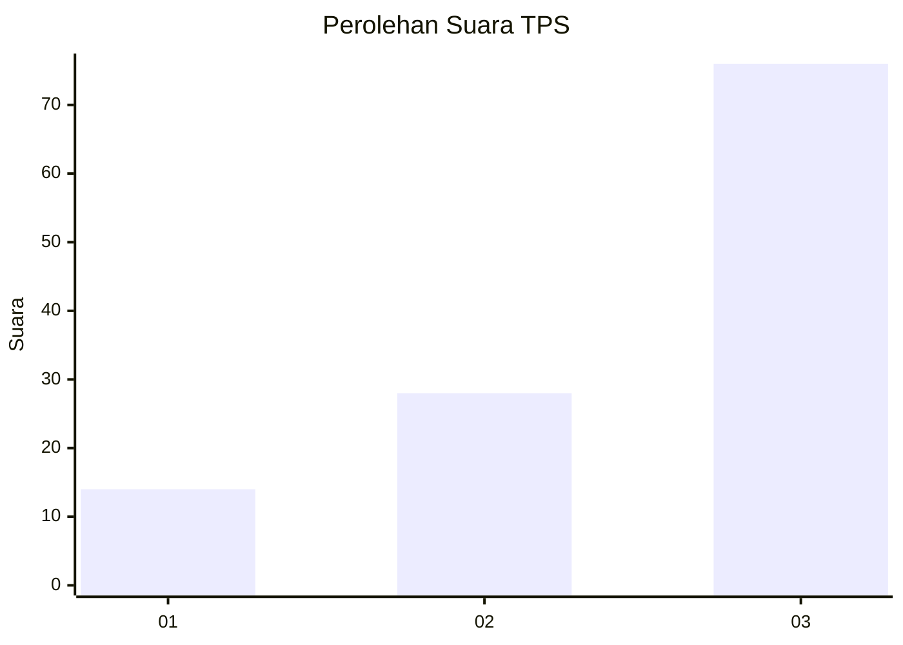
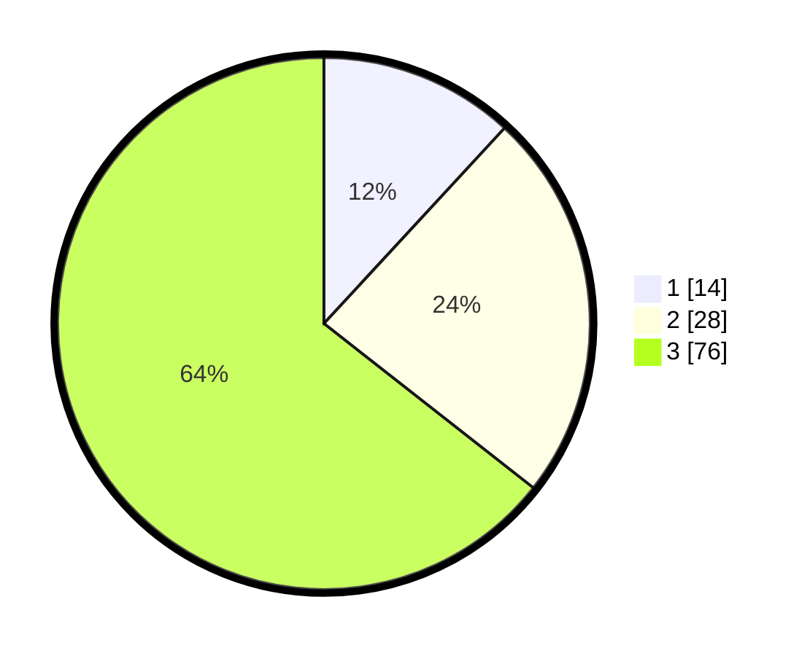

# Hasil

## Grafik

## Tabel

| No. | Nama Paslon    | Suara | Suara (raw) | Persentase |
|:--- |:-------------- | -----:| -----------:| ----------:|
| 1   | ANIES MUHAIMIN | 14    | [14][p-1]   | 11,86      |
| 2   | PRABOWO GIBRAN | 28    | [28][p-2]   | 23,73      |
| 3   | GANJAR MAHFUD  | 76    | [76][p-3]   | 64,41      |

[p-1]: https://github.com/gigit-pemilu/pemilu-2024-33-jawa-tengah/blob/main/pilpres/hitung-suara/sub/33-jawa-tengah/sub/29-brebes/sub/02-bantarkawung/sub/2018-waru/sub/005-tps/sub/paslon-1.txt
[p-2]: https://github.com/gigit-pemilu/pemilu-2024-33-jawa-tengah/blob/main/pilpres/hitung-suara/sub/33-jawa-tengah/sub/29-brebes/sub/02-bantarkawung/sub/2018-waru/sub/005-tps/sub/paslon-2.txt
[p-3]: https://github.com/gigit-pemilu/pemilu-2024-33-jawa-tengah/blob/main/pilpres/hitung-suara/sub/33-jawa-tengah/sub/29-brebes/sub/02-bantarkawung/sub/2018-waru/sub/005-tps/sub/paslon-3.txt

## Foto C Plano

https://sirekap-obj-formc.kpu.go.id/9c90/pemilu/ppwp/33/29/02/20/18/3329022018005-20240215-003604--ee553035-6a1b-4a44-9a8d-f97ddf907d8c.jpg

https://sirekap-obj-formc.kpu.go.id/9c90/pemilu/ppwp/33/29/02/20/18/3329022018005-20240215-003620--257ad77a-4ec9-477e-bfc6-00214b513449.jpg

https://sirekap-obj-formc.kpu.go.id/9c90/pemilu/ppwp/33/29/02/20/18/3329022018005-20240215-003623--a5f7fd05-7afb-4523-8314-64e0c016dabb.jpg

## Metadata

| Key        | Value               |
| ---------- | ------------------- |
| Time Stamp | 2024-02-16 14:30:33 |

